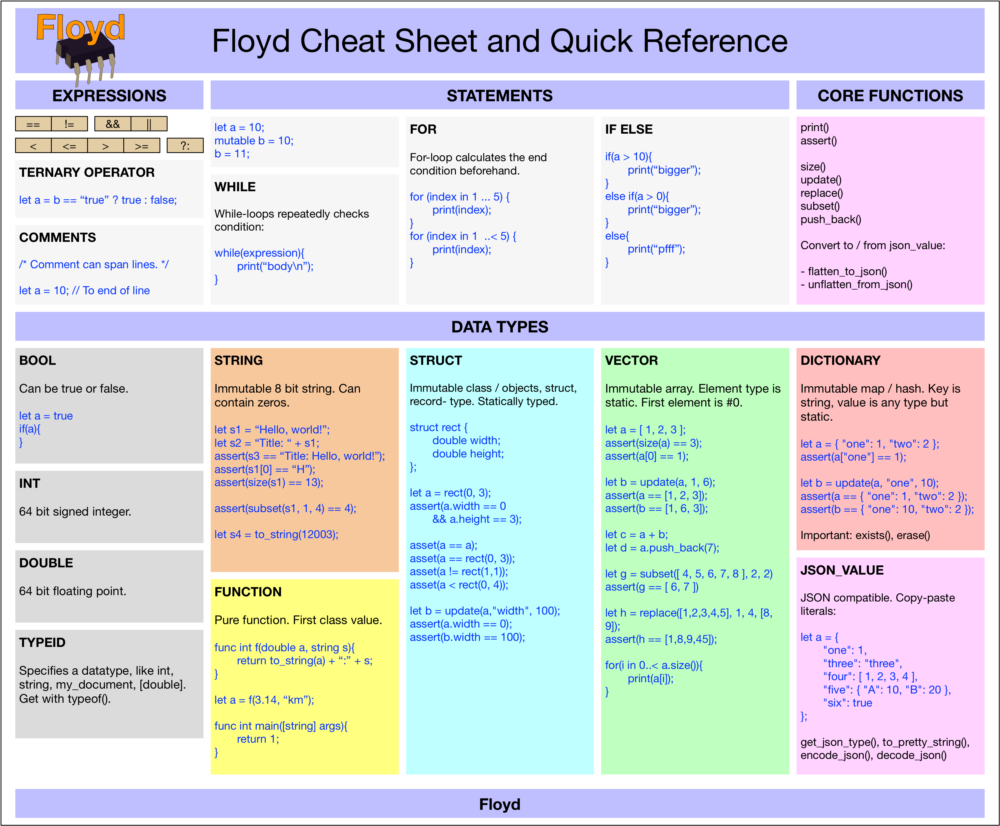

License: at the moment Floyd is closed software, (c) Marcus Zetterquist. Plan is to change license to MIT or similar.

# WHAT IS FLOYD?

Floyd is a new programming language designed to have ready made answers for how to do great, robust and composable programs, both small programs and huge systems.

It feels familiar to Javascript / C / Java / C++ programmers but gets rid of a lot of the troublesome features and replaces it with new and better ways. Floyd prioritises solving the bigger questions: how to make big composable software the really works, rather on dweilling on neat syntactic details on the expression and statement level.

**FEATURES:** Functions, structs as immutable value objects, immutable strings, immutable vectors, immutable dictionaries, deep and immutable JSON integration, static typing, type deducing, automatic deep behaviour of all types, like comparison and copying.

**REMOVED:** Pointers and references and aliasing, null, classes with mutation and aliasing, inheritance, memory management, header files, constructors and manual lifetime operators (like copy-constructors and assignment operatorsetc), dynamic types, dynamic members of objects.

**COMING SOON:** file system access, clocks & channels, protocols, sumtype.

Floyd consists of the language specification, a compiler and a byte code interpreter. Floyd is written in portable C++ 11.

For details, read the [Floyd reference docs](./docs/floyd_reference.md).

# CHEAT SHEET

# EXAMPLE

	//  Make simple, ready-for use struct.
	struct photo {
		int width;
		int height;
		[float] pixels;
	};

	//  Try the new struct.
	let a = photo(1, 3, [ 0.0, 1.0, 2.0 ]);
	assert(a.width == 1);
	assert(a.height == 3);
	assert(a.pixels[2] == 2.0);

	let b = photo(0, 3, []);
	let c = photo(1, 3, [ 0.0, 1.0, 2.0 ]);

	//	Try automatic features for equality
	asset(a == a);
	asset(a != b);
	asset(a == c);
	asset(c > b);

# INSTALLATION

Floyd is distributed as C++ source code.

# PLANNED LANGUAGE FEATURES

- Channels / clocks - for time / concurrency.
- High-level constructs, for system, component, client.
- Add runtime-concepts -- a way to layer systems on top of others.
- Protocol mechanism, instead of inheritance.
- Map, filter, reduce, lambda.
- Struct encapsulation.
- Bit manipulation.
- Text type and basic toolkit.
- Support integers with range.
- Protocol buffers-style features.
- Closures

# PLANNED TOOLS & RUNTIME

- Playground-like system around Floyd. With visual help. Interactive, graphs, tests, docs.
- File system runtime
- Interactive motherboard designer / debugger / profiler where you assemble Floyd apps that interacts with the world and runs over time, from pure parts and libraries written in Floyd.
- Tweaks, tracing & dynamic collection backends selection.
- LLVM backend for making native code.
- Features for embedding Floyd runtime easily in an application.
- Add N x M green threads.
- Round-trip code -> AST -> executable function in runtime = optimization / generics.
- Standardized pretty printer.

