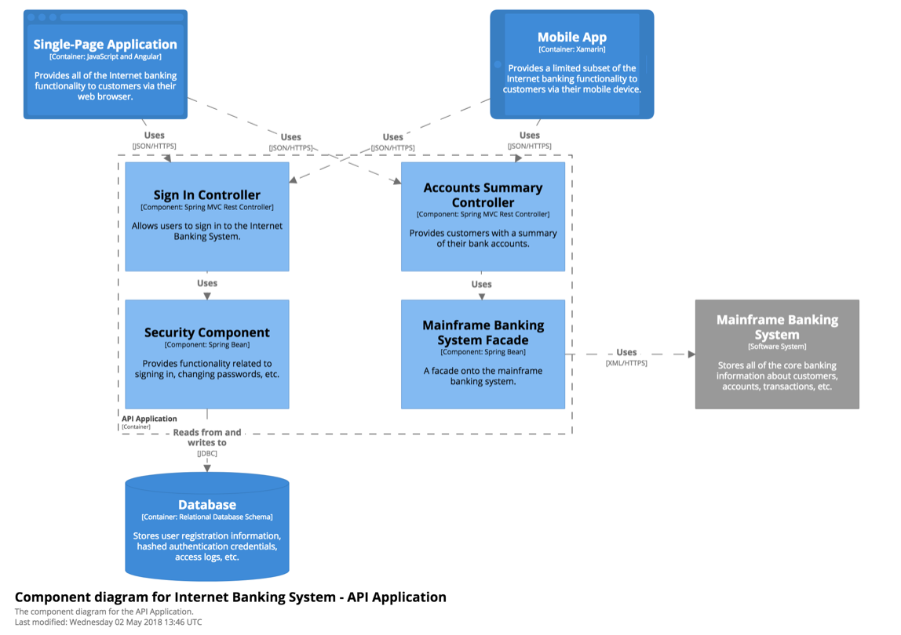

# NOTES AND IDEAS FOR FUTURE

??? IDEA: Supervisors: this is a function that creates and tracks and restarts clocks.
??? Give separate names to unpure component vs pure component. Only unpure components are important when designing the container.
??? IDEA: Glue expressions, calling FLoyd functions
??? What if you want a container-like setup for each "document"? Allow making sub-container that can be instantiated in a container? Or a tree of stuff inside a container.
??? make unpure and pure components two different concepts? Or use containers instead of unpure components?

### IDEA: TASK DISPATCHER

This part lets you queue up tasks that have dependencies between them, and it will r
??? This only increases performance = part of optimization. Make this something you declare to expose potential for parallel task processing. Supports a stream of jobs, like a game engine does.

### IDEA: SUPERVISORS

See Erlang. These start, monitor and fix containers and actors.

### IDEA: DIFF AND MERGE

Diff and merge are important to container code to detect what changes needs to be performed in the world.

### IDEA: All OS-services are implemented as clock:

you send them messages and they execute asynchronously? Nah, better to have blocking calls.

### IDEA: The clock records a LOG of all generations of its state

...in a forever-growing vector of states. In practice, those older generations are not kept or just kept for a short time. RESULT: this is not done automatically. It can be implemented as a vector in clock's state.

### IDEA: ADD SIMD FEATURES

### IDEA: MAP() CAN RUN FUNCTION WITH SIMD INSTRUCTIONS

	let pixel2 = map(pixels1, func (rgba p){ return rgba(p.red * 0.1, p.green * 0.2, p.blue * 0.3, 1.0) })

Turns into

	let count = size(pixels)
	let batches = count / 4
	var pos = 0
	for(i in 0 .. batches){
		let vec factors = { pixels[pos].red, pixels[pos + 1].red, pixels[pos + 2].red, pixels[pos + 3].red }
		let vec reds = { pixels[pos].red, pixels[pos + 1].red, pixels[pos + 2].red, pixels[pos + 3].red }
		let vec greens = { pixels[pos].green, pixels[pos + 1].green, pixels[pos + 2].green, pixels[pos + 3].green }
		let vec blues = { pixels[pos].blue, pixels[pos + 1].blue, pixels[pos + 2].blue, pixels[pos + 3].blue }
		let vec alphas = { pixels[pos].alpha, pixels[pos + 1].alpha, pixels[pos + 2].alpha, pixels[pos + 3].alpha }

		let vec result = reds * 
		pos = pos + 4
	}

### IDEA: TRANSFORMER MODES

1. sample-value: Make snapshot of current value. If no current value, returns none.

2. get-new-writes: Get a vector with every value that has been written (including double-writes) since last read of the transformer.

3. get-all-writes: Get a vector of EVERY value EVER written to the transformer. This includes double-writes. Doesn't reset the history.

4. block-until-value: Block execution until a value exists in the transformer. Pops the value. If value already exists: returns immediately.

READER modes:

- Default: reader blocks until new value is written be writer.
- Sample the latest value in the optocoupler, don't block.
- Sample queue of all values since last read.

	

### IDEA: MAKE EXAMPLE OF INSTRAGRAM APP

- main ui thread()
- rendering / scaling clock
- server comm clock

??? IDEA: Assigning things to physical threads -- algorithmically

??? rename "Actor" to "green process". "Clock"? "Mediator", "State".