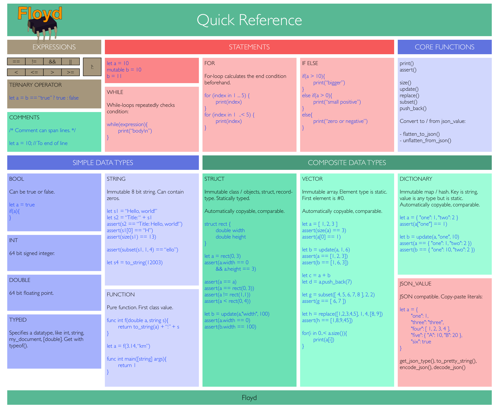
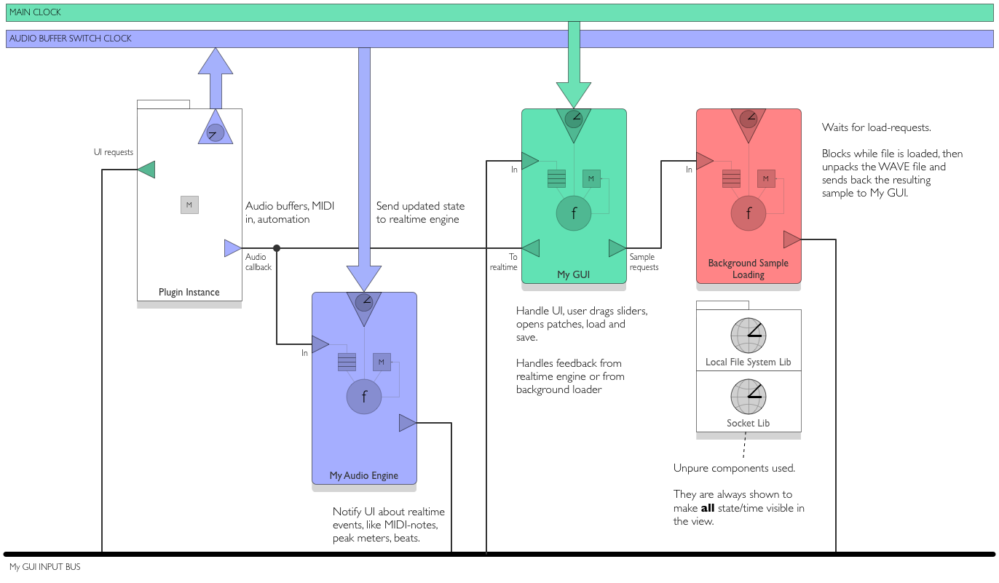

License: MIT

Status: Language spec for 1.0 almost done. Compiles to byte code and interprets it. Not ready for production yet. 

# FLOYD

Floyd is a general-purpose static and compiled programming language with strong opinions on how to write complex and robust software products with minimum pain and minimum waste of time. Fast programs. It's tools are visual and interactive.

Floyd replaces languages like C++, C#, Rust, Swift and Java -- but also scripting languages like Python and Javascript.

It's designed to allow you to write the next Photoshop and Grand Theft Auto and any type of mobile app.

The end goal is always to ship great *products* that execute extremely well on the hardware and that are a delight to develop further.

Floyd has a bunch of novel concepts, how it separates the programming work in new ways, imposes a clean system-wide structure and has simple built-in ways to do hard things like concurrency.

# THE MATRIX

- **Red Pill**: Knowledge, freedom, uncertainty and the brutal truths of reality
- **Blue Pill**: Security, happiness, beauty, and the blissful ignorance of illusion

Working interactive software needs both red and blue code. Floyd uses a red - blue - red sandwich were:

1. **Red pill**: the Floyd runtime sits at the bottom of the sandwich and upholds the blue matrix simulation above it.
2. **Blue pill**: ontop of the runtime is the blissful matrix illusion. Make sure most of your code goes here. It's a fantasic place to write solid programs.
3. **Red pill**: Finally, on top of it all sits the Floyd containers and processes - introducing reality: time, mutation, communication with an every changing outside world. Keep this code as small as possible. It also reaches downward and adjusts the matrix and the runtime to improve performance.

# SO EXACTLY WHAT IS FLOYD?

Floyd consists of a small and elegant toolkit of features built directly into the language that all go together to support you to make great products. Every feature has been carefully picked, polished and adopted as a first class feature in the language. The goal is to have one simple way to do each common thing.

**What's *not* included and what you *can't* do is a core of Floyd's design**

##### PRIMARY GOALS

1. Make it simpler to create robust large scale software products
2. Replace many bad programming ideas with a few good ones, critical to make code composable
3. Introduce high-level features needed for large scale software
4. Extreme execution speed, faster than practical in majority of C systems
5. Next-gen visual and interactive tools to support exploration and experimentation

# UNIQUE FEATURES

1. Floyd splits your system into three areas: a) your program's logic, b) your program's processing and c) mapping its execution to the hardware.
2. Floyd has a clean and minimal skeleton structure for *complete* software systems - including processes, people, concurrency and how they all interact.
3. Carefully distilled set of syntactical features to move focus to the *system* rather than the inside of functions
4. Feels like simple imperative programming but with the best bits of functional programming sneaked in discretely
5. Visual and interactive tools

Floyd has three big parts:

1. **Floyd Speak** - a neat new programming language for doing logic. It's statically typed with inference, compiles to byte code or native code. Here you program the bulk of your system.

2. **Floyd Systems** - does two things: A) defines your complete software system and its internal interactions and processes and concurrency, and B) Allows you to use Tweakers to map your software onto the hardware resources (cores, caches, RAM) 

3. **Floyd Studio** - a fast interactive and visual tool to play around with your code and visually wire things together, profile your system and apply heavy optimizations to it

Read more about Floyd: [Read more](readme_deeper.md)

# INSTALLATION

TBD (for now, explore dev directory)

# STATUS

The core of the Floyd Speak language is up and running. The compiler compiles the source code to byte code that runs quite fast on an interpreter. There are approximately 750 tests the make sure compiler is solid. The manual is complete.
A handful small but critical features needs to be implemented before it's truly useful for real world programming.

Floyd Systems finally has its design in place but needs to be implemented in the compiler and runtime.

The details on Tweakers, probes and Floyd Studio are on the drawing board.

|Item				| Feature					| Link
|:---				|:---					|:---
| **Floyd Speak Manual**		|Details the language itself				|[Floyd Speak Manual](floyd_speak.md)
| **Floyd Speak Core Library Manual**		|Details the most fundamental functions and types				|[Floyd Speak Core Library Manual](floyd_speak_corelibs.md)
| **Floyd Speak compiler**		|Compiles Floyd Speak source code to byte code.
| **Floyd Speak interpreter**	|Runs your programs at approx. 7-15% of native speeds.
| **Floyd Systems Manual**		|				|[Floyd Systems Manual](floyd_systems.md)
| **TODO POC: Floyd Systems compiler**			|compiles floyd systems and containers etc to byte code.|
| Standard library				|A number of basic components|

Floyd compilers and tools are written in portable C++17.
