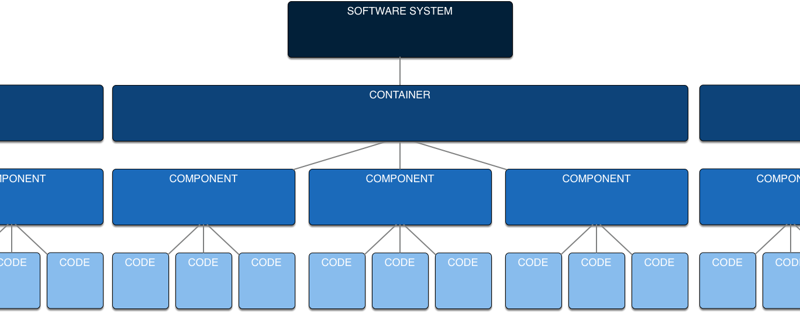

License: MIT

# WHAT IS THE PROBLEM?

Most software sucks. Both to use and to improve. At least compare to what is possible with our hardware. There is a lot of dogma and conservatism that holds programming back.

Floyd wants to move the needle.

While hardware designers have grown from thousands of transistors to billions over the last 40 years, programmers are still programming exactly the same way - typing individual if-statements and for-loops by using emacs in 7 bit text files. Exactly like our parents and grandparents did in the 60ies and 70ies.

Programming at this levels is the software equivalent of building a NVIDIA graphis card by placing NAND-gates onto the silicon, one by one.

From the other end hardware designers have spent decades and enormous amount of on-chip transistors to try to work around the software industry's lack of progress. The hardware today tries to figure out the intent and structure of your code *while executing it* to boost performance. These are things the software already knows!

BUT:

- If you love spending brainpower creating your own clever string classes, exploring new ways to think about software, feel strongly about expressing yourself in your code or just love the bad-ass feeling of *finally* tracking down an exciting threading problem -- then C++ is for you, not Floyd. Eventually you too might stumble across the finishing line of releasing a product.

- If you need intellectual rushes from mastering clever theoretical programming concepts, go read about set theory and monads or something, you are clearly not into programming to make great products.

- If you are obsessed about getting the compiler to generate optimal CPU instructions for every function no matter the consequences but don't care to learn how CPUs and caches actually work and how to best structure your *entire* program for best results -- use C++ with turned-off exceptions and no RTTI and no built in collection classes. You may be able to release a product at some time, but everyone will hate working on that code base.

- If you love emacs or vi and the only keyboard you care to use weights 2 kg and sounds like klockety-klock -- well maybe your children may be ready for Floyd.

When you've gotten all above crap out of your system and feel ready to make great and solid products that execute *extremely fast* you are welcome to Floyd!

# WHAT FLOYD WANTS TO DO

Floyd is a little bit snobbish -- but mostly just tired and intolerant of programming religion and conservativsm and all shiny distracting things that makes it hard to make great software and to advance the *way* we make software.

Floyd knows programming is about engineering and making insightful compromises about how your *system* works and performs. You exploring your system from different angles and try improvements and see what works.

- You have limited brainpower, limited time, limited hardware -- great design is about figuring out how to spend these where it has maximum impactor for the *product*.

Also at all cost avoid getting "design lumps" into your system that constantly limits how you can improve the software. "It can't be changed".

- Typing code into a function is **not** the right place to express yourself or do clever things.
- Programming is **not** math, programming is engineering.
- The new neat language syntax won't help you a bit.
- You don't make programs fast by trying to optimise the hell out of every single function in isolation. You don't make multithreaded programs by sprinkling thread-stuff all over your code.
- If you can't on request draw a clear overview picture how your system is structured -- then you can't possibly make system-wide decisions like which functions to optimize, what to cache and how to do *anything* with concurreny.

Floyd solves much of this by setting a simple but clear structure for how big systems (and small) needs to be organised and *enforces* this structure in the language from top to bottom to make us concentrate on making good software. All while trying not to scare conservative programmers with too big changes to their source code typing.

Just like structured programming replaced goto hell with more specific but limited if-else and while loops, Floyd tries to name and impose another structure on systems and how they interact and are composed.

# SO EXACTLY WHAT IS FLOYD?

Floyd steals the good bits from each religion and proposes a complete and slick package that gets the job done. And in a surprisingly elegantly way.

Floyd has *one* simple and elegant way to do error handling, to organise data into collections, to cache data etc

Floyd consists of a small and elegant toolkit of features built into the language that all go together to support you in this work. Every feature has been carefully picked, polished and adopted as a first class feature in the language. When you look at the feature list you will say "is that all?" and that is a good thing!

**What's *not* included and what you *can't* do is one of Floyds best features**

Floyd is a programming language with strong opinions on how to write complex and robust software products with minimum pain and minimum waste of time.

You can write something like Photoshop or Grand Theft Auto V using Floyd. The end goal is *always* to ship great *products* that are a delight to develop further.

Floyd is a general-purpose language intended for making AAA games, mobile applications, desktop applications etc. Floyd replaces languages like C++, C# and Java but also scripting languages like Python and Javascript. Since Floyd programs are very uncluttered and simple with hardly an boilerplate code it's a good fit for quickly making small scripts or creating small tools.

# UNIQUE FEATURES

1. Floyd splits your program in three parts: the logic part (Floyd Speak), the processing part (Floyd Systems) and optimisation (Tweakers and Probes). Logic is where you make code how the program should behave, manipulate data and so forth. Processing is where you communicate, write to files and concurrency. Tweaks is where you decide on threading, caching strategies etc. This is done *on top* of the working logic, without modifying the logic.

3. Visual and interactive tools

4. Built-in holistic structure for *everything* needed in a complete software system including systems, processes, people, concurrency and communication between processes

5. Carefully destilled set of syntactical features to move focus to the system rather coding functions

6. Fusion of imperative programming but with the best bits of functional programming sneaked in discretely

There are three parts:

1. **Floyd Speak** - a neat new programming language for doing logic. It's statically typed with inference, compiles to byte code or native code

2. **Floyd Systems** - a language that defines your complete software system and its internal interactions and processes. A big focus on system performancem concurrency / parallelism, robustness and working interactively.

3. **Floyd Studio** - a fast interactive and visual tool to play around with your code and visually wire things together, profile your system and apply heavy optimizations to it

This sounds really complicated and heavy-weight but it's not, as you'll see.

# PRIMARY GOALS

1. Make it simpler to create robust large scale software products

2. Replace many bad programming ideas with a few good ones, critical to make code composable

3. Introduce high-level features needed for large scale software

4. Extreme execution speed, faster than practical in C systems

5. Nextgen visual and interactive tools

# SOLUTION PART 1/2 - FLOYD SPEAK

Floyd Speak is a fast and modern C-like program language that makes writing correct programs simpler and faster than any other programming language.

It's focus is composability, minimalism and robust programming techniques.

Normally, Floyd Speak functions don't have side effects or write to files etc -- they are doing logic therefor "pure" functions.

When a function needs to have side effects = an "unpure" function it needs to have those features supplied as an argument from its caller -- this makes those side effects parts of the static signature of the function. You can't accidentlayy call one.

The caller of unpure functions are best very near the top of the call stack, close to its actor (read more about actors elsewhere). 

These functions are more risky and expensive so try to have a minum of them. Also try to have as little logic as possible in these functions -- move any logic, even if-elses to separate, pure functions.

Floyd is not a functional language. You write statements, change local variables etc. But those changes cannot escape the function -- the are hidden inside the function. This makes the functions composable.

## FEATURES

1. All critical builing blocks are built-in mechanisms: strings, vectors, dictionaries and JSON literals and serialization. Avoid DYI primitives!
2. Statically typed with type inference.
3. Higher level (slightly) than C or Javascript. No pointers
4. Byte code interpreter. Future: compiled to native using LLVM
5. Support to make it simple to make tools: access to ASTs etc
6. Values, persistent data structures
7. Automatic behaviors: comparable, copyable, roundtrip values -> strings -> files -> protocols -> source code
8. Pure functions, imperative. Encapsulation and protocols but not OOP
9. Visual playground
10. Familiar looks an feel for most programmers

## GOALS

- Be precisely the set of features needed to make excellent software. No more, no less.
- Have one explict and solid way to do every important thing - no need for developer to invent basics.
- Guide developer to designing great software, instead of struggling / tinkering with language stuff or inventing custom systems.
- Remove everyday timesinks like boiler plate code, serializing data, formatting data, formatting code, threading, aliasing problems and sideffects.
- Promote robust software and development practices.
- Promote composable software and million-line-of-code products.
- Make programs execute extremely quickly.
- Make it easy and fast to pick up and use for smaller things, then be contagious.
- Make language fun and easy to adopt for new developers, rather than existing developers.
- Make language minimal, small and focused - easy to master for a human.
- Easy to write tools for

## NON-GOALS

- Have neat syntactical features that do not improve final product.
- Be multiparadigm.
- Be a real functional language.
- Be a real object oriented.
- Provide choice and expressing yourself
- Let programmer be 100% in control of the hardware.
- Be an interesting intellectual challenge to master language

## COMPOSABILITY

Features that break composabiity is limited and carefully controlled in the language. Things like threading and synchronisation, error responses, file handling, optimization choices. Normal Floyd code lives free, outside of time and the real world and can be used in many contexts.

To easy composability, the basic wiring between libraries and subsystems is built-in and standardized - this like common datatypes, error propagation between libraries, logging and asserts, memory handling and streaming data. All built-in and composable.

## CHEAT SHEET

## EXAMPLE CODE

	//  Make simple, ready-for use struct.
	struct photo {
		int width;
		int height;
		[float] pixels;
	};

	//  Try the new struct.
	let a = photo(1, 3, [ 0.0, 1.0, 2.0 ]);
	assert(a.width == 1);
	assert(a.height == 3);
	assert(a.pixels[2] == 2.0);

	let b = photo(0, 3, []);
	let c = photo(1, 3, [ 0.0, 1.0, 2.0 ]);

	//	Try automatic features for equality
	asset(a == a);
	asset(a != b);
	asset(a == c);
	asset(c > b);

## DETAILS

**Floyd Speak Manual:** [Floyd Speak Manual](floyd_speak.md).

## BAD IDEAS

There feature have been excluded from Floyd on purpose, because they are a bad idea:

1. Aliasing
2. Pointers & references
3. Null and null-exceptions
4. Tracing garbage collection
5. Threads, locks, atomics, await, async, nested callback hell
6. OOP
7. Memory management
8. Mutable state
9. Callbacks, observers or broadcasting
10. Singletons and globals
11. Side effects
12. Find your resources
13. Header files
14. Error codes
15. Local optimisation, caching 
16. Local threading decisions and assumptions
17. Shared mutable state
18. “Express your self in code”
19. Make your own linked list

# SOLUTION PART 2/3 - FLOYD SYSTEMS

This is a language that defines your complete software system and its internal interactions: components, concurrency, parallelism, communication, errors, time and mutation. The goals are these:

1. You can reason about it, present to no-developers and use to navigate visually

2. Clean concepts of robustness, concurrency, parallelism, communication, errors, time and mutation

3. Composable components

4. Simple to create tools

5. Visual profiling and editing

## SYSTEM STRUCTURE

Your software system is composed of containers (apps, servers and other programs), components (libraries) and code.

## EXAMPLE CONTAINER

This is a container with a bunch of actors wired together:

Concurrency is done using actors -- small processes inspired by Erlang processes. There are no threads, locks, atomics, await-async, nested callback hell etc.

Read more here: **Floyd Systems Manual**: [Floyd Systems Manual](floyd_systems.md), **Floyd Systems Reference**: [Floyd Systems Reference](floyd_systems_ref.md).

# SOLUTION PART 3/3 - FLOYD STUDIO

TODO 1.0
This is a webbased interactive tool for making, exploring and tuning complete software systems.

**Floyd Studio Manual**: [Floyd Studio Manual](floyd_studio.md).

# FLOYD - IN THE BOX

|Item				| Feature					| Link
|:---				|:---					|:---
| **Floyd Speak Manual**		|				|[Floyd Speak Manual](floyd_speak.md)
| **Floyd Speak compiler**		|Compiles Floyd Speak source code to byte code.
| **Floyd Speak interpreter**	|Runs your programs at approx 10% of native speeds.
| **Floyd Systems Manual**		|				|[Floyd Systems Manual](floyd_systems.md)
| **Floyd Systems Reference**	|				|[Floyd Systems Reference](floyd_systems_ref.md)
| **TODO POC: Floyd Systems compiler**			|compiles floyd systems and containers etc to byte code.|
| Standard library				|A number of basic components|

Floyd compilers and tools are written in portable C++11.

# BACKLOG
These are upcoming features, listed here to give you an idea of what the plan is: [Floyd Backlog](backlog.md)
