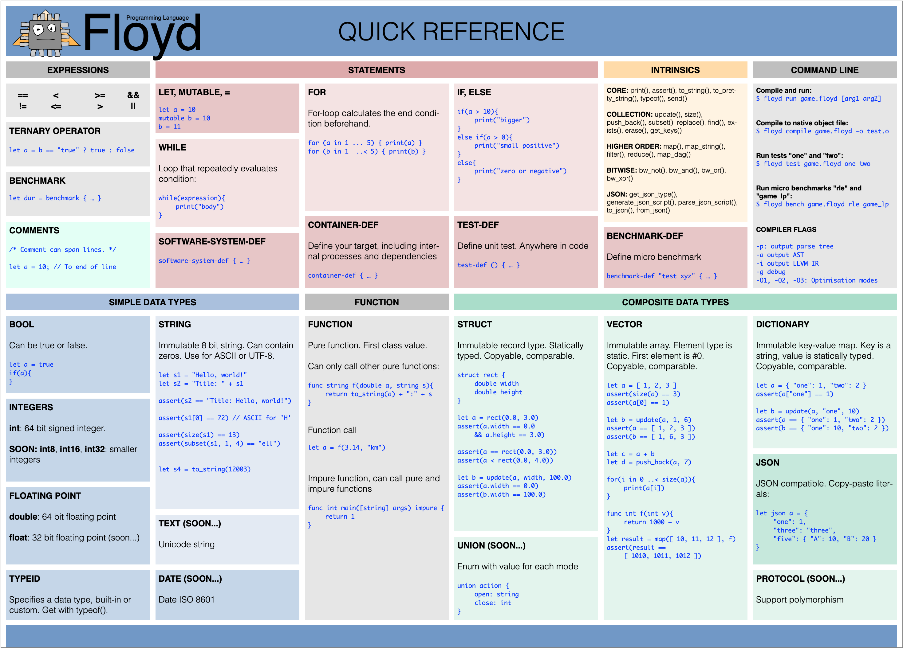

<!---
Building TOC and links using Sublime Text 3, Markdowntoc and Markdown preview
-->


# TABLE OF CONTENTS

<!-- MarkdownTOC autolink="true" levels="1, 2, 3" autolink="true" autoanchor="true"  -->

- [1 FLOYD LANGUAGE USER'S MANUAL](#1-floyd-language-users-manual)
	- [1.1 GETTING STARTED](#11-getting-started)
	- [1.2 COMMAND LINE TOOL](#12-command-line-tool)
	- [1.3 GLOBAL SCOPE AND MAIN FUNCTION](#13-global-scope-and-main-function)
	- [1.4 DATA TYPES](#14-data-types)
	- [1.5 OPERATORS AND EXPRESSIONS](#15-operators-and-expressions)
	- [1.6 VALUES, VARIABLES](#16-values-variables)
		- [IMMUTABLE VALUES VS VARIABLES](#immutable-values-vs-variables)
		- [DEEP BY VALUE](#deep-by-value)
		- [VALUE ORIENTED, NO POINTERS](#value-oriented-no-pointers)
		- [STATIC TYPING, INFERRED](#static-typing-inferred)
	- [1.7 COMMENTS AND DOCUMENTATION](#17-comments-and-documentation)
	- [1.8 STRING](#18-string)
	- [1.9 VECTOR](#19-vector)
	- [1.10 DICTIONARY](#110-dictionary)
	- [1.11 STRUCT](#111-struct)
	- [1.12 FUNCTION](#112-function)
	- [1.13 JSON AND AUTOMATIC SERIALIZATION](#113-json-and-automatic-serialization)
	- [1.14 FLOYD PROCESSES - TALKING TO THE REAL WORLD](#114-floyd-processes---talking-to-the-real-world)
		- [GAIN PERFORMANCE VIA CONCURRENCY](#gain-performance-via-concurrency)
		- [CONCURRENCY SCENARIOS](#concurrency-scenarios)
		- [EXAMPLE: SIMPLE CONSOLE PROGRAM](#example-simple-console-program)
		- [EXAMPLE: PACMAN IPHONE](#example-pacman-iphone)
	- [1.15 SYSTEM ARCHITECTURE](#115-system-architecture)
		- [DIAGRAMS](#diagrams)
	- [1.16 TODO: EXCEPTIONS](#116-todo-exceptions)
	- [1.17 ABOUT PERFORMANCE](#117-about-performance)
	- [1.18 ABOUT MICRO BENCHMARKS](#118-about-micro-benchmarks)
		- [BENCHMARK WITH 11 INSTANCES](#benchmark-with-11-instances)
		- [RUNNING MICRO BENCHMARKS FROM COMMAND LINE TOOL](#running-micro-benchmarks-from-command-line-tool)
		- [RUNNING MICRO BENCHMARKS FROM FLOYD CODE](#running-micro-benchmarks-from-floyd-code)
		- [HARDWARE CAPS](#hardware-caps)
	- [1.19 ABOUT PARALLELISM](#119-about-parallelism)
	- [1.20 TODO: PROBES](#120-todo-probes)
	- [1.21 TODO: TWEAKERS](#121-todo-tweakers)
- [2 FLOYD LANGUAGE REFERENCE MANUAL](#2-floyd-language-reference-manual)
	- [2.1 SOURCE CODE FILES](#21-source-code-files)
	- [2.2 MAIN\(\) & EXECUTING PROGRAMS](#22-main--executing-programs)
	- [2.3 CORECALLS - AKA INTRINSICS, OPERATORS](#23-corecalls---aka-intrinsics-operators)
	- [2.4 DATA TYPES](#24-data-types)
		- [EXAMPLE TYPE DECLARATIONS](#example-type-declarations)
		- [BOOL](#bool)
		- [INT](#int)
		- [DOUBLE](#double)
		- [STRING](#string)
		- [VECTOR](#vector)
		- [DICTIONARY](#dictionary)
		- [STRUCT](#struct)
		- [TYPEID](#typeid)
		- [JSON](#json)
		- [TODO: PROTOCOL](#todo-protocol)
	- [2.5 EXPRESSIONS](#25-expressions)
		- [LITERALS](#literals)
		- [VECTOR CONSTRUCTOR](#vector-constructor)
		- [DICTIONARY CONSTRUCTOR](#dictionary-constructor)
		- [FUNCTION CALL](#function-call)
		- [ARITHMETIC OPERATORS](#arithmetic-operators)
		- [RELATIONAL OPERATORS](#relational-operators)
		- [LOGICAL OPERATORS](#logical-operators)
		- [CONDITIONAL OPERATOR](#conditional-operator)
		- [BITWISE OPERATORS](#bitwise-operators)
		- [BENCHMARK](#benchmark)
		- [EXAMPLE EXPRESSIONS](#example-expressions)
	- [2.6 STATEMENTS](#26-statements)
		- [LET](#let)
		- [MUTABLE](#mutable)
		- [FUNCTION DEFINITION](#function-definition)
		- [STRUCT DEFINITION](#struct-definition)
		- [IF - THEN - ELSE](#if---then---else)
		- [FOR LOOP](#for-loop)
		- [WHILE](#while)
		- [RETURN](#return)
		- [SOFTWARE-SYSTEM-DEF](#software-system-def)
		- [CONTAINER-DEF](#container-def)
		- [BENCHMARK-DEF](#benchmark-def)
		- [TODO: SWITCH](#todo-switch)
	- [2.7 EXAMPLE SOFTWARE SYSTEM FILE](#27-example-software-system-file)
	- [2.8 FLOYD SYNTAX](#28-floyd-syntax)
- [3 STANDARD LIBRARY](#3-standard-library)
	- [3.1 MICRO BENCHMARKING FEATURES](#31-micro-benchmarking-features)
		- [microbench\_def\_t, benchmark\_id\_t, benchmark\_result2\_t](#microbenchdef_t-benchmark_id_t-benchmark_result2t)
		- [get\_benchmarks\(\)](#get_benchmarks)
		- [run\_benchmarks\(\)](#run_benchmarks)
		- [trace\_benchmarks\(\)](#trace_benchmarks)
		- [make\_benchmark\_report\(\)](#makebenchmarkreport)
	- [3.2 HARDWARE CAPS](#32-hardware-caps)
		- [detect\_hardware\_caps\(\)](#detecthardwarecaps)
	- [3.3 WORKING WITH HASHES - SHA1](#33-working-with-hashes---sha1)
		- [quick\_hash\_t](#quickhasht)
		- [sha1_t](#sha1_t)
		- [calc\_string\_sha1\(\)](#calcstringsha1)
		- [calc\_binary\_sha1\(\)](#calcbinarysha1)
	- [3.4 DATE AND TIME](#34-date-and-time)
		- [time\_ms\_t](#timemst)
		- [date_t](#date_t)
		- [get\_time\_of\_day\(\)](#gettime_ofday)
	- [3.5 FILE SYSTEM FEATURES](#35-file-system-features)
		- [read\_text\_file\(\)](#readtextfile)
		- [write\_text\_file\(\)](#writetextfile)
		- [get\_fsentries_shallow\(\) and get\_fsentries\_deep\(\)](#getfsentries_shallow-and-get_fsentriesdeep)
		- [get\_fsentry\_info\(\)](#getfsentryinfo)
		- [get\_fs\_environment\(\)](#getfsenvironment)
		- [does\_fsentry\_exist\(\)](#doesfsentryexist)
		- [create\_directory\_branch\(\)](#createdirectorybranch)
		- [delete\_fsentry\_deep\(\)](#deletefsentrydeep)
		- [rename\_fsentry\(\)](#rename_fsentry)
	- [3.6 STANDARD TYPES](#36-standard-types)
		- [uuid_t](#uuid_t)
		- [ip\_address\_t](#ipaddresst)
		- [url_t](#url_t)
		- [url\_parts\_t {}](#urlpartst-)
		- [key_t](#key_t)
		- [binary_t](#binary_t)
		- [seq_t](#seq_t)
		- [text_t](#text_t)
		- [text\_resource\_id](#textresourceid)
		- [image\_id\_t](#imageidt)
		- [color_t](#color_t)
		- [vector2_t](#vector2_t)

<!-- /MarkdownTOC -->

<a id="1-floyd-language-users-manual"></a>
# 1 FLOYD LANGUAGE USER'S MANUAL

Floyd is a programming language that aims to compete with languages like Java, C++, Rust, Go, Javascript and Python. Floyd cares about low level things like CPU memory hardware as well as high level things like software systems, containers, components, APIs and virtual processes.

Floyd generates native machine code but also comes with a bytecode interpreter.

This document assumes the reader knows basic programming concepts like variables, functions and types. It comes in two parts. The first is the user’s guide which explains how to use Floyd to build programs, the unique features of Floyd and its most important concepts. The second part is the reference manual that goes through every feature and explains in detail how they work.


<a id="11-getting-started"></a>
## 1.1 GETTING STARTED


 


<a id="12-command-line-tool"></a>
## 1.2 COMMAND LINE TOOL

|COMMAND		  	| MEANING
|:---				|:---	
| floyd run mygame.floyd		| compile and run the floyd program "mygame.floyd" using native execution
| floyd run_bc mygame.floyd		| compile and run the floyd program "mygame.floyd" using the Floyd byte code interpreter
| floyd compile mygame.floyd	| compile the floyd program "mygame.floyd" to an AST, in JSON format
| floyd help					| Show built in help for command line tool
| floyd runtests				| Runs Floyds internal unit tests
| floyd benchmark 				| Runs Floyd built in suite of benchmark tests and prints the results.
| floyd run -t mygame.floyd		| the -t turns on tracing, which shows Floyd compilation steps and internal states


<a id="13-global-scope-and-main-function"></a>
## 1.3 GLOBAL SCOPE AND MAIN FUNCTION

The global scope is the top level of you source file: statements that are not inside any function. Here you normally define functions, structs and global constants. The global scope can have almost any statement and they execute at program start. Simple programs can do without defining any functions at all.

You can implement a function called "main" that will be called by the Floyd runtime after all global statements have been executed. The main() function is optional, but the only way to get command line arguments and return a command line error code. Main-function that receives a vector of command line arguments:

```
func int main([string] args){
	print(args)
	assert(args == ["-a", "output.txt"])

	return 42
}
```

>floyd run my_program.floyd -a output.txt

...will call your main() function with ["-a", "output.txt"] and your executable will return 42.


<a id="14-data-types"></a>
## 1.4 DATA TYPES

These are the primitive data types built into the language itself. The building blocks of all values and data in Floyd.
One of Floyd's goals is that all the basics you need are already there in the language and the standard library. This makes it easy to start making meaningful programs. It also promotes composability since all Floyd code can rely on these types and communicate between themselves using these types. This greatly reduces the need to write glue code that converts between different library's string classes and logging and so on.

|TYPE		  	| USE
|:---				|:---	
|__bool__			|__true__ or __false__
|__int__			| Signed 64 bit integer
|__double__		| 64-bit floating point number
|__string__		| Built-in string type
|__typeid__		| Describes the *type* of a value
|__function__	| A function value. Functions can be Floyd functions or C functions. They are callable
|__struct__		| Like C struct or classes or tuples. A value object
|__vector__		| A continuous array of elements addressed via indexes
|__dictionary__	| Lookup values using string keys
|__json__	| A value that holds a JSON-compatible value, can be a big JSON tree

Notice that string has many qualities of an array of characters. You can ask for its size, access characters via [], etc.

The standard library has more common types, like sha1_t, uuid_t, url_t, date_t, binary_t and text_t.


<a id="15-operators-and-expressions"></a>
## 1.5 OPERATORS AND EXPRESSIONS

There are operators for comparing values: <, >, <=, >=, == (equal), != (not equal).
Logical operators && (and) and || (or).
There are arithmetic operators like +, -, *, / and %.


The trinary comparison operator is also supported:

```
let direction = x > 0 ? -1 : +1
```

Notice that floyd has no special operator syntax for bitwise operations the way C has.


<a id="16-values-variables"></a>
## 1.6 VALUES, VARIABLES

<a id="immutable-values-vs-variables"></a>
### IMMUTABLE VALUES VS VARIABLES

All values in Floyd are immutable -- you make new values based on previous values, but you don't directly modify old values. Internally Floyd uses clever mechanisms to make this fast and avoids copying data too much. It's perfectly good to replace a character in a 3 GB long string and get a new 3 GB string as a result. Almost all of the characters will be stored only once.
The only exception is local variables that can be forced to be mutable.

(Also, each green-process has one mutable value too.)

- Function arguments
- Function local variables
- Member variables of structs.

When defining a variable, you can often skip telling which type it is, since the type can be inferred by the Floyd compiler.

Explicit

```
let int x = 10
```

Implicit

```
let y = 11
```


Example:

```
let a = "hello"
a = "goodbye"	//	Error - you cannot change variable a.
```

You can use "mutable" to make a variable changeable.

```
mutable a = "hello"
a = "goodbye"	//	Changes variable a to "goodbye".
```

<a id="deep-by-value"></a>
### DEEP BY VALUE

All values and aggregated members values are always considered in operations in any type of nesting of structs and values and collections. This includes equality checks or assignment for example.

The order of the members inside the struct (or collection) is important for sorting since those are done member by member from top to bottom.

Example: your application's entire state may be stored in *one* value in a struct containing other structs and vectors and so on. This value can still be copied around quickly, it is automatically sortable, convertible to JSON or whatever.


<a id="value-oriented-no-pointers"></a>
### VALUE ORIENTED, NO POINTERS

There are no pointers or references in Floyd. You copy values around deeply instead. Even a big value like your game's entire world or your word processor's entire document. Behind the curtains Floyd uses pointers extensively to make this fast.

Removing the concept of pointers makes programming easier. There are no dangling pointers, aliasing problems or defensive copying and other classic problems. It also makes it simpler for the runtime and compiler to generate extremely fast code.


<a id="static-typing-inferred"></a>
### STATIC TYPING, INFERRED

Floyd is strongly typed language. Every variable, argument, return value and struct member has a defined type. If you make a vector of elements, you need to decide on one type of elements to store in the vector.

All types are defined at compile time, before the program runs. This is how Java, C++ and Swift works.

Javascript, Python and Ruby does not use static typing.

You can often leave out the actual type from the code, when the compiler already knows the type - the compiler can often guess = infer the type.


<a id="17-comments-and-documentation"></a>
## 1.7 COMMENTS AND DOCUMENTATION

Use comments to write documentation, notes or explanations in the code. Comments are not executed or compiled -- they are only for humans. You often use the comment features to disable / hide code from the compiler.

Two types of comments:


You can wrap many lines with "/\*" and "\*/" to make a big section of documentation or to disable many lines of code. You can nest comments, for example wrap a lot of code that already contains comments using /* ... */.

```
/*	This is a comment */
```


Everything between // and newline is a comment:

```
//	This is an end-of line comment
let a = "hello" //	This is an end of line comment.
```


<a id="18-string"></a>
## 1.8 STRING

Floyd has a built-in 8-bit string type. As all data types in Floyd, the string type is immutable. You can also use them as fast and compact arrays of bytes since there are no other 8 bit types in Floyd. You can make string literals directly in the source code like this: ``` let a = "Hello, world!" ```

All comparison expressions work, like a == b, a < b, a >= b, a != b and so on. You can access a random character in the string, using its integer position, where element 0 is the first character, 1 the second etc. You can append two strings together using the + operation.

```
let a = "Hello"[1]
assert(a == "e")
```

**Notice 1**: You cannot modify the string using [], only read. Use update() to change a character.

**Notice 2**: Floyd returns the character as an int, which is 64 bit signed integer.

Notice: a special mechansim for Unicode is planned, using another data type: "text".


<a id="19-vector"></a>
## 1.9 VECTOR

A vector is a collection of values where you look up the values using an index between 0 and (vector size - 1). The items in a vector are called "elements". The elements are ordered. Finding an element at an index uses constant time. In other languages vectors are called "arrays" or even "lists". Floyd vectors can have any size - the number of elements is not part of the type.

You can make a new vector and specify its elements directly, like this:

```
let a = [ 1, 2, 3]
```

You can also calculate its elements, they don't need to be constants:

```
let a = [ calc_pi(4), 2.1, size([ 20, 21 ]) ]
```

You can put any type of value into a vector: integers, doubles, strings, structs, other vectors and so on. All elements must be the *same type* inside a specific vector.

You can copy vectors using = operator. All comparison expressions work, like a == b, a < b, a >= b, a != b and similar. Comparisons will compare each element of the two vectors.

This lets you access a random element in the vector, using its integer position.

```
let a = [10, 20, 30][1]
assert(a == 20)
```

**Notice:** You cannot modify the vector using [], only read. Use update() to change an element.

You can append two vectors together using the + operation.

```
let a = [ 10, 20, 30 ] + [ 40, 50 ]
assert(a == [ 10, 20, 30, 40, 50 ])
```


<a id="110-dictionary"></a>
## 1.10 DICTIONARY

A collection of values where you identify the values using string keys. In C++ you would use a std::map. When you specify the type of dictionary you must always include "string". You can put any type of value into the dictionary (but not mix inside the same dictionary).


You make a new dictionary and specify its values like this:

```
let [string: int] a = { "red": 0, "blue": 100, "green": 255 }
```

or shorter:

```
b = { "red": 0, "blue": 100, "green": 255 }
```

Use [] to look up values using a key. It throws an exception is the key not found. If you want to avoid that. check with exists() first.

You copy dictionaries using = and all comparison expressions work, just like with strings and vectors.


<a id="111-struct"></a>
## 1.11 STRUCT

Structs are the central building block for composing data in Floyd. They are used in place of classes in other programming languages. Structs are always values and immutable. They are very fast and compact: behind the curtains copied structs shares state between them, even when partially modified.

Every struct type automatically gets a constructor function with the same name. It is the only function that can create a value of the struct. Its arguments match the struct's members.

Usually you create some functions that makes instancing a struct convenient, like make_black_color(), make_empty() etc.

All comparison operators: == != < > <= >= always work.

There is no concept of pointers or references or shared structs so there are no problems with aliasing or side effects caused by several clients modifying the same struct.


Example:

```
//	Make simple, ready-for use struct.
struct point {
	double x
	double y
}

//	Try the new struct:

let a = point(0, 3)
assert(a.x == 0)
assert(a.y == 3)

let b = point(0, 3)
let c = point(1, 3)

assert(a == a)
assert(a == b)
assert(a != c)
assert(c > a)
```


UPDATE()

let b = update(a, member, value)

```
//	Make simple, ready-for use struct.
struct point {
	double x
	double y
}

let a = point(0, 3)

//	Nothing happens! Setting width to 100 returns us a new point but we don't keep it.
update(a, x, 100)
assert(a.x == 0)

//	Modifying a member creates a new instance, we assign it to b
let b = update(a, x, 100)

//	Now we have the original, unmodified a and the new, updated b.
assert(a.x == 0)
assert(b.x == 100)
```

This works with nested values too:


```
//	Define an image-struct that holds some stuff, including a pixel struct.
struct image { string name; point size }

let a = image("Cat image.png", point(512, 256))

assert(a.size.x == 512)

//	Update the width-member inside the image's size-member. The result is a brand-new image, b!
let b = update(a, size.x, 100)
assert(a.size.x == 512)
assert(b.size.x == 100)
```


<a id="112-function"></a>
## 1.12 FUNCTION

Functions in Floyd are by default *pure*, or *referential transparent*. This means they can only read their input arguments and constants. They cannot modify global variables or affect the outside work via communication or files.

> When you call a pure function with a set of arguments you *always get the same result back*.

While a function executes, it perceives the outside world to stand still.

Functions always return exactly one value. Use a struct to return more values.

Example definitions of functions:

```
func int f1(string x){
	return 3
}

func int f2(int a, int b){
	return 5
}

func int f3(){	
	return 100
}

func string f4(string x, bool y){
	return "<" + x + ">"
}
```

Function types:

```
func bool (string, double)
```


This is a function that takes a function value as argument:

```
func int f5(func bool (string, string))
```

This is a function that returns a function value:

```
func bool (string, string) f5(int x)
```

All arguments to a function are read-only -- you cannot modify the arguments or anything they refer too. There are no output parameters in Floyd.


<a id="impure-functions"></a>
#### IMPURE FUNCTIONS

You can tag a function to be impure using the "impure" keyword.

```
func int f1(string x) impure {
	return 3
}
```

This means the function has side effects or gets information somewhere that can change over time.

- A pure function cannot call any impure functions!
- An impure function can call both pure and impure functions.

Limit the amount of impure code!

A number of impure functions are built into the language and its standard library.


<a id="gray-pure-functions"></a>
#### GRAY PURE FUNCTIONS

This is a type of function that *has side effects or state* -- but the calling functions cannot observe this so from their perspective it is pure. Examples are memory allocators and memory pools and logging program execution.

Why is this OK? Well to be picky there are no pure functions, since calling a pure function makes your CPU emit more heat and consumes real-world time, makes other programs run slower, consumes memory bandwidth. But a pure function cannot observe those side effects either.


<a id="113-json-and-automatic-serialization"></a>
## 1.13 JSON AND AUTOMATIC SERIALIZATION

Serializing any Floyd value is a built-in mechanism. It is always true-deep.

>*This is very important in Floyd since values are central to Floyd's design. The JSON features allows any value to be easily passed around, sent as messages, stored in files, copy-pasted from log or debugger into the source code and so on.**

There are built in functions for a floyd json to a JSON string and back. The JSON-string can be directly read or written to a text file, sent via a protocol and so on.

```
string generate_json_script(json v)
json parse_json_script(string s)
```

Converts any Floyd value, (including any type of nesting of custom structs, collections and primitives) into a json, storing enough info so the original Floyd value can be reconstructed at a later time from the json, using from_json().

```
json to_json(any v)
any from_json(json v)
```

There is also direct support for JSON literals in your program source code, like this:

```
let json d = { "pigcount": 3, "pigcolor": "pink" }
```

```
let test_json2 = json(
	{
		"one": 1,
		"two": 2,
		"three": "three",
		"four": [ 1, 2, 3, 4 ],
		"five": { "alpha": 1000, "beta": 2000 },
		"six": true,
		"seven": false,
	}
)
```


<a id="114-floyd-processes---talking-to-the-real-world"></a>
## 1.14 FLOYD PROCESSES - TALKING TO THE REAL WORLD

Floyd processes is how you express the passing of time, updating state (mutation) and handling concurrency in Floyd. These concepts are tied together.

The goal with Floyd's concurrency model is:

1. Built-in mechanisms for real-world concurrency need. Avoid general-purpose primitives.
2. Simple and robust.
3. Composable.
4. Allow you to make a *static design* of your program and its concurrency and state.
5. Separate out parallelism into a separate mechanism.
6. Avoid problematic constructs like threads, locks, callback hell, nested futures and await/async -- dead ends of concurrency.
7. Let you control/tune how many threads and cores to use for what parts of the system, independently of the actual code.

Inspirations for Floyd's concurrency model are CSP, Erlang, Go routines and channels and Clojure Core.Async.


Floyd processes lives inside a Floyd container and are very light weight. They are not the same as OS-processes. They *are* sandboxed from their sibling processes. They can be run in their own OS-threads or share OS-thread with other Floyd processes.

A process is defined by:

1. a value **M** for its memory / state -- usually a struct

2. an initialisation function that instantiates needed components and returns the initial state

3. a process function **f** that repeatedly handles messages. It can make impure calls, send messages to other processes and block for a long time. The process function ends each call by returning an updated version of its state - this is the only mutable memory in Floyd.

4. A message inbox.


Usually process functions are one-offs and not reusable, they are the glue that binds your program together.

Avoid having logic inside the process functions - move that logic to separate, pure functions.


Example process code:

```
struct my_gui_state_t {
	int _count
}

func my_gui_state_t my_gui__init(){
	send("a", "dec")

	return my_gui_state_t(0	)
}

func my_gui_state_t my_gui(my_gui_state_t state, json message){
	if(message == "inc"){
		return update(state, _count, state._count + 1)
	}
	else if(message == "dec"){
		return update(state, _count, state._count - 1)
	}
	else{
		assert(false)
	}
}
```

|Part		| Details
|:---	|:---	
|**my\_gui\_state_t**		| this is a struct that holds the mutable memory of this process and any component instances needed by the container.
|**my\_gui()**				| this function is specified in the software-system/"containers"/"my_iphone_app"/"clocks". The message is always a json. You can decide how to encode the message into that.
|**my\_gui__init()**		| this is the init function -- it has the same name with "__init" at the end. It has no arguments and returns the initial state of the process.


##### PROCESSES: INBOX, STATE, PROCESSING FUNCTION

For each independent mutable state and/or "thread" you want in your container, you need to insert a process. Processes are statically instantiated in a container -- you cannot allocate them at runtime.

The process represents a little standalone program with its own call stack that listens to messages from other processes. When a process receives a message in its inbox, its function is called (now or some time later) with the message and the process's previous state. The process does some work - something simple or maybe call a big call tree or do blocking calls to the file system, and then it ends by returning its new state, which completes the message handling.

**The process feature is the only way to keep state in Floyd.**

Use a process if:

1. You want to be able to run work concurrently, like loading data in the background
2. You want a mutable state / memory
3. You want to model a system where things happen concurrently, like audio streaming vs main thread


The inbox is thread safe and it's THE way to communicate across processes. The inbox has these purposes:
	
1. Allow process to *wait* for external messages using the select() call
2. Transform messages between different clock-bases -- the inbox is thread safe
3. Allow buffering of messages, that is moving them in time

You need to implement your process's processing function and define its mutable state. The processing function is impure. It can call OS-functions, block on writes to disk, use sockets etc. Each API you want to use needs to be passed as an argument into the processing function, it cannot go find them - or anything else.

Processes cannot change any other state than its own, they run in their own virtual address space.

When you send messages to other process you can block until you get a reply, get replies via your inbox or just don't use replies.

The process function CAN chose to have several select()-statements which makes it work as a small state machine.

Processes are very inexpensive.


**Synchronization points between systems (state or concurrent) always breaks all attempts to composition. That's why Floyd has moved these to top level of container.**


The runtime can choose to execute processes on different cores or servers. You have control over this via tweakers. Tweakers also controls the priority of processes vs hardware.


Floyd process limitations:

- Cannot find assets / ports / resources — those are handed to it via the container's wiring
- Cannot be created or deleted at runtime
- Cannot access any global state or other processes


##### SYNCHRONOUS PROCESSES

If the processes are running on the same clock, the sequence of:

- process A posts message to process B
- process B receives the message
- process B processes the message
- process B completes and updates its state
- process A continues

...is done synchronously without any scheduling or OS-level context switching - just like a function call from A to B.

You synchronise processes when it's important that the receiving process handles the messages *right away*. 

Synced processes still have their own state and can be used as controllers / mediators.


<a id="gain-performance-via-concurrency"></a>
### GAIN PERFORMANCE VIA CONCURRENCY

Sometimes we introduce concurrency to make more parallelism possible: multithreading a game engine is taking a non-concurrent design and making it concurrent to be able to improve throughput by running many tasks in parallel. This is different to using concurrency to model real-world concurrency like UI vs background cloud com vs real-time audio processing.


<a id="concurrency-scenarios"></a>
### CONCURRENCY SCENARIOS

|#	|Need		|Traditional	|Floyd
|---	|---			|---			|---
|1	| Make a REST request	| Block entire thread / nested callbacks / futures / async-await | Just block. Make call from process to keep caller running
|2	| Make a sequence of back and forth communication with a REST server | Make separate thread and block on each step then notify main thread on completion / nested futures or callbacks / await-async | Make a process that makes blocking calls
|3	| Perform non-blocking impure background calculation (auto save doc) | Copy document, create worker thread | Use process, use data directly
|4	| Run process concurrently, like analyze game world to prefetch assets | Manually synchronize all shared data, use separate thread | Use process -- data is immutable
|5	| Handle requests from OS quickly, like call to audio buffer switch process() | Use callback function | Use process and set its clock to sync to clock of buffer switch
|6	| Improve performance using concurrency + parallelism / fan-in-fan-out / processing pipeline | Split work into small tasks that are independent, queue them to a thread team, resolve dependencies somehow, use end-fence with competition notification | call map() or map_dag() from a process.
|7	| Spread heavy work across time (do some processing each game frame) | Use coroutine or thread that sleeps after doing some work. Wake it next frame. | Process does work. It calls select() inside a loop to wait for next trigger to continue work.
|8	| Do work regularly, independent of other threads (like a timer interrupt) | Call timer with callback / make thread that sleeps on event | Use process that calls post_at_time(now() + 100) to itself
|9	| Small server | Write loop that listens to socket | Use process that waits for messages


<a id="example-simple-console-program"></a>
### EXAMPLE: SIMPLE CONSOLE PROGRAM

This is a basic command line app. It doesn't need a Floyd process at all, it's just a function. It gets its input values from the command line arguments, calls some pure Floyd functions on the arguments, reads and writes to the world, then finally return an integer result. 


<a id="example-pacman-iphone"></a>
### EXAMPLE: PACMAN IPHONE


TODO: make example of *all* the diagrams, including Software System diagram.

A complex game will have many clocks, both to model concurrency and to allow parallelism. When simulation has been run, it can hand of a copy of the game world for renderer to work on in parallel.

- UI event loop clock
- Prefetch assets clock
- World-simulation / physics clock
- Rendering pass 1 clock
- Commit to OpenGL clock
- Audio streaming clock

https://www.youtube.com/watch?v=v2Q_zHG3vqg


<a id="115-system-architecture"></a>
## 1.15 SYSTEM ARCHITECTURE

Floyd uses the C4 model to navigate and present your code and for its terminology. It's completely optional to use these features. They give you a very fast and lightweight way method to think about your system and to automatically generate a few great diagrams that helps you reason about it.

Read more here: https://c4model.com/

The C4 diagrams lets you have a complete overview over your entire system and how users interact with it, then drill down to individual containers and further down to components and the code itself.

In Floyd you describe your system using the keywords **software-system-def** and **container-def**, which use C4 terminology.


**PERSON**: Represents various human users of your software system. They access the system through some sort of user interface. For example, a UI on an iPhone.

**SOFTWARE SYSTEM:** This describes the entire software system you are building -- something that delivers value to its users, whether they are human or not. It can be composed of many computers, servers and apps working together -- or just one, like an iPhone app.

**CONTAINER:** A container is a thing that needs to be running in order for the overall software system to work. A mobile app, a server-side web application, a client-side web application, a micro service.

A container is usually a single OS-process. It looks for resources and knows how to string things together inside the container, does its own processing of events and so forth, has its own state and handles runtimer errors. Sockets, file systems, concurrency, messages and screens are handled here.

A container's design is usually a one-off and not reusable.


In Floyd, containers are defined using container-def, which lists the components it needs, which internal Floyd processes it runs and which impure Floyd functions that run those processes.


**COMPONENT:** A component is the same as a library, package or module. It's a group of related features encapsulated behind a well-defined API. You can make your own components, use built-in component and get 3rd party components.

Examples: JPEG library, JSON lib. Custom component for syncing with your server. Amazon S3 library, socket library.

**CODE:** These are the source files and functions that makes up a component.

Example software system statement:


```
software-system-def {
	"name": "My Arcade Game",
	"desc": "Space shooter for mobile devices with connection to a server.",

	"people": {
		"Gamer": "Plays the game on one of the mobile apps",
		"Curator": "Updates achievements, competitions, make custom on-off maps",
		"Admin": "Keeps the system running"
	},
	"connections": [
		{ "source": "Game", "dest": "iphone app", "interaction": "plays", "tech": "" }
	],
	"containers": [
		"gmail mail server",
		"iphone app",
		"Android app"
	]
}
```

<a id="diagrams"></a>
### DIAGRAMS

##### LEVEL 1 - SYSTEM CONTEXT DIAGRAM


##### LEVEL 2 - CONTAINER DIAGRAM

Zooms into your software system and shows the different containers (apps) that makes up the system.

You can use a mix of your own custom containers and proxy-containers for things like Amazon S3 or an email server. They are all part of the diagram.


##### LEVEL 3 - COMPONENT DIAGRAM

This diagram zooms into an individual container to show the components inside.


##### LEVEL 4 - CODE DIAGRAM

Classes. Instance diagram. Examples. Passive. You often use a simple UML diagram here.


TODO: Make script that generates diagrams from software-system-def JSON.


TODO: support proxy software-systems
TODO: support connections between components inside containers.


<a id="116-todo-exceptions"></a>
## 1.16 TODO: EXCEPTIONS

Throw exception. Built in types, free noun. Refine, final.


<a id="117-about-performance"></a>
## 1.17 ABOUT PERFORMANCE

Chandler Carruth:

- EFFICIENCY: HOW MUCH WORK IS REQUIRED BY A TASK
	- Improve by doing less work.
	- Better algorithms.
	
- PERFORMANCE: HOW QUICKLY A PROGRAM DOES ITS WORK.
	- Do work faster. 
	- Lighting up all the transistors.
	- Data structures


**EFFICIENCY WITH ALGORITHMS, PERFORMANCE WITH DATA STRUCTURES**


Floyd is designed to make it simple and practical to make big systems with performance better than what you get with average optimized C code.

It does this by splitting the design into two different concepts:

1. Encourage your logic and processing code to be simple and correct and to declare where there is opportunity to execute code independently of each other. This type of code is ideal to run in parallel or cache etc, like a shader in a graphics API.

2. At the top level, profile execution and make high-level improvements that dramatically alter how the code is *generated* and executed to run on the available hardware. Caching, collection type selection, batching, parallelization, ordering work for different localities, memory layouts and access patterns.

It is also simple to introduce more concurrency to create more opportunities to run computations in parallel.


TODO: Also draw computing power.
TOD: Fact check stats.


<a id="118-about-micro-benchmarks"></a>
## 1.18 ABOUT MICRO BENCHMARKS

Floyd is about engineering programs for fast execution. To aid in this, Floyd has built-in features to benchmark your code so you know the actual performance.

```
benchmark-def "Linear veq 0" {
	let dur = benchmark {
		let a = unpack_linear_veq(x)
	}
	return [ benchmark_result_t(dur, {}) ]
}
```

The snippet above measures how long the statement "let a = unpack_linear_veq(x)" takes to execute.

The Floyd micro benchmark features give you a simple way to measure the performance of a snippet of code on a specific computer and get statistics on how it performs for different data sets.

> NOTICE: Micro benchmarking is not the same as profiling with a profiler. Profiling is used on an entire program and helps you *find* hotspots. Micro benchmarking just looks at a small code snippet.

You can add a micro benchmark anywhere in a source file using the **benchmark-def statement** and the **benchmark expression**, ideally right next the function to measure. The micro benchmarks are not automatically run, you need to request that, either from the floyd command line tool or via your own code. You are in control over which tests to run and can control how to present the output.

You leave the micro benchmarks in your code. They can be stripped out when compiling.

> TERM **benchmark**: in Floyd benchmark means **one explicitly defined task that performs the exact same instructs every time over the exact same data**.

> TERM **run**: Floyd will run a benchmark many times to get better precision of the measurement. These are called "runs".

> TERM **benchmark instance**: Often you want to run a benchmark for several different sized data sets. Floyd allows you to make several **benchmark instances** from the same benchmark definition. This results in several measurements but you only need to define it once.


The benchmark features have been designed to:

- Give you a built-in simple way to measure performance
- Let you control which tests to run and when
- Let you keep the tests next to the function under test 
- Let you control how to use the measurements, even from code.


<a id="benchmark-with-11-instances"></a>
### BENCHMARK WITH 11 INSTANCES

```
benchmark-def "Linear veq" {
	mutable [benchmark_result_t] results = []
	let instances = [ 0, 1, 2, 3, 4, 10, 20, 100, 1000, 10000, 100000 ]
	for(i in 0 ..< size(instances)){
		let x = instances[i]
		mutable acc = 0

		let r = benchmark {
			//	The work to measure
			for(a in 0 ..< x){
				acc = acc + 1
			}
		}
		results = push_back(results, benchmark_result_t(r, json( { "Count": x } )))
	}
	return results
}
```


<a id="running-micro-benchmarks-from-command-line-tool"></a>
### RUNNING MICRO BENCHMARKS FROM COMMAND LINE TOOL

Run all micro benchmarks in your program:

```
floyd bench mygame.floyd
```

This results in a printout something like this:

```
| Test          | Params    | Duration s    | Work bytes/sec
|---            |---        |---            |---
| Linear veq    | 0         | 0.000000 s    | 0
| Linear veq    | 1         | 0.000000 s    | 1
| Linear veq    | 2         | 0.000000 s    | 1
| Linear veq    | 1000      | 0.0022000 s   | 2.000
| Linear veq    | 10000     | 0.003200 s    | 40.000
```


Runs all micro benchmarks in the image_processing library and the blur_helpers module:

```
floyd bench --module img_lib blur
```

Runs specific tests in specific modules:

```
floyd bench "img_lib:Linear veq" "img_lib:Smart tiling" "blur:blur1" "blur:b2"
```

The output will be formatted and sent to stdout. Use --json to instead print the test output as json-data (see json format for micro benchmarks).

When you run a benchmark, all/any of its instances are always run.


<a id="running-micro-benchmarks-from-floyd-code"></a>
### RUNNING MICRO BENCHMARKS FROM FLOYD CODE


This snippets runs all registered benchmarks, formats their output and prints to the terminal:
```
print(trace_benchmarks(run_benchmarks(get_benchmarks())))
```

You can write code that run only some benchmark and uses the output in some other way or special formats.


<a id="hardware-caps"></a>
### HARDWARE CAPS

These built-in features lets you see what kind of CPU and memory system your program is currently running on. This is important when recording and understanding microbenchmark results.

```
[string: json] detect_hardware_caps()
```
Output is something similar to this:

```
{
	"availcpu" : 0,
	"bus_freq_hz" : 100000000,
	"byteorder" : 1234,
	"cacheline_size" : 64,
	"cpu_freq_hz" : 4000000000,
	"cpu_type" : 7,
	"cpu_type_subtype" : 8,
	"epoch" : 0,
	"floatingpoint" : 0,
	"l1_data_cache_size" : 32768,
	"l1_instruction_cache_size" : 32768,
	"l2_cache_size" : 262144,
	"l3_cache_size" : 8388610,
	"logical_processor_count" : 8,
	"machdep_cpu_brand_string" : "Intel(R) Core(TM) i7-4790K CPU @ 4.00GHz",
	"machine" : "x86_64",
	"machinearch" : "",
	"mem_size" : 17179900000,
	"model" : "iMac15,1",
	"ncpu" : 8,
	"packaged" : 1,
	"page_size" : 4096,
	"physical_processor_count" : 4,
	"physmem" : 2147480000,
	"scalar_align" : 16,
	"tbfrequency" : 1000000000,
	"usermem" : 4214070000,
	"vectorunit" : 1
}
```


<a id="119-about-parallelism"></a>
## 1.19 ABOUT PARALLELISM

Parallelism is about finishing a task faster by using more of the available hardware.

In Floyd you parallelize your code by write the code so it expose where there are dependencies between computations and where there are not. Then you can orchestrate how to best execute your program from the top level -- using tweak probes and profiling probes. This lets you control how the hardware is mapped to your logic.

Easy ways to expose parallelism is by writing pure functions (their results can be cached or precomputed) and by using functions like map(), fold(), filter() and map_dag(). These function work on individual elements of a collection and each computation is independent of the others. This lets the runtime process the different elements on parallel hardware.

The functions map() and map_dag() replaces FAN-IN-FAN-OUT-mechanisms.

map_dag() works like map(), but each element also has dependencies to other elements in the collection.

Accelerating computations (parallelism) is done using tweaks — a separate mechanism. It supports moving computations in time (lazy, eager, caching) and running work in parallel.

The optimizations using tweaks in no way affect the logic of your program, only the timing and order where those don't matter.

**Task** - this is a work item that ideally takes 0.5 - 100 ms to execute and has an end. The runtime generates these when it wants to run map() elements in parallel. All tasks in the entire container are scheduled together.

Notice: map() and map_dag() shares threads with other mechanisms in the Floyd runtime. This mean that even if your tasks cannot be distributed to all execution units, other things going on can fill those execution gaps with other work.


<a id="120-todo-probes"></a>
## 1.20 TODO: PROBES

You add probes to wires, processes and individual functions and expressions. They gather intel on how your program runs on the hardware, let's you explore your running code and profile its hardware use.


<a id="121-todo-tweakers"></a>
## 1.21 TODO: TWEAKERS

Tweakers are inserted onto the wires and clocks and functions and expressions of the code and affect how the runtime and language executes that code, without changing its logic. Caching, batching, pre-calculation, parallelization, hardware allocation, collection-type selection are examples of what's possible.


<a id="2-floyd-language-reference-manual"></a>
# 2 FLOYD LANGUAGE REFERENCE MANUAL


<a id="21-source-code-files"></a>
## 2.1 SOURCE CODE FILES

Floyd files are always utf-8 files with no BOM. Their extension is ".floyd".


<a id="22-main--executing-programs"></a>
## 2.2 MAIN() & EXECUTING PROGRAMS

These are the steps used by the Floyd runtime to executing a Floyd program that has a main() function

1. Main thread initialises all globals and constants
2. Main thread executes all global statements 
3. Main thread calls main()
4. When main() returns, the runtime is taken down and the OS executable is exited

These are the steps used by the Floyd runtime to executing a Floyd program that has no main() function

1. Main thread initialises all globals and constants
2. Main thread executes all global statements 
3. Main thread starts all floyd processes in separate threads. How they execute is undefined here but under your control
4. When all floyd processes have exited, the runtime is taken down and the OS executable is exited.

A Floyd program either has a main() function or processes.

Main-function with no command line arguments:

```
int main(){ }
```

Main-function that receives a vector of command line arguments:

```
int main([string] args){ }
```


Example:

```
func int main([string] args){
	print(args)
	assert(args == ["-a", "output.txt"])

	return 42
}
```

>floyd run my_program.floyd -a output.txt

...will call your main() function with ["-a", "output.txt"] and your executable will return 42.


<a id="23-corecalls---aka-intrinsics-operators"></a>
## 2.3 CORECALLS - AKA INTRINSICS, OPERATORS

These functions are built into the language itself and are always available to your code. They are all pure unless except print() and send(). The have special code generation algorithms. Many of these functions are generic -- they work on many different types.

**COMPLETE LIST OF CORECALLS:**

| CORECALLS: BASICS	  				| USE
|:---								|:---
| print() -- IMPURE					| Prints a value to standard output
| send() -- IMPURE 					| Posts a message to a process
| assert()							| Halts program on false
| to_string()						| Converts any value to a string
| to_pretty_string()				| Converts value to an exploded multi-line string
| typeof()							| Return the type of its input value
| probe()							| TODO: Expose variable to test and performance tools
| select()							| TODO: Called from a process function to read its inbox. It will block until a message is received or it times out

| CORECALLS: FOR SOME TYPES ONLY  	| USE
|:---								|:---
| update() 							| Replace an element in a vector, string, dictionary or struct
| size()							| Returns number of elements in a collection or string
| find()							| Find index of value in a vector or string
| exists()							| Check if key exists in dictionary
| erase()							| Erase value in dictionary
| get_keys()						| Get all keys of dictionary
| push_back()						| Append an element to a vector or string
| subset()							| Extract range of elements from vector or string
| replace()							| Replace range of elements from vector or string
| map()								| Perform operation on every element of a vector
| map_dag()							| Perform operation on every element of a vector, where elements have dependencies
| filter()							| Remove some elements from vector, based on expression
| reduce()							| Accumulate all vector elements into a new value
| stable_sort()						| Sort vector
| get_json_type()					| Get which value sits in a json value. It can be one of the 8 types supported by JSON
| generate_json_script()			| Convert json value to a JSON-compatible string
| parse_json_script()				| Parse a JSON string and create a json-value
| json to_json(any)							| Convert any Floyd value to a json-value
| from_json()						| Convert a json-value to a specific Floyd type
| bw_not()							| Bitwise not operation
| bw_and()							| Bitwise and operation
| bw_or()							| Bitwise or operation
| bw_xor()							| Bitwise xor operation
| bw_shift_left()					| Bitwise shift left
| bw_shift_right()					| Bitwise shift right (logical)
| bw_shift_right_arithmetic()		| Bitwise shift right with sign extension for signed values


<a id="print----impure"></a>
#### print() -- IMPURE

This outputs one line of text to the default output of the application. It can print any type of value. If you want to compose output of many parts you need to convert them to strings and add them. Also works with types, like a struct-type.

```
print(any)
```


| Example										| Result |
|---											| ---
| print(3)										| 3
| print("shark")								| shark
| print("Number four: " + to_string(4))			| Number four: 4
| print(int)									| int
| print([int])									| [int]
| print({string: double})						| {string:double}
| print([7, 8, 9])								| [7, 8, 9]
| print({"a": 1})								| {"a": 1}
| print(json("b"))						| b
| print(json(5.3))						| 5.3
| print(json({"x": 0, "y": -1}))			| {"a": 0, "b": -1}
| print(json(["q", "u", "v"]))			| ["q", "u", "v"]
| print(json(true))						| true
| print(json(false))						| false
| print(json(null))						| null


<a id="send----impure"></a>
#### send() -- IMPURE

Sends a message to the inbox of a Floyd process, possibly your own process.

The process may run on a different OS thread but send() is guaranteed to be thread safe.

	send(string process_key, json message) impure

The send function returns immediately.


<a id="assert"></a>
#### assert()

Used this to check your code for programming errors, and check the inputs of your function for misuse by its callers.

```
assert(bool)
```

If the expression evaluates to false, the program will log to the output, then be aborted via an exception.

Example:

```
func f(int x){
	assert(x >= 0)
}
```


<a id="to_string"></a>
#### to_string()

Converts its input to a string. This works with any type of values. It also works with types themselves, which is useful for debugging.

```
string to_string(any)
```

You often use this function to convert numbers to strings.


<a id="toprettystring"></a>
#### to\_pretty\_string()

Converts its input to a string of JSON data that is formatted nicely with indentations. It works with any Floyd value.


<a id="typeof"></a>
#### typeof()

Return the type of its input value. The returned typeid-value is a complete Floyd type and can be stored, compared and so on. The type is resolved at compile time so the same source code line will always return the same type. 

```
typeid typeof(any)
```


<a id="24-data-types"></a>
## 2.4 DATA TYPES

These are the data types built into the language itself:

|TYPE		  	| USE
|:---				|:---	
|__bool__			|__true__ or __false__
|__int__			| Signed 64 bit integer
|__double__		| 64-bit floating point number
|__string__		| Built-in string type. 8-bit pure (supports embedded zeros). Use for machine strings, basic UI. Not localizable. Typically used for Windows Latin1, UTF-8 or ASCII.
|__typeid__		| Describes the *type* of a value.
|__function__	| A function value. Functions can be Floyd functions or C functions. They are callable.
|__struct__		| Like C struct or classes or tuples. A value object.
|__vector__		| A continuous array of elements addressed via indexes.
|__dictionary__	| Lookup values using string keys.
|__json__	| A value that holds a JSON-compatible value, can be a big JSON tree.
|**protocol**	| **TODO:** A value that holds a number of callable functions. Also called interface or abstract base class.
|**sum-type**	| **TODO:** Tagged union
|**float**		| **TODO:** 32-bit floating point number
|**int8**		| **TODO:** 8-bit signed integer
|**int16**		| **TODO:** 16-bit signed integer
|**int32**		| **TODO:** 32-bit signed integer


<a id="example-type-declarations"></a>
### EXAMPLE TYPE DECLARATIONS

|SOURCE		| MEANING
|:---	|:---	
| bool								| Bool type: **true** or **false**
| int								| Int type
| string								| String type
| [int]								| Vector of ints
| [[int]]								| Vector of int-vectors
| [string:int]						| Dictionary of ints
| func int ()								| Function returning int, no arguments
| func int (double a, string b)				| Function returning int, arguments are double and string
| [func int (double a, string b)]			| vector of functions, were functions return int and takes double and string arg.
| func int (double a) ()					| Function A with no arguments that returns a function B. B returns int and has a double argument.
| my_global							| name of custom type
| [my_global]							| vector of custom type
| func mything (mything a, mything b)			| function returning mything-type, with two mything arguments
| func bool (int (double a) b)				| function returns bool and takes an argument of type: function that returns in and take double-argument.


<a id="bool"></a>
### BOOL

The bool type in Floyd can only be true or false.

```
let a = false
assert(a == false)
assert(a != true)
```
You can use it to store flags. It is also the output of all comparison operators.


<a id="int"></a>
### INT

Floyd integers are 64 bit signed. All normal expressions and comparisons work on them, like + - and so on.

Here we make a new variable containing an integer:

```
let a = 1003
```

The "1003" above is an integer literal. There are several ways you can type an integer literal:

- decimal number
- hexadecimal
- binary number
- an ASCII character, including escape code (see string literal section)

Example: ASCII character
```
let b ='X'

assert(b == 88) // 88 is the ASCII code for uppercase A.
```

Hexadecimal integer literals

|CODE		| EXPLANATION
|:---							|:---
| 0x0							| Hexadecimal number 0, decimal 0
| 0xff							| Hexadecimal number FF, decimal 255
| 0xabcd						| Hexadecimal number ABCD, decimal 43981
| 0xffff1111					| Hexadecimal number FFFF1111, decimal 4294906129


Binary integer literals:

|CODE		| EXPLANATION
|:---		|:---
| 0b000										| Binary number 000, decimal 0
| 0b00000000								| Binary number 00000000, decimal 0
| 0b00000001								| Binary number 00000001, decimal 1
| 0b10000000								| Binary number 10000000, decimal 128
| 0b11111111								| Binary number 11111111, decimal 255
| 0b11111111000000000000000011111111		| Binary number 11111111000000000000000011111111, decimal 4278190335


**Divider:** you can use the ' character as a divider between groups of 8 number for both hex and binary literals (but not for decimal literals). This makes longer sequences of numbers easier to read.

|CODE		| EXPLANATION
|:---											|:---
| 0xffff1111'00000000'00000fff'fff00000		| Hexadecimal number with separators
| 0b11111111'00000000'00000000'11111111		| Binary number with separators


#### BITWISE OPERATORS

Notice that floyd has no special operator syntax for bitwise operations the way C has. Instead Floyd has explicitly named operators for these operations. This:

1) allows us to have more and more specific operators, like several types of shift operations
2) avoid accidentally mixing && with &.
3) forces explicit evaluation order

They are real operators and translate to machine instructions, they just don't have any special syntax in the language.

|OPERATOR		| EXPLANATION
|:---	|:---
| int bw\_not(int v)		| inverts all bits in the integer v.
| int bw\_and(int a, int b)		| and:s each bit in a with the corresponding bit in b
| int bw\_or(int a, int b)		| or:s each bit in a with the corresponding bit in b
| int bw\_xor(int a, int b)		| xor:s each bit in a with the corresponding bit in b
| int bw\_shift\_left(int v, int count)		| shifts the bits in v left, the number of bits specified by count. New bits are set to 0.
| int bw\_shift\_right(int v, int count)		| shifts the bits in v right, the number of bits specified by count. New bits are set to 0.
| int bw\_shift\_right\_arithmetic(int v, int count)		| shifts the bits in v right, the number of bits specified by count. New bits are copied from bit 63, which sign-extends the number		| it doesn't lose its negativeness.

When doing bitwise manipulation it is often convenient to use binary literals or hexadecimal literals, rather than normal decimal literals.


<a id="double"></a>
### DOUBLE

This is a 64 bit floating point number. It's literals looks like this:

```
let a = 3.14
```
You need to include the "." or the literal will be interpreted as an integer.


<a id="string"></a>
### STRING

This is a pure 8-bit string type. It is immutable. The encoding of the characters in the string is undefined. You can put 7-bit ASCII in them or UTF-8 or something else. You can also use them as fast arrays of bytes. When you access individual elements in the string you use the int-type, which is a 64 bit signed type. There is no equivalent to C-lang "char" type.

Here we make a simple string:

```
let a = "hello, world!"
```

You need to wrap string literals in quote characters. Some characters cannot be entered directly into string literals - you need to use special trick, called an escape sequence. You can use these escape characters inside string literals by entering \n or \' or \" etc.

|ESCAPE SEQUENCE	| RESULT CHAR, AS HEX		| ASCII MEANING | JSON
|:---	|:---		|:---	|:---
| \0		| 0x00	| ZERO	| NO
| \a		| 0x07	| BEL, bell, alarm, \a	| NO
| \b		| 0x08	| BS, backspace, \b	| YES
| \f		| 0x0c	| FF, NP, form feed, \f	| NO
| \n		| 0x0a	| Newline (Line Feed)	| YES
| \r		| 0x0d	| Carriage Return		| YES
| \t		| 0x09	| Horizontal Tab		| YES
| \v		| 0x0b	| Vertical Tab	| NO
| \\\\		| 0x5c	| Backslash		| YES
| \\'		| 0x27	| Single quotation mark		| NO
| \\"		| 0x22	| Double quotation mark		| YES
| \\/		| 0x2f	| Forward slash		| YES

Notice: Floyd string literals do not support insert hex sequences or Unicode code points.

Example: escape sequences

```
print("hello") //	pPrints: hello

print("What does \\"blob\\" mean?")	//	Prints: What does "blob" mean?
```

You can access a random character in the string, using its integer position, where element 0 is the first character, 1 the second etc.

```
let a = "Hello"[1]
assert(a == "e")
```

Notice 1: You cannot modify the string using [], only read. Use update() to change a character.
Notice 2: Floyd returns the character as an int, which is 64 bit signed.


| FEATURE  	| SIGNATURE | DESCRIPTION
|:---		|:---	|:---
| [] | int s[int index] | Lookup element in the string sand return it
| <		>	<=	>=	==	!= || Compares strings, element by element
| + || Concatunates two strings
| update() | string update(string s, int index, int new_element) | Changes one element of the string and returns a new string
| size() | int size(string s) | Return the number of elements in the string. Returns 0 if the string is empty
| find() | int find(string s, int element) | Returns the index of the first occurance of element, -1 if none found
| push_back() | string push_back(string s, int element) | Returns a new string where the element is appended last
| subset() | string subset(string s, int start, int end) | This returns a new string with a range of elements from the collection. Both start and end are clipped to be 0 to size(s). In other languages this function is called substr()
| replace() | string replace(string s, int start, int end, string new) | Replace the range start to end in the string s with the contents of new. Both start and end are clipped to be 0 to size(s). Can also be used to erase or insert

Example: size()

```
assert(size("hello") == 5)
```


Example: find()

```
assert(find("hello", "o") == 4)
assert(find("hello", "x") == -1)
```

Example: replace()


```
assert(replace("hello", 0, 2, "bori") == borillo)
```

Example: subset()

```
assert(subset("hello", 2, 4) == "ll")
```

Example: update()

```
assert(update("hello", 3, 'x') == "helxo")
```


Example: push_back()

```
assert(push_back("hello", 'x') == hellox)
```

<a id="vector"></a>
### VECTOR

A vector is a collection of values where you look up the values using an index between 0 and (vector size - 1). Finding an element at an index uses constant time.

You can make a new vector and specify its elements directly, like this:

```
let a = [ 1, 2, 3]
```

This is called the vector constructor. It lets you create a new vector value anywhere an expression can be put. This expression supports non-constant elements of the constructor.


Notice: You cannot modify the vector using [], only read. Use update() to change an element.

You can append two vectors together using the + operation.


| FEATURE  	| SIGNATURE | DESCRIPTION
|:---		|:---	|:---
|[] | ELEMENT s[int index] | Lookup element in vector s and return it
| <		>	<=	>=	==	!= || Compares vectors, element by element
| + || Concatunates two vectors of the same type
| update() | VECTOR update(VECTOR s, int index, ELEMENT new_element) | Changes one element of the vector and returns a new vector
| size() | int size(VECTOR s) | Returns the number of elements in the vector. Returns 0 if the vector is empty
| find() | int find(VECTOR s, ELEMENT element) | Returns the index of the first occurance of element, -1 if none found
| push_back() | VECTOR push_back(VECTOR s, ELEMENT element) | Returns a new vector where the element is appended last
| subset() | VECTOR subset(VECTOR s, int start, int end) | Returns a new vector with a range of elements from the collection. Both start and end are clipped to be 0 to size(s).
| replace() | VECTOR replace(VECTOR s, int start, int end, VECTOR new) | Replace the range start to end in the vector s with the contents of new and returns the new vector. Both start and end are clipped to be 0 to size(s). Can also be used to erase or insert
| map() || See below
| map_dag() || See below
| filter() || See below
| reduce() || See below
| stable_sort() || See below


Example: update()

```
assert(update([1, 2, 3, 4], 2, 33) == [1, 2, 33, 4])
```

Example: size()

```
assert(size([1, 2, 3, 4]) == 4)
```

Example: find()

```
assert(find([ 10, 20, 30, 40], 30) == 3)
```

Example: replace()

```
assert(replace([ 1, 2, 3, 4, 5], 1, 4, [8, 9])	== [1, 8, 9, 5])
```

Example: subset()

```
assert(subset([ 10, 20, 30, 40 ], 1, 3) == [ 20, 30 ])
```


#### VECTOR FUNCTIONAL-STYLE OPERATIONS

Also called "Higher-order functions".

IMPORTANT: These functions replace custom loops but *also* expose parallelism opportunities that allows the Floyd runtime to process each element on a separate hardware core, like shaders works in a graphics card. The supplied function must be pure.

##### map()

Processes a vector of values one by one using function f. It returns a vector of the same size, but with values of type R.

```
[R] map([E] elements, func R (E e, C context) f, C context)
```

Supports mapping over
- vectors
- characters in a string


##### map_dag()

```
[R] map_dag([E] elements, [int] depends_on, func R (E, [R], C context) f, C context)
```

This function runs a bunch of tasks with dependencies between them. When map_dag() returns, all tasks have been executed.

- Tasks can call blocking functions or impure functions. This makes the map_dag() call impure too.
- Tasks cannot generate new tasks.
- A task *can* call map_dag.
- Task will not start until all its dependencies have been finished.
- There is no way for any code to observe partially executed map_dag(). It's done or not.

- **values**: a vector of tasks and their dependencies. A task is a value of type T. T can be an enum to allow mixing different types of tasks. Each task also has a vector of integers tell which other tasks it depends upon. The indexes are the indexes into the tasks-vector. Use index -1 to mean *depends on nothing*.

- **f**: this is your function that processes one T and returns a result R. The function must not depend on the order in which tasks execute. When f is called, all the tasks dependency tasks have already been executed and you get their results in [R].

- **result**: a vector with one element for each element in the tasks-argument. The order of the elements is the same as the input vector.


Notice: your function f can send messages to a clock — this means another clock can start consuming results while map_dag() is still running.

Notice: using this function exposes potential for parallelism.


##### filter()

Processes a vector of values and returns each that function f decides to include.

```
[E] filter([E] elements, func bool (E e, C context) f, C context)
```


##### reduce()

Processes a vector or values using the supplied function. Result is *one* value.

```
R reduce([E] elements, R accumulator_init, func R (R accumulator, E element, C context) f, C context)
```


##### stable_sort()

Sort a vector and return a new sorted vector. The existing vector is unchanged.

```
[T] stable_sort([T] elements, func bool (T left, T right, C context) less, C context)
```


<a id="dictionary"></a>
### DICTIONARY

A collection of values where you identify the values using string keys. Internally it is represented as a hash table. It is not sorted.

You make a new dictionary and specify its values like this:

```
b = { "red": 0, "blue": 100, "green": 255 }
```

This is called the dictionary-constructor and it lets you create a new dictionary value anywhere an expression can be typed. This expression supports non-constant elements of the constructor.

Dictionaries always use string-keys. When you specify the type of dictionary you must always include "string". In the future other types of keys may be supported.

Use [] to look up values using a key. It throws an exception is the key not found. If you want to avoid that. check with exists() first.


| FEATURE  	| SIGNATURE | DESCRIPTION
|:---		|:---	|:---
|[] | ELEMENT s[string key] | Lookup element in the dictionary s using its string key
| < > <= >= == != && || Compares dictionaries, element by element
| update() | DICTIONARY update(DICTIONARY s, string key, ELEMENT new_element) | Changes one element of the dictionary and returns a new dictionary
| size() | int size(DICTIONARY s) | Returns the number of elements in the dictionary. Returns 0 if the dictionary is empty
| exists() | bool exists(DICTIONARY s, string key) | Returns true if the key is found
| erase() | DICTIONARY push_back(DICTIONARY s, string key) | Erases the value from the dictionary, returns a new dictionary
| get_keys() | [ELEMENT] get_keys(DICTIONARY s) | Returns a vector with all the string keys of the dictionary. Order is undefined


Example: size()

```
assert(size({ "a": 1, "b": 1000 }) == 2)
```

Example: get_keys()
```
let a = { "a": 1, "b": 2, "c" : 3 }
let b = get_keys(a)
assert(b == [ "a", "b", "c"])
```

??? erase() key not part of dict = silent or error?

Example: update()

```
let x = update({ "a": 1 }, "b", 2)
assert(x == { "a": 1, "b": 2 })

let y = update({ "a": 1, "b": 2, "c": 3 }, "a", 11)
assert(y == { "a":11, "b":2, "c": 3 })
```

Example: exists()

```
assert(exists({ "a": 1, "b": 2, "c": 3 }, "b")	== true)

assert(exists({ "a": 1, "b": 2, "c": 3 }, "f")	== false)
```


<a id="struct"></a>
### STRUCT

Structs are aggregate types. The members have name and type. They replace struct and class of other languages. Structs are always values and immutable. They are very fast and compact: behind the curtains copied structs shares state between them, even when partially modified.

A struct type automatically gets a construction function with the same name as the struct. This is the only function that can create a value of the struct from scratch. It's arguments match the struct members and are in the order they are listed in the struct definition.

There are no destructors.
Comparison operators: == != < > <= >= (this allows sorting too) automatically works for every struct.

NOT POSSIBLE:

- You cannot make constructors. There is only *one* way to initialize the members, via the constructor, which always takes *all* members
- There is no way to directly initialize a member when defining the struct.
- There is no way to have several different constructors, instead create explicit functions like make_square().
- If you want a default constructor, implement one yourself: ```func rect make_zero_rect(){ return rect(0, 0) }```.
- Unlike struct in the C language, Floyd's struct has an undefined layout so you cannot use them to do byte-level mapping like you often do in C. Floyd is free to store members in any way it wants too - pack or reorder in any way.


Example:

```
//	Make simple, ready-for use struct.
struct point {
	double x
	double y
}

//	Try the new struct:

let a = point(0, 3)
assert(a.x == 0)
assert(a.y == 3)
```

Example: update()

```
let b = point(10, 20)
let c = update(b, x, 123)
assert(c == point(123, 20))
```


| FEATURE  	| SIGNATURE | DESCRIPTION
|:---		|:---	|:---
| < > <= >= == != && || Compares struct values in member order
| update() | STRUCT update(STRUCT s, member, new_value) | Changes one member of the struct and returns a new struct. The member is evalutated at compile time. The new_value must match member's type


<a id="typeid"></a>
### TYPEID

A typeid is tells the type of a value.

When you reference one of the built-in primitive types by name, you are accessing a variable of type typeid.

- bool
- int
- double
- string

```
assert(typeid("hello") == string)
assert(to_string(typeid([ 1, 2, 3 ])) == "[int]")
```

A typeid is a proper Floyd value: you can copy it, compare it, convert it to strings, store it in dictionaries or whatever. Since to_string() supports typeid, you can easily print out the exact layout of any type, including complex ones with nested structs and vectors etc.


| FEATURE  	| SIGNATURE | DESCRIPTION
|:---		|:---	|:---
| < > <= >= == != && || Compares dictionaries, element by element


<a id="json"></a>
### JSON

Why JSON? JSON is very central to Floyd. Floyd is based on values (simple ones or entire data models as one value) JSON is a simple and standard way to store composite values in a tree shape in a simple and standardized way. It also makes it easy to serializing any Floyd value to text and back. JSON is built directly into the language as the default serialized format for Floyd values.

Read more about JSON here: www.json.org

It can be used for custom file format and protocol and to interface with other JSON-based systems. All structs also automatically are serializable to and from JSON automatically.

JSON format is also used by the compiler and language itself to store intermediate Floyd program code, for all logging and for debugging features.

> Floyd has built in support for JSON in the language.

It has a JSON type called __json__ and functions to pack & unpack strings / JSON files into the JSON type.

Floyd has support for JSON literals: you can put JSON data directly into a Floyd file. Great for copy-pasting snippets for tests.

This value can contain any of the 7 JSON-compatible types:

| JSON TYPE  	| EXAMPLE CODE | FLOYD CONSTANT NAME | FLOYD CONSTANT VALUE | FLOYD TYPE
|:---			|:--- |:--- |:--- |:---
| object		| json({ "a": 1 })	| json_object | 1 | dictionary
| array			| json([1, 2, 3])	| json_array | 2 | vector
| string		| json("hi!")	| json_string	| 3 | string
| number		| json(13.2)	| json_number	| 4 | double
| true			| json(true) 	| json_true		| 5 | bool:true
| false			| json(false)	| json_false	| 6 | bool:false
| null			| json(null)	| json_null		| 7 | illegal


Notice: This is the only situation were Floyd supports null. Floyd things null is a concept to avoid when possible.

Notice that Floyd stores true/false as a bool type with the values true / false, not as two types called "true" and "false".


Notice that json can contain an entire huge JSON file, with a big tree of JSON objects and arrays and so on. A json can also contain just a string or a number or a single JSON array of strings. The json is used for every node in the json tree.


| FEATURE  	| SIGNATURE | DESCRIPTION
|:---		|:---	|:---
| < > <= >= == != && || Compares dictionaries, element by element
| size()		| int size(json s)		| If the json contains an array or object, it will return the number of elements. Else throws an exception
| get_json_type()		| int get_json_type(json s) | Returns the actual type of this value stores inside the json. It can be one of the 7 types supported by JSON. This needs to be queried at runtime since the json type can change its type at runtime
| generate_json_script()	| string generate_json_script(json v) | Pack a JSON value to a JSON script string, ready to write to a file, send via protocol etc. The result is a valid JSON script string that can be handed to another system to be unpacked. The string is unescaped, not ready to stored in URL etc
| parse_json_script()	| json parse_json_script(string s) | Make a new Floyd JSON value from a JSON-script string. If the string is malformed, exceptions will be thrown. The string s is expected to be unescaped
| to_json()		| json to_json(any v) | Converts any Floyd value to a hiearchy of json-values
| from_json()		| any from_json(json v, typeid target_type) | Attempts to convert a json to a specific Floyd type


Example: size()

```
let a = size(json([ 1, 2, 3 ])
assert(a == 3)

let b = size(json({ "a": 9 })
assert(b == 1)
```


Example: get_json_type() and json constants (json_object etc)

```
func string get_name(json value){
	let t = get_json_type(value)
	if(t == json_object){
		return "json_object"
	}
	else if(t == json_array){
		return "json_array"
	}
	else if(t == json_string){
		return "json_string"
	}
	else if(t == json_number){
		return "json_number"
	}
	else if(t == json_true){
		return "json_true"
	}
	else if(t == json_false){
		return "json_false"
	}
	else if(t == json_null){
		return "json_null"
	}
	else {
		assert(false)
	}
}
	
assert(get_name(json({ "a": 1, "b": 2 })) == "json_object")
assert(get_name(json([ 1, 2, 3 ])) == "json_array")
assert(get_name(json("crash")) == "json_string")
assert(get_name(json(0.125)) == "json_number")
assert(get_name(json(true)) == "json_true")
assert(get_name(json(false)) == "json_false")
```

#### JSON LITERALS

You can directly embed JSON inside Floyd source code file. This is extremely simple - no escaping needed - just paste a snippet into the Floyd source code.

Example JSON:

```
let json a = 13
let json b = "Hello!"
let json c = { "hello": 1, "bye": 3 }
let json d = { "pigcount": 3, "pigcolor": "pink" }

assert(a == 13)
assert(b == "Hello!")
assert(c["hello"] == 1)
assert(c["bye"] == 3)
assert(size(c) == 2)

let test_json2 = json(
	{
		"one": 1,
		"two": 2,
		"three": "three",
		"four": [ 1, 2, 3, 4 ],
		"five": { "alpha": 1000, "beta": 2000 },
		"six": true,
		"seven": false,
	}
)
```

Notice that JSON objects are laxer than other Floyd values: you can mix different types of values in the same object or array. Floyd is stricter: a vector can only hold one type of element, same with dictionaries. If your code makes an invalid JSON you get an error.


These are the different shapes a JSON can have in Floyd:

1. Floyd value: a normal Floyd value - struct or a vector or a number etc. Stored in RAM.

2. json: data is JSON compatible, stored in RAM the 7 different value types supported by json. It holds one JSON value or a JSON object or a JSON array, that in turn can hold other json:s.

3. JSON-script string: JSON data encoded as a string of characters, as stored in a text file.

	Example string: {"name":"John", "age":31, "city":"New York"}

	It contains quotation characters, question mark characters, new lines etc.

4. Escaped string: the string is simplified to be stuffed as a string snippet into some restricted format, like inside a parameter in a URL, as a string-literal inside another JSON or inside a REST command.

	Example string: {\\"name\":\\"John\", \\"age\\":31, \\"city\\":\\"New York\\"}

Different destinations have different limitations and escape mechanisms and will need different escape functions. This is not really a JSON-related issue, more a URL, REST question.


<a id="todo-protocol"></a>
### TODO: PROTOCOL

TODO 1.0

This defines a set of functions that several clients can implement differently. This introduced polymorphism into Floyd. Equivalent to interface classes in other languages.

Protocol member functions can be tagged "impure" which allows it to be implemented so it saves or uses state, modifies the world. There is no way to do these things in the implementation of pure protocol function members.


<a id="25-expressions"></a>
## 2.5 EXPRESSIONS

An expression is how you calculate new values. The output of an expression is always another value.

Comparisons are deep: for a composite value they consider all members values and their member values. This goes for struct members and collections.


<a id="literals"></a>
### LITERALS

This is a value that is fully defined directly in the code. Like the number 3. See each data type for its literals work.


<a id="vector-constructor"></a>
### VECTOR CONSTRUCTOR

This lets you create a new vector value anywhere an expression can be put. This expression supports non-constant elements of the constructor.
Read more in the vector data type text.


<a id="dictionary-constructor"></a>
### DICTIONARY CONSTRUCTOR

This lets you create a new dictionary value anywhere an expression can be typed. This expression supports non-constant elements of the constructor.
Read more in the dictionary data type text.

<a id="function-call"></a>
### FUNCTION CALL

```
	let a = make_friendly_message("Lana")
```

Anywhere an expression can be put, so can a function call be put. Notice that the function value itself can also be an expression, so can each of its arguments.


<a id="arithmetic-operators"></a>
### ARITHMETIC OPERATORS

How to add and combine values:

|OPERATOR		| EXPLANATION
|:---			|:---	
|+	|Addition - adds two operands: "a = b + c", "a = b + c + d"
|−	|Subtracts second operand from the first. "a = b - c", "a = b - c - d"
|*	|Multiplies both operands: "a = b * c", "a = b * c * d"
|/	|Divides numerator by de-numerator: "a = b / c", "a = b / c / d"
|%	|Modulus Operator returns remainder after an integer division: "a = b / c", "a = b / c / d"


<a id="relational-operators"></a>
### RELATIONAL OPERATORS

Used to compare two values. The result is true or false:

|OPERATOR		| EXPLANATION
|:---			|:---	
|	a == b	|	true if a and b have the same value
|	a != b	|	true if a and b have different values
|	a > b	|	true if the value of a is greater than the value of b
|	a < b	|	true if the value of a is smaller than the value of b
|	a >= b	|	true if a is greater than or equal to b
|	a <= b	|	true if a is less than or equal to b


<a id="logical-operators"></a>
### LOGICAL OPERATORS

Used to compare two values. The result is true or false:

|OPERATOR		| EXPLANATION
|:---			|:---	
| a && b		|	true if a is true and b is true
| a \|\| b		|	true if a is true or b is true


<a id="conditional-operator"></a>
### CONDITIONAL OPERATOR

When the condition is true, this entire expression has the value of a. Else it has the value of b. Also called ternary operator, because it has three parts.

```
condition ? a : b
```

Condition, a and b can all be complex expressions, with function calls, etc.

```
func bool is_polite(string x){
	return x == "hello" ? "polite" : "rude"
}
assert(is_polite("hiya!") == false)
assert(is_polite("hello") == true)
```

<a id="bitwise-operators"></a>
### BITWISE OPERATORS

Floyd uses explicit names for all bitwise operators, not special language operators like C does. C uses "&" for AND and "<<" for shift left. This is to make evaluation order clear and to avoid accidental mixup between logical operators and bitwise operators.

Read more about this in the int data type section.


<a id="benchmark"></a>
### BENCHMARK

```
int benchmark { ... }
```

You use this expression to wrap a code snippet to measure. Only the statements inside the brackets are measured, no code outside.

The expression returns the duration

The compiler's dead-code elimination is disabled inside the brackets to not trip up the measurement. The result of the benchmark expression is a value that tells how long the bracketed statements took to execute.

Floyd will execute the bracketed statements many times: both to warm up the computer caches before measuring, then to get a statistically safe number -- to reduce the error caused by the OS or hardware doing other things.


<a id="example-expressions"></a>
### EXAMPLE EXPRESSIONS

|SOURCE		| MEANING
|:---	|:---	
| 0											|
| 3											|
| 3.5										|
| (3)										|
| 3 + 4										|
| (1 + 2) * 3									|
| x											|
| x + y										|
| hello + 3									|
| "test"										|
| "test number"								|
| f()										|
| f(10, 122)									|
| print(3)									|
| print (3) 									|
| print ("Hello, World!")						|
| print("Hello, World!" + f(3) == 2)				|
| (my\_fun1("hello, 3) + 4) * my_fun2(10))		|	
| hello[\"troll\"].kitty[10].cat					|
| condition_expr ? yes_expr : no_expr				|
| condition_expr ? yes_expr : no_expr				|
| a == 1 ? "one" : ”some other number"			|


<a id="26-statements"></a>
## 2.6 STATEMENTS


<a id="let"></a>
### LET

Makes a new constant with a name and a value. The value cannot be changed.

```
let hello = "Greeting message."
```

|SOURCE		| MEANING
|:---		|:---	
| let int b = 11				| Allocate an immutable local int "b" and initialize it with 11
| let c = 11				| Allocate an immutable local "b" and initialize it with 11. Type will be inferred to int.
| let d = 8.5				| Allocate an immutable local "d" and initialize it with 8.5. Type will be inferred to double.
| let e = "hello"				| Allocate an immutable local "e" and initialize it with "hello". Type will be inferred to string.
| let f = f(3) == 2		| Allocate an immutable local "f" and initialize it true/false. Type will be bool.
| let int x = {"a": 1, "b": 2} | Allocate a new dictionary.


<a id="mutable"></a>
### MUTABLE

Makes a new local variable with a name, calculated from the expression. The variable can be changed to hold another value of the same type.


```
mutable hello = "Greeting message."
```

|SOURCE		| MEANING
|:---		|:---	
| mutable int a = 10				| Allocate a mutable local int "a" and initialize it with 10
| a = 12						| Assign 12 to local mutable "a".
| mutable int x = 10 |


<a id="function-definition"></a>
### FUNCTION DEFINITION

```
func int hello(string s){
	...
}
```
This defines a new function value and gives it a name in the current scope. If you don't include the { ... } body you get a *function declaration*, you tell the compiler this function exists but is implemented elsewhere.

|SOURCE		| MEANING
|:---	|:---	
| func int f(string name){ return 13 | Function **f** returns int, accepts a string input.
| func int print(float a) { ... }			| Function **print** returns int, accepts float argument
| func int f(string name)					| Function declaration (without body) |


<a id="struct-definition"></a>
### STRUCT DEFINITION

This defines a new struct-type and gives it a name in the current scope.

```
struct my_struct_t {
	int a
	string b
}
```

|SOURCE		| MEANING
|:---	|:---	
| struct mytype_t { float a float b } | 
| struct a {} 						|
| struct b { int a }					|
| struct c { int a = 13 }				|
| struct pixel { int red int green int blue }		|
| struct pixel { int red = 255 int green = 255 int blue = 255 }|


<a id="if---then---else"></a>
### IF - THEN - ELSE

This is a normal if-elseif-else feature, like in most languages. Brackets are required always.

```
if (s == "one"){
	return 1
}
```

You can add an else body like this:

```
if(s == "one"){
	return 1
}
else{
	return -1
}
```

Else-if lets you avoid big nested if-else statements and do this:

```
if(s == "one"){
	return 1
}
else if(s == "two"){
	return 2
}
else{
	return -1
}
```

In each body you can write any statements. There is no "break" keyword.

##### EXAMPLE IF STATEMENTS

|SOURCE		| MEANING
|:---	|:---	
| if(true){ return 1000 } else { return 1001 } [


<a id="for-loop"></a>
### FOR LOOP

For loops are used to execute a body of statements many times. The number of times is calculated *before* the first time the body is called. Many other languages evaluate the condition for each loop iteration. In Floyd you use a while-loop for that.

Example: Closed range that starts with 1 and ends with 5:

```
for (index in 1 ... 5) {
	print(index)
}
```

Example: Open range that starts with 1 and ends with 59:

```
for (tickMark in 0 ..< 60) {
}
```

You can use expressions to define the range:, not only constants:

```
for (tickMark in a ..< string.size()) {
}
```

- ..< defines an *open range*. Up to the end value but *excluding the end value*.
- ..- defines a *closed range*. Up to and *including* the end.

Notice: prefer to use map(), filter() and reduce() instead of for-loops whenever possible. This makes cleaner code and more optimisation opportunities.

<a id="while"></a>
### WHILE

Perform the loop body while the expression is true.

```
while (my_array[a] != 3){
}
```

The condition is executed each time before body is executed. If the condition is false initially, then zero loops will run. If you can calculate the number of loop iteration beforehand, then prefer to use for-loop since it expresses that better and also can give better performance.


<a id="return"></a>
### RETURN

The return statement aborts the execution of the current function as the function will have the return statement's expression as its return value.


|SOURCE		| MEANING
|:---	|:---	
| return 3						|
| return myfunc(myfunc() + 3) |


<a id="software-system-def"></a>
### SOFTWARE-SYSTEM-DEF

This is a dedicated keyword for defining software systems: **software-system-def**. Its contents is encoded as a JSON object and designed to be either hand-coded or processed by tools. You only have one of these in a software system.

|Key		| Meaning
|:---	|:---	
|**name**		| name of your software system. Something short. JSON String.
|**desc**		| longer description of your software system. JSON String.
|**people**	| personas involved in using or maintaining your system. Don't go crazy. JSON object.
|**connections**	| the most important relationships between people and the containers. Be specific "user sends email using gmail" or "user plays game on device" or "mobile app pulls user account from server based on login". JSON array.
|**containers**	| Your iOS app, your server, the email system. Notice that you gmail-server is a container, even though it's a gigantic software system by itself. JSON array with container names as strings. These strings are used as keys to identify containers.


##### PEOPLE

This is an object where each key is the name of a persona and a short description of that persona.

```
"people": {
	"Gamer": "Plays the game on one of the mobile apps",
	"Curator": "Updates achievements, competitions, make custom on-off maps",
	"Admin": "Keeps the system running"
}
```


##### CONNECTIONS

```
"connections": [
	{
		"source": "Game",
		"dest": "iphone app",
		"interaction": "plays",
		"tech": ""
	}
]
```


|Key		| Meaning
|:---	|:---	
|**source**		| the name of the container or user, as listed in the software-system-def
|**dest**		| the name of the container or user, as listed in the software-system-def
|**interaction**		| "user plays game on device" or "server sends order notification"
|**tech**		| "webhook", "REST command"


<a id="container-def"></a>
### CONTAINER-DEF

This is a dedicated keyword. It defines *one* container, its name, its internal processes and how they interact.

|Key		| Meaning
|:---	|:---	
|**name**		| Needs to match the name listed in software-system-defs, containers.
|**tech**		| short string that lists the most important technologies, languages, toolkits.
|**desc**		| short string that tells what this component is and does.
|**clocks**		| defines every clock (concurrent process) in this container and lists which processes that are synced to each of these clocks
|**connections**		| connects the processes together using virtual wires. Source-process-name, dest-process-name, interaction-description.
|**probes\_and\_tweakers**		| lists all probes and tweakers used in this container. Notice that the same function or component can have a different set of probes and tweakers per container or share them.
|**components**		| lists all imported components needed for this container


You should keep this statement close to process-code that makes up the container. That handles messages, stores their mutable state, does all communication with the real world. Keep the logic code out of here as much as possible, the Floyd processes are about communication and state and time only.

##### EXAMPLE CONTAINER

```
container-def {
	"name": "iphone app",
	"tech": "Swift, iOS, Xcode, Open GL",
	"desc": "Mobile shooter game for iOS.",

	"clocks": {
		"main": {
			"a": "my_gui",
			"b": "iphone-ux"
		},

		"com-clock": {
			"c": "server_com"
		},
		"opengl_feeder": {
			"d": "renderer"
		}
	},
	"connections": [
		{ "source": "b", "dest": "a", "interaction": "b sends messages to a", "tech": "OS call" },
		{ "source": "b", "dest": "c", "interaction": "b also sends messages to c, which is another clock", "tech": "OS call" }
	],
	"components": [
		"My Arcade Game-iphone-app",
		"My Arcade Game-logic",
		"My Arcade Game-servercom",
		"OpenGL-component",
		"Free Game Engine-component",
		"iphone-ux-component"
	]
}
```


##### PROXY CONTAINER

If you use an external component or software system, like for example gmail, you list it here so we can represent it via a proxy container.

```
container-def {
	"name": "gmail mail server"
}
```

or 

```
container-def {
	"name": "gmail mail server"
	"tech": "Google tech",
	"desc": "Use gmail to store all gamer notifications."
}
```

##### CONTAINER CODE

For each floyd process you've listed under "clocks", ("my_gui", "iphone-ux", "server_com" and "renderer" in the example above) you need to implement two functions. The init-function and the message handler. These functions are named based on the process.

The init function is called x__init() where x is a placeholder. It takes no arguments, is impure and returns a value of type of your choice. This type is your process' memory slot -- the only mutable state your process has access to.

The message handler is named like your process, takes two arguments: the current state of your memory, of type T and a message to process. It's am impure function. It returns the next state of it's memory. The memory type must be the same between the init and message handler functions. It's usually a struct that represents the top level of your process' entire state.

The message is represented as a json for now. This is a workaround until there is a proper sumtype feature in Floyd.


```
func my_gui_state_t my_gui__init() impure {
	send("a", "dec")
	send("a", "dec")
	send("a", "dec")
	send("a", "dec")
	send("a", "stop")
	return my_gui_state_t(1000)
}

func my_gui_state_t my_gui(my_gui_state_t state, json message) impure{
}
```


<a id="benchmark-def"></a>
### BENCHMARK-DEF

Defines a benchmark (optionally with several instances) so it's available to Floyd.

- **name**: A human readable name for what you are measuring
- **f**: A function that runs a benchmark. The function signature must be [benchmark_result_t] f(). Each entry in the vector represents a separate instance of the benchmark. If you only want to measure one thing, return a vector with a single element.

Your test will be run for each test in the set. Usually you want to measure for some small numbers and for some bigger numbers. Example: blurring an image. This matters because the hardware has overheads and memory cache system. This is a vector of tests to run.

You can use built-in resources (because those functions are pure) but not load any file.

<a id="advanced"></a>
#### ADVANCED

This is what really happens when you use benchmark-def:

```
benchmark-def "ABC" {
	let dur = benchmark {}
		print("ABC")
	}
	return [ benchmark_result_t(dur, {}) ]
}
benchmark-def "XYZ" {
	let dur = benchmark {}
		print("ABC")
	}
	return [ benchmark_result_t(dur, {}) ]
}
```

Turns to:

```
func [benchmark_result_t] benchmark__ABC(){
	let dur = benchmark {}
		print("ABC")
	}
	return [ benchmark_result_t(dur, {}) ]
}

func [benchmark_result_t] benchmark__XYZ(){
	let dur = benchmark {}
		print("ABC")
	}
	return [ benchmark_result_t(dur, {}) ]
}

struct benchmark_def_t {
	string name
	func [benchmark_result_t] () f
}

let [benchmark_def_t] benchmark_registry = [ benchmark_def_t("ABC", benchmark__ABC), benchmark_def_t("XYZ", benchmark__XYZ) ]

```

This means you can write code that explores the benchmark_registry vector and its contents, and even run tests using code. There are also standard library functions that helps you do this.


<a id="todo-switch"></a>
### TODO: SWITCH

TODO POC


<a id="27-example-software-system-file"></a>
## 2.7 EXAMPLE SOFTWARE SYSTEM FILE


```
software-system-def {
	"name": "My Arcade Game",
	"desc": "Space shooter for mobile devices with connection to a server.",

	"people": {
		"Gamer": "Plays the game on one of the mobile apps",
		"Curator": "Updates achievements, competitions, make custom on-off maps",
		"Admin": "Keeps the system running"
	},
	"connections": [
		{ "source": "Game", "dest": "iphone app", "interaction": "plays", "tech": "" }
	],
	"containers": [
		"gmail mail server",
		"iphone app",
		"Android app"
	]
}
result = 123

container-def {
	"name": "iphone app",
	"tech": "Swift, iOS, Xcode, Open GL",
	"desc": "Mobile shooter game for iOS.",

	"clocks": {
		"main": {
			"a": "my_gui",
			"b": "iphone-ux"
		},

		"com-clock": {
			"c": "server_com"
		},
		"opengl_feeder": {
			"d": "renderer"
		}
	},
	"connections": [
		{ "source": "b", "dest": "a", "interaction": "b sends messages to a", "tech": "OS call" },
		{ "source": "b", "dest": "c", "interaction": "b also sends messages to c, which is another clock", "tech": "OS call" }
	],
	"components": [
		"My Arcade Game-iphone-app",
		"My Arcade Game-logic",
		"My Arcade Game-servercom",
		"OpenGL-component",
		"Free Game Engine-component",
		"iphone-ux-component"
	]
}

func string my_gui__init() impure {
	print("HELLO")
	send("a", "stop")
	send("b", "stop")
	send("c", "stop")
	send("d", "stop")
	return "a is done"
}

```
<a id="28-floyd-syntax"></a>
## 2.8 FLOYD SYNTAX

Here is the DAG for the complete syntax of Floyd.

	IDENTIFIER_CHARS: "abcdefghijklmnopqrstuvwxyzABCDEFGHIJKLMNOPQRSTUVWXYZ0123456789_"
	WHITESPACE: " \n\t"

	LITERAL:
		BOOL_LITERAL: "true" or "false"
		INTEGER_LITERAL: [0123456789]
		DOUBLE_LITERAL: [0123456789.]
		STRING_LITERAL: "?"
	IDENTIFIER: IDENTIFIER_CHARS*

	TYPE:
		NULL							"null"
		BOOL							"bool"
		INT							"int"
		DOUBLE						"double"
		STRING						"string"
		TYPEID						???
		VECTOR						"[" TYPE "]"
		DICTIONARY					"{" TYPE ":" TYPE" "}"
		FUNCTION-TYPE					TYPE "(" ARGUMENT ","* ")" "{" BODY "}"
			ARGUMENT					TYPE identifier
		STRUCT-DEF					"struct" IDENTIFIER "{" MEMBER* "}"
			MEMBER					 TYPE IDENTIFIER
		UNNAMED-STRUCT				"struct" "{" TYPE* "}"

		UNRESOLVED-TYPE				IDENTIFIER-CHARS, like "hello"

	EXPRESSION:
		EXPRESSION-COMMA-LIST			EXPRESSION | EXPRESSION "," EXPRESSION-COMMA-LIST
		NAME-EXPRESSION				IDENTIFIER ":" EXPRESSION
		NAME-COLON-EXPRESSION-LIST		NAME-EXPRESSION | NAME-EXPRESSION "," NAME-COLON-EXPRESSION-LIST

		TYPE-NAME						TYPE IDENTIFIER
		TYPE-NAME-COMMA-LIST			TYPE-NAME | TYPE-NAME "," TYPE-NAME-COMMA-LIST
		TYPE-NAME-SEMICOLON-LIST		TYPE-NAME ";" | TYPE-NAME ";" TYPE-NAME-SEMICOLON-LIST

		NUMERIC-LITERAL				"0123456789" +++
		RESOLVE-IDENTIFIER				IDENTIFIER +++

		CONSTRUCTOR-CALL				TYPE "(" EXPRESSION-COMMA-LIST ")" +++

		VECTOR-DEFINITION				"[" EXPRESSION-COMMA-LIST "]" +++
		DICT-DEFINITION				"[" NAME-COLON-EXPRESSION-LIST "]" +++
		ADD							EXPRESSION "+" EXPRESSION +++
		SUB							EXPRESSION "-" EXPRESSION +++
									EXPRESSION "&&" EXPRESSION +++
		RESOLVE-MEMBER				EXPRESSION "." EXPRESSION +++
		GROUP						"(" EXPRESSION ")"" +++
		LOOKUP						EXPRESSION "[" EXPRESSION "]"" +++
		CALL							EXPRESSION "(" EXPRESSION-COMMA-LIST ")" +++
		UNARY-MINUS					"-" EXPRESSION
		CONDITIONAL-OPERATOR			EXPRESSION ? EXPRESSION : EXPRESSION +++

	STATEMENT:
		BODY							"{" STATEMENT* "}"

		RETURN						"return" EXPRESSION
		DEFINE-STRUCT					"struct" IDENTIFIER "{" TYPE-NAME-SEMICOLON-LIST "}"
		DEFINE-FUNCTION				"func" TYPE IDENTIFIER "(" TYPE-NAME-COMMA-LIST ")" BODY
		DEFINE-IMPURE-FUNCTION			"func" TYPE IDENTIFIER "(" TYPE-NAME-COMMA-LIST ")" "impure" BODY
		IF							"if" "(" EXPRESSION ")" BODY "else" BODY
		IF-ELSE						"if" "(" EXPRESSION ")" BODY "else" "if"(EXPRESSION) BODY "else" BODY
		FOR							"for" "(" IDENTIFIER "in" EXPRESSION "..." EXPRESSION ")" BODY
		FOR							"for" "(" IDENTIFIER "in" EXPRESSION "..<" EXPRESSION ")" BODY
		WHILE 						"while" "(" EXPRESSION ")" BODY

 		BIND-IMMUTABLE-TYPED			"let" TYPE IDENTIFIER "=" EXPRESSION
 		BIND-IMMUTABLE-INFERETYPE		"let" IDENTIFIER "=" EXPRESSION
 		BIND-MUTABLE-TYPED				"mutable" TYPE IDENTIFIER "=" EXPRESSION
 		BIND-MUTABLE-INFERCETYPE			"mutable" IDENTIFIER "=" EXPRESSION
		EXPRESSION-STATEMENT 			EXPRESSION
 		ASSIGNMENT	 				IDENTIFIER "=" EXPRESSION
		SOFTWARE-SYSTEM-DEF				"software-system-def" JSON_BODY
		COMPONENT-DEF					"component-def" JSON_BODY


<a id="3-standard-library"></a>
#3 STANDARD LIBRARY

This is a small set of functions and types you can rely on always being available to your Floyd programs. There are features for working with benchmarks, sha1 hashes, time and the file system.
There is also a set of data types that gives code a common way to talk about dates, binary data and so forth.


<a id="31-micro-benchmarking-features"></a>
##3.1 MICRO BENCHMARKING FEATURES

<a id="microbenchdef_t-benchmark_id_t-benchmark_result2t"></a>
### microbench\_def\_t, benchmark\_id\_t, benchmark\_result2\_t

```
struct microbench_def_t {
	string name
	func json(T) f
}
```

```
struct benchmark_id_t {
	string module
	string test
}
```

```
struct benchmark_result2_t {
	benchmark_id_t test_id
	benchmark_result_t result
}
```


<a id="get_benchmarks"></a>
### get\_benchmarks()

Get all benchmarks in the program, as defined using benchmark-def statements:
```
func [benchmark_id_t] get_benchmarks(){
```


<a id="run_benchmarks"></a>
### run\_benchmarks()

This is how you run one or many benchmarks:
```
[benchmark_result2_t] run_benchmarks([benchmark_id_t] m)
```


<a id="trace_benchmarks"></a>
### trace\_benchmarks()

You can also use the trace_benchmark() that prints a nice diagram in the console:

```
string trace_benchmarks([benchmark_result2_t] r)
```

Output from running a test:

```
| Linear veq | 0		|	0.000000 s	| 0
| Linear veq | 1		|	0.000000 s	| 1
| Linear veq | 2		|	0.000000 s	| 1
| Linear veq | 1000		|	0.0022000 s	| 2.000
| Linear veq | 10000	|	0.003200 s	| 40.000
```


<a id="makebenchmarkreport"></a>
### make\_benchmark\_report()

This function let's you control the formatting of benchmark reports:

```
let report = make_benchmark_report(test_results, [ -1, -1, -1, -1 ])
for(i in 0 ..< size(report)){
	print(report[i])
}
```

|MODULE |TEST    |DUR        |       |
|-------|--------|-----------|-------|
|mod1   |my      |240 ns     |""     |
|mod1   |my      |3000 ns    |""     |
|mod1   |my      |100000 ns  |"kb/s" |
|mod1   |my      |1200000 ns |"mb/s" |
|mod1   |baggins |5000 ns    |"mb/s" |
|mod1   |baggins |7000 ns    |"mb/s" |
|mod1   |baggins |8000 ns    |"mb/s" |
|mod1   |baggins |80000 ns   |"mb/s" |


<a id="32-hardware-caps"></a>
##3.2 HARDWARE CAPS

These built-in features lets you see what kind of CPU and memory system your program is currently running on. This is often useful when testing, optimising and debugging - both for your own computer and for a tester or user's computer.


<a id="detecthardwarecaps"></a>
### detect\_hardware\_caps()
```
[string: json] detect_hardware_caps()
```
Output is something similar to this:

```
{
	"availcpu" : 0,
	"bus_freq_hz" : 100000000,
	"byteorder" : 1234,
	"cacheline_size" : 64,
	"cpu_freq_hz" : 4000000000,
	"cpu_type" : 7,
	"cpu_type_subtype" : 8,
	"epoch" : 0,
	"floatingpoint" : 0,
	"l1_data_cache_size" : 32768,
	"l1_instruction_cache_size" : 32768,
	"l2_cache_size" : 262144,
	"l3_cache_size" : 8388610,
	"logical_processor_count" : 8,
	"machdep_cpu_brand_string" : "Intel(R) Core(TM) i7-4790K CPU @ 4.00GHz",
	"machine" : "x86_64",
	"machinearch" : "",
	"mem_size" : 17179900000,
	"model" : "iMac15,1",
	"ncpu" : 8,
	"packaged" : 1,
	"page_size" : 4096,
	"physical_processor_count" : 4,
	"physmem" : 2147480000,
	"scalar_align" : 16,
	"tbfrequency" : 1000000000,
	"usermem" : 4214070000,
	"vectorunit" : 1
}
```


<a id="33-working-with-hashes---sha1"></a>
##3.3 WORKING WITH HASHES - SHA1


<a id="quickhasht"></a>
### quick\_hash\_t

64-bit hash value used to speed up lookups and comparisons.

	struct quick_hash_t {
		int hash
	}


<a id="sha1_t"></a>
### sha1_t

128-bit SHA1 hash number.

	struct sha1_t {
		string ascii40
	}


<a id="calcstringsha1"></a>
### calc\_string\_sha1()

Calculates a SHA1 hash for the contents in a string.

```
sha1_t calc_string_sha1(string s)
```

<a id="calcbinarysha1"></a>
### calc\_binary\_sha1()

Calculates a SHA1 hash for a block binary data.

```
sha1_t calc_binary_sha1(binary_t d)
```


<a id="34-date-and-time"></a>
## 3.4 DATE AND TIME


<a id="timemst"></a>
### time\_ms\_t

64-bit integer counting miliseconds.

	typedef int64_t time_ms_t


<a id="date_t"></a>
### date_t

Stores a UDT.

	struct date_t {
		string utc_date
	}

<a id="gettime_ofday"></a>
### get\_time\_of\_day()

Returns the computer's realtime clock, expressed in the number of milliseconds since system start. Useful to measure program execution. Sample get_time_of_day() before and after execution and compare them to see duration.

	int get_time_of_day() impure


<a id="35-file-system-features"></a>
## 3.5 FILE SYSTEM FEATURES

These functions allow you to access the OS file system. They are all impure.

Floyd uses unix-style paths in all its APIs. It will convert these to native paths with accessing the OS.

fsentry = File System Entry. This is a node in the file system's graph of files and directories. It can either be a file or a directory.


<a id="readtextfile"></a>
### read\_text\_file()

Reads a text file from the file system and returns it as a string.

	string read_text_file(string abs_path) impure

Throws exception if file cannot be found or read.


<a id="writetextfile"></a>
### write\_text\_file()

Write a string to the file system as a text file. Will create any missing directories in the absolute path.

	void write_text_file(string abs_path, string data) impure


<a id="getfsentries_shallow-and-get_fsentriesdeep"></a>
### get\_fsentries_shallow() and get\_fsentries\_deep()

Returns a vector of all the files and directories found at the absolute path.

	struct fsentry_t {
		string type
		string name
		string abs_parent_path
	}
	
	[fsentry_t] get_fsentries_shallow(string abs_path) impure

- type: either "file" or "dir".
- name: name of the leaf directory or file.
- abs\_parent\_path: the path to the entires parent.

get_fsentries_deep() works the same way, but will also traverse each found directory. Contents of sub-directories will be also be prefixed by the sub-directory names. All path names are relative to the input directory - not absolute to file system.

	[fsentry_t] get_fsentries_deep(string abs_path) impure


<a id="getfsentryinfo"></a>
### get\_fsentry\_info()

Information about an entry in the file system. Can be a file or a directory.

	struct fsentry_info_t {
		string type
		string name
		string abs_parent_path

		string creation_date
		string modification_date
		int file_size
	}
	
	fsentry_info_t get_fsentry_info(string abs_path) impure

- type: either "file" or "dir".
- name: name of the leaf directory or file.
- abs\_parent\_path: the path to the entires parent.
- creation_date: creation date of the entry.
- modification_date: latest modification date of the entry.
- file_size: size of the file or directory.


<a id="getfsenvironment"></a>
### get\_fs\_environment()

Returns important root locations in the host computer's file system.

Notice: some of these directories can change while your program runs.

```
	struct fs_environment_t {
		string home_dir
		string documents_dir
		string desktop_dir

		string hidden_persistence_dir
		string preferences_dir
		string cache_dir
		string temp_dir

		string executable_dir
	}
```

```
fs_environment_t get_fs_environment() impure
```


##### home_dir
User's home directory. You don't normally store anything in this directory, but in one of the sub directories.

Example: "/Users/bob"

- User sees these files.

##### documents_dir
User's documents directory.

Example: "/Users/bob/Documents"

- User sees these files.

##### desktop_dir
User's desktop directory.

Example: "/Users/bob/Desktop"

- User sees these files.

##### hidden\_persistence\_dir
Current logged-in user's Application Support directory.
App creates data here and manages it on behalf of the user and can include files that contain user data.

Example: "/Users/marcus/Library/Application Support"

- Notice that this points to a directory shared by many applications: store your data in a sub directory!
- User don't see these files.

##### preferences_dir
Current logged-in user's preference directory.

Example: "/Users/marcus/Library/Preferences"

- Notice that this points to a directory shared by many applications: store your data in a sub directory!
- User don't see these files.

##### cache_dir
Current logged-in user's cache directory.

Example: "/Users/marcus/Library/Caches"

- Notice that this points to a directory shared by many applications: store your data in a sub directory!
- User don't see these files.

##### temp_dir
Temporary directory. Will be erased soon. Don't expect to find your files here next time your program starts or in 3 minutes.

- Notice that this points to a directory shared by many applications: store your data in a sub directory!
- User don't see these files.

##### executable_dir
Directory where your executable or bundle lives. This is usually read-only - you can't modify anything in this directory. You might use this path to read resources built into your executable or Mac bundle.

Example: "/Users/bob/Applications/MyApp.app/"


<a id="doesfsentryexist"></a>
### does\_fsentry\_exist()

Checks if there is a file or directory at specified path.

	bool does_fsentry_exist(string abs_path) impure


<a id="createdirectorybranch"></a>
### create\_directory\_branch()

Creates a directory at specified path. If the parents directories don't exist, then those will be created too.

	void create_directory_branch(string abs_path) impure


<a id="deletefsentrydeep"></a>
### delete\_fsentry\_deep()

Deletes a file or directory. If the entry has children those are deleted too - delete folder also deletes is contents.

	void delete_fsentry_deep(string abs_path) impure


<a id="rename_fsentry"></a>
### rename\_fsentry()

Renames a file or directory. If it is a directory, its contents is unchanged.
After this call completes, abs_path no longer references an entry.

	void rename_fsentry(string abs_path, string n) impure

Example:

Before:
	In the file system: "/Users/bob/Desktop/original_name.txt"
	abs_path: "/Users/bob/Desktop/original_name.txt"
	n: "name_name.txt"

After:
	world: "/Users/bob/Desktop/name_name.txt"


<a id="36-standard-types"></a>
## 3.6 STANDARD TYPES
A bunch of common data types are built into Floyd. This is to make composition easier and avoid the noise of converting all simple types between different component's own versions.


<a id="uuid_t"></a>
### uuid_t

A universally unique identifier (UUID) is a 128-bit number used to identify information in computer systems. The term globaly unique identifier (GUID) is also used.

	struct uuid_t {
		int high64
		int low64
	}


<a id="ipaddresst"></a>
### ip\_address\_t

Internet IP adress in using IPv6 128-bit number.

	struct ip_address_t {
		int high64
		int low_64_bits
	}


<a id="url_t"></a>
### url_t

Internet URL.

	struct url_t {
		string absolute_url
	}


<a id="urlpartst-"></a>
### url\_parts\_t {}

This struct contains an URL separate to its components.

	struct url_parts_t {
		string protocol
		string domain
		string path
		[string:string] query_strings
		int port
	}

Example 1:

	url_parts_t("http", "example.com", "path/to/page", {"name": "ferret", "color": "purple"})

	Output: "http://example.com/path/to/page?name=ferret&color=purple"


<a id="key_t"></a>
### key_t

Efficent keying using 64-bit hash instead of a string. Hash can often be computed from string key at compile time.

	struct key_t {
		quick_hash_t hash
	}


<a id="binary_t"></a>
### binary_t

Raw binary data, 8bit per byte.

	struct binary_t {
		string bytes
	}


<a id="seq_t"></a>
### seq_t

This is the neatest way to parse strings without using an iterator or indexes.

	struct seq_t {
		string str
		size_t pos
	}

When you consume data at start of seq_t you get a *new* seq_t that holds
the rest of the string. No side effects.

This is a magic string were you can easily peek into the beginning and also get a new string
without the first character(s).

It shares the actual string data behind the curtains so is efficent.


<a id="text_t"></a>
### text_t

Unicode text. Opaque data -- only use library functions to process text_t. Think of text_t and Uncode text more like a PDF.

	struct text_t {
		binary_t data
	}


<a id="textresourceid"></a>
### text\_resource\_id

How you specify text resources.

	struct text_resource_id {
		quick_hash_t id
	}


<a id="imageidt"></a>
### image\_id\_t

How you specify image resources.

	struct image_id_t {
		int id
	}


<a id="color_t"></a>
### color_t

Color. If you don't need alpha, set it to 1.0. Components are normally min 0.0 -- max 1.0 but you can use other ranges.

	struct color_t {
		float red
		float green
		float blue
		float alpha
	}


<a id="vector2_t"></a>
### vector2_t

2D position in cartesian coordinate system. Use to specify position on the screen and similar.

	struct vector2_t {
		float x
		float y
	}


