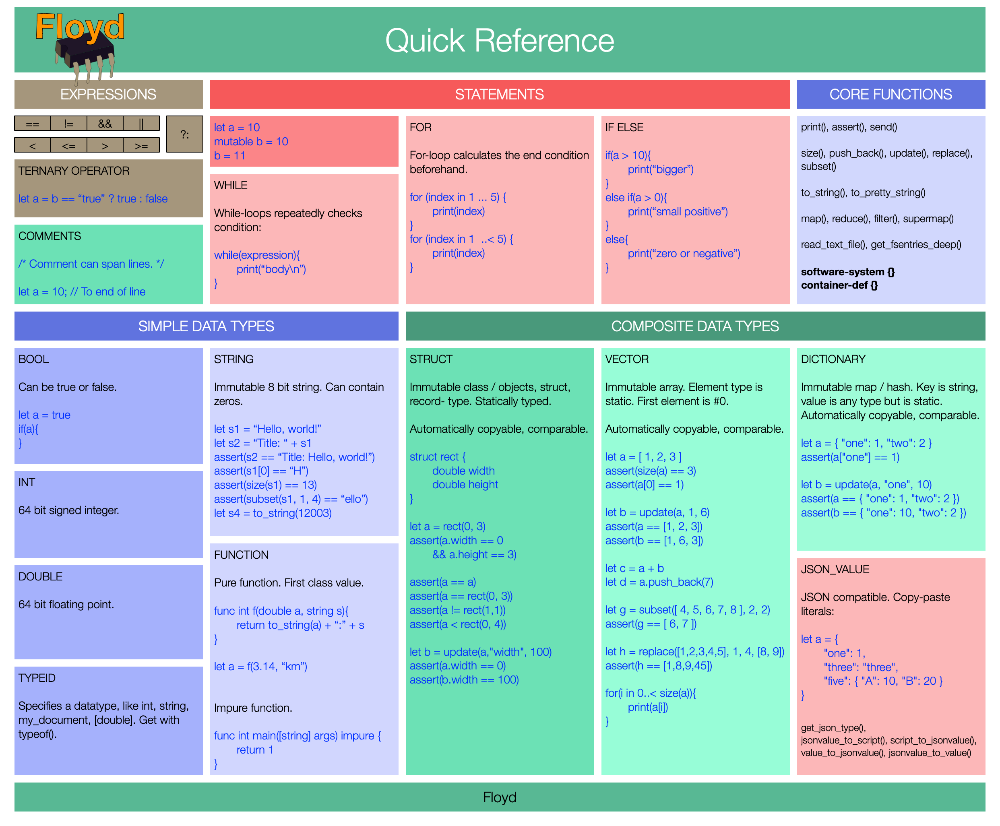

# FLOYD SPEAK

Floyd Speak is the programming language part of Floyd. It's an alternative to Java or Javascript or C++. Using Floyd Speak you write functions and data structures.




# TYPES

These are the primitive data types built into the language itself. The goal is that all the basics you need are already there in the language. This makes it easy to start making useful programs, you don't need to choose or build the basics. It allows composability since all libraries can rely on these types and communicate between themselves using them. Reduces need for custom types and glue code.

|Type		  	| Use
|---				|---	
|__bool__			|__true__ or __false__
|__int__			| Signed 64 bit integer
|__double__		| 64-bit floating point number
|__string__		| Built-in string type. 8-bit pure (supports embedded zeros). Use for machine strings, basic UI. Not localizable.
|__typeid__		| Describes the *type* of a value.
|__function__		| A function value. Functions can be Floyd functions or C functions. They are callable.
|__struct__		| Like C struct or classes or tuples. A value object.
|__vector__		| A continuous array of elements addressed via indexes.
|__dictionary__	| Lookup values using string keys.
|__json_value__	| A value that holds a JSON-compatible value, can be a big JSON tree.
|TODO POC: __sum-type__		| Tagged union.
|TODO 1.0: __float__		| 32-bit floating point number
|TODO 1.0: __int8__		| 8-bit signed integer
|TODO 1.0: __int16__		| 16-bit signed integer
|TODO 1.0: __int32__		| 32-bit signed integer

Notice that string has many qualities of an array of characters. You can ask for its size, access characters via [], etc.


# TRUE DEEP

True-deep is a Floyd term that means that all values and sub-values are always considered in operations in any type of nesting of structs and values and collections. This includes equality checks or assignment, for example.

The order of the members inside the struct (or collection) is important for sorting since those are done member by member from top to bottom.


# CORE TYPE FEATURES

These are features built into every type: integer, string, struct, dictionary, etc. They are true-deep.

|Expression		| Explanation
|---				|---	
|__a = b__ 		| This true-deep copies the value b to the new name a.
|__a == b__		| a exactly the same as b
|__a != b__		| a different to b
|__a < b__		| a smaller than b
|__a <= b__ 		| a smaller or equal to b
|__a > b__ 		| a larger than b
|__a >= b__ 		| a larger or equal to b


# SOURCE CODE FILES

Floyd Speak files are always utf-8 files with no BOM. Their extension is ".floyd".


# VALUES, VARIABLES AND CONSTANTS

All "variables" aka values are immutable.

- Function arguments
- Function local variables
- Member variables of structs, etc.

Floyd is statically typed, which means every variable only supports a specific type of value.

When defining a variable you can often skip telling which type it is, since the type can be deduced by the Floyd compiler.

Explicit

```
	let int x = 10
```

Implicit

```
	let y = 11
```


Example:

```
	int main(){
		let a = "hello"
		a = "goodbye"	//	Runtime error - you cannot change variable a.
		return 3
	}
```

You can use "mutable" to make a local variable changeable.

```
	int main(){
		mutable a = "hello"
		a = "goodbye"	//	Changes variable a to "goodbye".
		return 3
	}
```

# GLOBAL SCOPE

Here you normally define functions, structs and global constants. The global scope can have almost any statement and they execute at program start, before main() is called. You don't even need a main function if you don't want it.


__main()__ This function is called by the host when program starts. You get the input arguments from the outside world (command line arguments etc) and you can return an integer to the outside.


# FUNCTIONS

Functions in Floyd are by default *pure*, or *referential transparent*. This means they can only read their input arguments and constants, never read or modify anything: not global variables, not by calling another, impure function. It's not possible to call a function with a set of arguments and later call it with the same argument and get a different result. A function like get_time() is impure.

While a function executes, it perceives the outside world to stand still.

Functions always return exactly one value. Use a struct to return more values.

A function without return value usually makes no sense since function cannot have side effects. Possible uses would be logging, asserting or throwing exceptions.

Example definitions of functions:

```
	func int f1(string x){
		return 3
	}

	func int f2(int a, int b){
		return 5
	}

	func int f3(){	
		return 100
	}

	func string f4(string x, bool y){
		return "<" + x + ">"
	}
```

Function types:

```
	func bool (string, double)
```


This is a function that takes a function value as argument:

```
	func int f5(func bool (string, string))
```

This is a function that returns a function value:

```
	func bool (string, string) f5(int x)
```


# EXPRESSIONS

Reference: http://www.tutorialspoint.com/cprogramming/c_operators.htm
Comparisons are true-deep: they consider all members and also member structs and collections.

### Arithmetic Operators
How to add and combine values:

```
+	Addition - adds two operands: "a = b + c", "a = b + c + d"
−	Subtracts second operand from the first. "a = b - c", "a = b - c - d"
*	Multiplies both operands: "a = b * c", "a = b * c * d"
/	Divides numerator by de-numerator: "a = b / c", "a = b / c / d"
%	Modulus Operator and remainder of after an integer division: "a = b / c", "a = b / c / d"
```

#### Relational Operators
Used to compare two values. The result is true or false:

```
	a == b					true if a and b have the same value
	a != b				true if a and b have different values
	a > b				true if the value of a is greater than the value of b
	a < b				true if the value of a is smaller than the value of b
	a >= b
	a <= b
```

### Logical Operators
Used to compare two values. The result is true or false:

```
	a && b
	a || b
```

### Conditional Operator
```
	condition ? a : b
```

When the condition is true, this entire expression has the value of a. Else it has the value of b. Condition, a and b can all be complex expressions, with function calls, etc.

```
	func bool is_polite(string x){
		return x == "hello" ? "polite" : "rude"
	}
	assert(is_polity("hiya!") == false)
	assert(is_polity("hello") == true)
```


# IF - THEN - ELSE -- STATEMENT

This is a normal if-elseif-else feature, like in most languages. Brackets are required always.

```
		if (s == "one"){
			return 1
		}
```

You can add an else body like this:

```
		if(s == "one"){
			return 1
		}
		else{
			return -1
		}
```

Else-if lets you avoid big nested if-else statements and do this:

```
		if(s == "one"){
			return 1
		}
		else if(s == "two"){
			return 2
		}
		else{
			return -1
		}
```

In each body you can write any statements. There is no "break" keyword.


# MATCH

TODO POC


# FOR LOOPS

For-loops are used to execute a body of statements many times. The number of times is calculated while the program runs. The entire condition expression is evaluated *before* the first time the body is called. This means the program already decided the number of loops to run before running the first loop iteration.

Closed range that starts with 1 and ends with 5:

```
	for (index in 1...5) {
		print(index)
	}
```

Open range that starts with 1 and ends with 59:

```
	for (tickMark in 0..<60) {
	}
```

You can use expressions for range:

```
	for (tickMark in a..<string.size()) {
	}
```


Above snippet simulates the for loop of the C language but it works a little differently. There is always exactly ONE loop variable and it is defined and inited in the first section, checked in the condition section and incremented / updated in the third section. It must be the same symbol.
The result is the equivalent to

```
	let b = 3
	{ a = 0; print(a + b) }
	{ a = 1; print(a + b) }
	{ a = 2; print(a + b) }
```

The loop is expanded before the first time the body is called. There is no way to have any other kind of condition expression, that relies on the result of the body, etc.

- init: must be an assignment statement for variable X.
- condition: Must be a bool expression with only variable X. Is executed before each time body is executed. 
- advance-statement: must be an assignment statement to X.
- body: this is required and must have brackets. Brackets can be empty, like "{}".


# WHILE LOOPS

```
	while (my_array[a] != 3){
	}
```

- condition: executed each time before body is executed. If the condition is false initially, then zero loops will run.


# STRING

This is a pure 8-bit string type. It is immutable. You can compare with other strings, copy it using = and so on. There is a small kit of functions for changing and processing strings.

The encoding of the characters in the string is undefined. You can put 7-bit ASCII in them or UTF-8 or something else. You can also use them as fast arrays of bytes.

You can make string literals directly in the source code like this:

	let a = "Hello, world!"

Notice: You cannot use any escape characters, like in the C-language.

All comparison expressions work, like a == b, a < b, a >= b, a != b and so on.

You can access a random character in the string, using its integer position.

	let a = "Hello"[1]
	assert(a == "e")

Notice 1: You cannot modify the string using [], only read. Use update() to change a character.
Notice 2: Floyd returns the character as an int, which is 64 bit signed.

You can append to strings together using the + operation.

	let a = "Hello" + ", world!"
	assert(a == "Hello, world!"


### CORE FUNCTIONS

- __print()__: prints a string to the default output of the app.
- __update()__: changes one character of the string and returns a new string.
- __size()__: returns the number of characters in the string, as an integer.
- __find()__: searches from left to right after a substring and returns its index or -1
- __push_back()__: appends a character or string to the right side of the string. The character is stored in an int.
- __subset__: extracts a range of characters from the string, as specified by start and end indexes. aka substr()
- __replace()__: replaces a range of a string with another string. Can also be used to erase or insert.


# VECTOR

A vector is a collection of values where you lookup the values using an index between 0 and (vector size - 1). The positions in the vector are called "elements". The elements are ordered. Finding an element at a position uses constant time. In other languages vectors are called "arrays" or even "lists".


You can make a new vector and specify its elements directly, like this:

	let a = [ 1, 2, 3]

You can also calculate elements:

	let a = [ calc_pi(4), 2.1, calc_bounds() ]


You can put ANY type of value into a vector: integers, doubles, strings, structs, other vectors and so on. But all elements must be the same type inside a specific vector.

You can copy vectors using =. All comparison expressions work, like a == b, a < b, a >= b, a != b and similar. Comparisons will compare each element of the two vectors.

This lets you access a random element in the vector, using its integer position.

	let a = [10, 20, 30][1]
	assert(a == 20)

Notice: You cannot modify the vector using [], only read. Use update() to change an element.

You can append to vector together using the + operation.

	let a = [ 10, 20, 30 ] + [ 40, 50 ]
	assert(a == [ 10, 20, 30, 40, 50 ])

### CORE FUNCTIONS

- __print()__: prints a vector to the default output of the app.
- __update()__: changes one element of the vector and returns a new vector.
- __size()__: returns the number of elements in the vector, as an integer.
- __find()__: searches from left to right after a sub-vector and returns its index or -1
- __push_back()__: appends an element to the right side of the vector.
- __subset__: extracts a range of elements from the vector, as specified by start and end indexes.
- __replace()__: replaces a range of a vector with another vector. Can also be used to erase or insert.


# DICTIONARY

A collection that maps a key to a value. It is not sorted. Like a C++ map. 

You make a new dictionary and specify its elements like this:

	let [string: int] a = {"red": 0, "blue": 100,"green": 255}

or shorter:

	b = {"red": 0, "blue": 100,"green": 255}

Dictionaries always use string-keys. When you specify the type of dictionary you must always include "string".

	struct test {
		{string: int} _my_dict
	}

You can put any type of value into the dictionary (but not mix inside the same dictionary).

Use [] to look up elements using a key. It throws an exception is the key not found. Use exists() first.

You copy dictionaries using = and all comparison expressions work.


### CORE FUNCTIONS

- __print()__: prints a vector to the default output of the app.
- __update()__: changes one element of the dictionary and returns a new dictionary
- __size()__: returns the number of elements in the dictionary, as an integer.
- __exists()__: checks to see if the dictionary holds a specific key
- __erase()__: erase a specific key from the dictionary and returns a new dictionary


# STRUCTs - THE BASICS

Structs are the central building block for composing data in Floyd. They are used in place of structs and classes in other programming languages. Structs are always values and immutable. They are still fast and compact: behind the curtains copied structs  shares state between them, even when partially modified.

#### Automatic features of every struct:

- constructor -- this is the only function that can create a value of the struct. It always requires every struct member, in the order they are listed in the struct definition. Make explicit function that makes making values more convenient.
- destructor -- will destroy the value including member values, when no longer needed. There are no custom destructors.
- Comparison operators: == != < > <= >= (this allows sorting too)
- Reading member values.
- Modify member values

There is no concept of pointers or references or shared structs so there are no problems with aliasing or side effects caused by several clients modifying the same struct.

This all makes simple structs extremely simple to create and use.

#### Not possible:

- You cannot make constructors. There is only *one* way to initialize the members, via the constructor, which always takes *all* members
- There is no way to directly initialize a member when defining the struct.
- There is no way to have several different constructors, instead create explicit functions like make_square().
- If you want a default constructor, implement one yourself: ```rect make_zero_rect(){ return rect(0, 0) }```.
- There is no aliasing of structs -- changing a struct is always invisible to all other code that has copies of that struct.


Example:

```
	//	Make simple, ready-for use struct.
	struct rect {
		double width
		double height
	}

	//	Try the new struct:

	let a = rect(0, 3)
	assert(a.width == 0)
	assert(a.height == 3)

	let b = rect(0, 3)
	let c = rect(1, 3)

	assert(a == a)
	assert(a == b)
	assert(a != c)
	assert(c > a)
```

A simple struct works almost like a collection with fixed number of named elements. It is only possible to make new instances by specifying every member or copying / modifying an existing one.


### UPDATE()

let b = update(a, member, value)


```
	//	Make simple, ready-for use struct.
	struct rect {
		double width
		double height
	}

	let a = rect(0, 3)

	//	Nothing happens! Setting width to 100 returns us a new rect but we we don't keep it.
	update(a,"width", 100)
	assert(a.width == 0)

	//	Modifying a member creates a new instance, we assign it to b
	let b = update(a,"width", 100)

	//	Now we have the original, unmodified a and the new, updated b.
	assert(a.width == 0)
	assert(b.width == 100)
```

This works with nested values too:


```
	//	Define an image-struct that holds some stuff, including a pixel struct.
	struct image { string name; rect size }

	let a = image("Cat image.png", rect(512, 256))

	assert(a.size.width == 512)

	//	Update the width-member inside the image's size-member. The result is a brand new image, b!
	let b = update(a, "size.width", 100)
	assert(a.size.width == 512)
	assert(b.size.width == 100)
```


# PROTOCOLS

TODO 1.0


# UPDATE

TODO 1.0
Update nested collections and structs.


# EXCEPTIONS

TODO 1.0
Throw exception. Built in types, free noun. Refine, final.


# COMMENTS AND DOCUMENTATION


Use comments to write documentation, notes or explanations in the code. Comments are not executed or compiled -- they are only for humans. You often use the comment features to disable / hide code from the compiler.

Two types of comments:


You can wrap many lines with "/*...*/" to make a big section of documentation or disable many lines of code. You can nest comments, for example wrap a lot of code with existing comments with /* ... */ to disable it.

	/*	This is a comment */


Everything between // and newline is a comment:

	//	This is an end-of line comment
	let a = "hello" //	This is an end of line comment.


# TYPEID

A typeid is tells the type of a value.

When you reference one of the built in primitive types by name, you are accessing a variable of type typeid.

- bool
- int
- double
- string

```
	assert(typeid("hello") == string)
	assert(to_string(typeid([1,2,3])) == "[int]")
```

A typeid is a proper Floyd value: you can copy it, compare it, convert it to strings, store it in dictionaries or whatever.


# JSON_VALUE

JSON is very central to Floyd. JSON is a way to store composite values in a tree shape in a simple and standardized way. Since Floyd mainly works with values this is a perfect match for serializing any Floyd value to text and back. It is built directly into the language as the default serialized format for Floyd values. If can be used for custom file format and protocol and to interface with other JSON-based systems. All structs also automatically are serializable to and from JSON automatically.

JSON format is also used by the compiler and language itself to store intermediate Floyd program code, for all logging and for debugging features.

- Floyd has built in support for JSON in the language. It has a JSON type called __json_value__ and functions to pack & unpack strings / JSON files into the JSON type.

- Floyd has support for JSON literals: you can put JSON data directly into a Floyd file. Great for copy-pasting snippets for tests.

Read more about JSON here: www.json.org


This value can contain any of the 6 JSON-compatible value:

- string
- number
- object
- array
- true / false
- null


__json_value__: 	This is an immutable value containing any JSON. You can query it for its contents and alter it (you get new values).

Notice that json_value can contain an entire huge JSON file, with a big tree of JSON objects and arrays and so on. A json_value can also contain just a string or a number or a single JSON array of strings. The json_value is used for every node in the json_value tree.


### JSON LITERALS

You can directly embed JSON inside source code file. Simple / no escaping needed. Just paste a snippet into the Floyd source code. Use this for test values. Round trip. Since the JSON code is not a string literal but actual Floyd syntax, there are not problems with escaping strings. The Floyd parser will create floyd strings, dictionaries and so on for the JSON data. Then it will create a json_value from that data. This will validate that this indeed is correct JSON data or an exception is thrown.

This all means you can write Floyd code that at runtime creates all or parts of a composite JSON value. Also: you can nest JSONs in each other.

Example JSON:

	let json_value a = 13
	let json_value b = "Hello!"
	let json_value c = {"hello": 1, "bye": 3}
	let json_value d = { "pigcount": 3, "pigcolor": "pink" }

	assert(a == 13)
	assert(b == "Hello!")
	assert(c["hello"] == 1)
	assert(c["bye"] == 3)
	assert(size(c) == 2)

	let test_json2 = json_value(
		{
			"one": 1,
			"two": 2,
			"three": "three",
			"four": [ 1, 2, 3, 4 ],
			"five": { "alpha": 1000, "beta": 2000 },
			"six": true,
			"seven": false,
		}
	)

Notice that JSON objects are more lax than Floyd: you can mix different types of values in the same object or array. Floyd is stricter: a vector can only hold one type of element, same with dictionaries.


### __get\_json\_type()__:

Returns the actual type of this value stores inside the json_value. It can be one of the types supported by JSON.

	typeid get_json_type(json_value v)

This is how you check the type of JSON value and reads their different values.

|Input						| Result 		| Int
|---						| ---			|---
| json_value({"a": 1})		| json_object	| 1
| json_value([1, 2, 3])		| json_array	| 2
| json_value("hi")			| json_string	| 3
| json_value(13)			| json_number	| 4
| json_value(true)			| json_true		| 5
| json_value(false)			| json_false	| 6
| 							| json_null		| 7


Demo snippet, that checks type of a json_value:

```
	func string get_name(json_value value){
		let t = get_json_type(value)
		if(t == json_object){
			return "json_object"
		}
		else if(t == json_array){
			return "json_array"
		}
		else if(t == json_string){
			return "json_string"
		}
		else if(t == json_number){
			return "json_number"
		}
		else if(t == json_true){
			return "json_true"
		}
		else if(t == json_false){
			return "json_false"
		}
		else if(t == json_null){
			return "json_null"
		}
		else {
			assert(false)
		}
	}
	
	assert(get_name(json_value({"a": 1, "b": 2})) == "json_object")
	assert(get_name(json_value([1,2,3])) == "json_array")
	assert(get_name(json_value("crash")) == "json_string")
	assert(get_name(json_value(0.125)) == "json_number")
	assert(get_name(json_value(true)) == "json_true")
	assert(get_name(json_value(false)) == "json_false")
```


### CORE FUNCTIONS

Many of the core functions work with json_value, but it often depends on the actual type of json_value. Example: size() works for strings, arrays and object only.

- __get\_json\_type()__
- __pretty_string()__
- __size()__
- __encode_json()__
- __decode_json()__
- __flatten\_to\_json()__
- __unflatten\_from\_json()__


# AUTOMATIC SERIALIZATION

Serializing any Floyd value is a built in mechanism. It is always true-deep. The result is always a normalized JSON text file in a Floyd string.


Converting a floyd json_value to a JSON string and back. The JSON-string can be directly read or written to a text file, sent via a protocol and so on.

	string encode_json(json_value v)
	json_value decode_json(string s)


Converts any Floyd value, (including any type of nesting of custom structs, collections and primitives) into a json_value, storing enough info so the original Floyd value can be reconstructed at a later time from the json_value, using unflatten_from_json().

	json_value flatten_to_json(any v)
	any unflatten_from_json(json_value v)


- __encode_json()__
- __decode_json()__
- __flatten\_to\_json()__
- __unflatten\_from\_json()__


# FUNCTION TOOLBOX

These are built in primitives you can always rely on being available.


### map(), filter(), reduce()

TODO POC: Implement

Expose possible parallelism of pure function, like shaders, at the code level (not declarative). The supplied function must be pure.


### supermap()

TODO 1.0

	[int:R] supermap(tasks: [T, [int], f: R (T, [R]))

This function runs a bunch of tasks with dependencies between them. When supermap() returns, all tasks have been executed.

- Tasks can block.
- Tasks cannot generate new tasks. A task *can* call supermap.
- Task will not start until all its dependencies have been finished.

- **tasks**: a vector of tasks and their dependencies. A task is a value of type T. T can be an enum to allow mixing different types of tasks. Each task also has a vector of integers tell which other tasks it depends upon. The indexes are the indexes into the tasks-vector.

- **f**: this is your function that processes one T and returns a result R. The function must not depend on the order in which tasks execute. When f is called, all the tasks dependency tasks have already been executed and you get their results in [R].

- **result**: a vector with one element for each element in the tasks-argument. The order of the elements are undefined. The int specifies which task, the R is its result.

Notice: your function f can send messages to a clock — this means another clock can start consuming results while supermap() is still running.

Notice: using this function exposes potential for parallelism.

??? IDEA: Make this a two-step process. First analyze the tasks into an execution description. Then use that description to run the tasks. ??? IDEA: Allows grouping small tasks into lumps. Allow you to reuse the dependency graph but tag some tasks NOP. This lets you keep the execution description for next time, if tasks are the same. Also lets you inspect the execution description and improve it or create one for scratch.


### print()

This outputs one line of text to the default output of the application. It can print any type of value. If you want to compose output of many parts you need to convert them to strings and add them. Also works with types, like a struct-type.

	print(any)


| Example										| Result |
|---											| ---
| print(3)										| 3
| print("shark")								| shark
| print("Number four: " + to_string(4))			| Number four: 4
| print(int)									| int
| print([int])									| [int]
| print({string: double})						| {string:double}
| print([7, 8, 9])								| [7, 8, 9]
| print({"a": 1})								| {"a": 1}
| print(json_value("b"))						| b
| print(json_value(5.3))						| 5.3
| print(json_value({"x": 0, "y": -1}))			| {"a": 0, "b": -1}
| print(json_value(["q", "u", "v"]))			| ["q", "u", "v"]
| print(json_value(true))						| true
| print(json_value(false))						| false
| print(json_value(null))						| null


### assert()

Used this to check your code for programming errors, and check the inputs of your function for miss use by its callers.

	assert(bool)


If the expression evaluates to false, the program will log to the output, then be aborted via an exception.


### probe()

TODO POC

In your code you write probe(my_temp, "My intermediate value", "key-1") to let clients log my_temp. The probe will appear as a hook in tools and you can chose to log the value and make stats and so on. Argument 2 is a descriptive name, argument 3 is a string-key that is scoped to the function and used to know if several probe()-statements log to the same signal or not.


### to_string()

Converts its input to a string. This works with any type of values. It also works with types, which is useful for debugging.

	string to_string(any)

You often use this function to convert numbers to strings.


### to\_pretty\_string()

Converts its input to a string of JSON data that is formatted nicely with indentations. It works with any Floyd value.


#### typeof()

Return the type of its input value. The returned typeid-value is a complete Floyd type and can be stored, compared and so on.

	typeid typeof(any)


### get\_time\_of\_day()

Returns the computer's realtime clock, expressed in the number of milliseconds since system start. Useful to measure program execution. Sample get_time_of_day() before and after execution and compare them to see duration.

	int get_time_of_day()


### update()

This is how you modify a field of a struct, an element in a vector or string or a dictionary. It replaces the value of the specified key and returns a completely new object. The original object (struct, vector etc) is unchanged.

	let obj_b = update(obj_a, key, new_value)


|Type		  	| Example						| Result |
|---			|---							| ---
| string		| update("hello", 3, 120)		| "helxo"
| vector		| update([1,2,3,4], 2, 33)		| [1,2,33,4]
| dictionary	| update({"a": 1, "b": 2, "c": 3}, "a", 11) | {"a":11,"b":2,"c":3}
| struct		| update(pixel,"red", 123)		| pixel(123,---,---)
| json_value:array		| 
| json_value:object		| 

For dictionaries it can be used to add completely new elements too.

|Type		  	| Example						| Result
|---			|---							| ---
| dictionary	| update({"a": 1}, "b", 2] | {"a":1,"b":2}


### size()

Returns the size of a collection -- the number of elements.

	int size(obj)

|Type		  		| Example					| Result
|---				|---						| ---
| string			| size("hello")				| 5
| vector			| size([1,2,3,4])			| 4
| dictionary		| size({"a": 1, "b": })		| 2
| struct			|							|
| json_value:array	| size(json_value([1,2,3])	| 3
| json_value:object	| size(json_value({"a": 9})	| 1


### find()

Searched for a value in a collection and returns its index or -1.

	int find(obj, value)

|Type		  	| Example						| Result |
|---			|---							| ---
| string		| find("hello", "o")			| 4
| string		| find("hello", "x")			| -1
| vector		| find([10,20,30,40], 30)		| 2
| dictionary	| 								|
| struct		|								|
| json_value:array	|							|
| json_value:object	| 							|


### exists()

Checks if the dictionary has an element with this key. Returns true or false.

	bool exists(dict, string key)

|Type		  	| Example						| Result |
|---			|---							| ---
| string		| 								|
| vector		| 								|
| dictionary	| exists({"a":1,"b":2,"c":3), "b")	| true
| dictionary	| exists({"a":1,"b":2,"c":3), "f")	| false
| struct		|								|
| json_value:array	|							|
| json_value:object	| 							|


### erase()

Erase an element in a dictionary, as specified using its key.


	dict erase(dict, string key)


### push_back()

Appends an element to the end of a collection. A new collection is returned, the original unaffected.

|Type		  	| Example						| Result |
|---			|---							| ---
| string		| push_back("hello", 120)		| hellox
| vector		| push_back([1,2,3], 7)			| [1,2,3,7]
| dictionary	| 								|
| struct		|								|
| json_value:array	|							|
| json_value:object	| 							|


### subset()

This returns a range of elements from the collection.

	string subset(string a, int start, int end)
	vector subset(vector a, int start, int end)

start: 0 or larger. If it is larger than the collection, it will be clipped to the size.
end: 0 or larger. If it is larger than the collection, it will be clipped to the size.


|Type		  	| Example						| Result |
|---			|---							| ---
| string		| subset("hello", 2, 4)			| ll
| vector		| subset([10,20,30,40, 1, 3)	| [20,30]
| dictionary	| 								|
| struct		|								|
| json_value:array	|							|
| json_value:object	| 							|


### replace()

Replaces a range of a collection with the contents of another collection.

	string replace(string a, int start, int end, string new)
	vector replace(vector a, int start, int end, vector new)


|Type		  	| Example						| Result |
|---			|---							| ---
| string		|replace("hello", 0, 2, "bori")	| borillo
| vector		|replace([1,2,3,4,5], 1, 4, [8, 9])	| [1,8,9,45]
| dictionary	| 								|
| struct		|								|
| json_value:array	|							|
| json_value:object	| 							|


Notice: if you use an empty collection for *new*, you will actually erase the range.
Notice: by specifying the same index in *start* and *length* you will __insert__ the new collection into the existing collection.


### get\_env\_path()

Returns user's home directory, like "/Volumes/Bob".

	string get_env_path()


### read\_text\_file()

Reads a text file from the file system and returns it as a string.

	string read_text_file(string path)


### write\_text\_file()

Write a string to the file system as a text file.

	void write_text_file(string path, string data)


# FLOYD SYNTAX
Here is the DAG for the complete syntax of Floyd.

	IDENTIFIER_CHARS: "abcdefghijklmnopqrstuvwxyzABCDEFGHIJKLMNOPQRSTUVWXYZ0123456789_"
	WHITESPACE: " \n\t"

	LITERAL:
		BOOL_LITERAL: "true" or "false"
		INTEGER_LITERAL: [0123456789]
		DOUBLE_LITERAL: [0123456789.]
		STRING_LITERAL: "?"
	IDENTIFIER: IDENTIFIER_CHARS*

	TYPE:
		NULL							"null"
		BOOL							"bool"
		INT								"int"
		DOUBLE							"double"
		STRING							"string"
		TYPEID							???
		VECTOR							"[" TYPE "]"
		DICTIONARY						"{" TYPE ":" TYPE" "}"
		FUNCTION-TYPE					TYPE "(" ARGUMENT ","* ")" "{" BODY "}"
			ARGUMENT					TYPE identifier
		STRUCT-DEF						"struct" IDENTIFIER "{" MEMBER* "}"
			MEMBER						 TYPE IDENTIFIER
		UNNAMED-STRUCT					"struct" "{" TYPE* "}"

		UNRESOLVED-TYPE					IDENTIFIER-CHARS, like "hello"

	EXPRESSION:
		EXPRESSION-COMMA-LIST			EXPRESSION | EXPRESSION "," EXPRESSION-COMMA-LIST
		NAME-EXPRESSION					IDENTIFIER ":" EXPRESSION
		NAME-COLON-EXPRESSION-LIST		NAME-EXPRESSION | NAME-EXPRESSION "," NAME-COLON-EXPRESSION-LIST

		TYPE-NAME						TYPE IDENTIFIER
		TYPE-NAME-COMMA-LIST			TYPE-NAME | TYPE-NAME "," TYPE-NAME-COMMA-LIST
		TYPE-NAME-SEMICOLON-LIST		TYPE-NAME ";" | TYPE-NAME ";" TYPE-NAME-SEMICOLON-LIST

		NUMERIC-LITERAL					"0123456789" +++
		RESOLVE-IDENTIFIER				IDENTIFIER +++

		CONSTRUCTOR-CALL				TYPE "(" EXPRESSION-COMMA-LIST ")" +++

		VECTOR-DEFINITION				"[" EXPRESSION-COMMA-LIST "]" +++
		DICT-DEFINITION					"[" NAME-COLON-EXPRESSION-LIST "]" +++
		ADD								EXPRESSION "+" EXPRESSION +++
		SUB								EXPRESSION "-" EXPRESSION +++
										EXPRESSION "&&" EXPRESSION +++
		RESOLVE-MEMBER					EXPRESSION "." EXPRESSION +++
		GROUP							"(" EXPRESSION ")"" +++
		LOOKUP							EXPRESSION "[" EXPRESSION "]"" +++
		CALL							EXPRESSION "(" EXPRESSION-COMMA-LIST ")" +++
		UNARY-MINUS						"-" EXPRESSION
		CONDITIONAL-OPERATOR			EXPRESSION ? EXPRESSION : EXPRESSION +++

	STATEMENT:
		BODY							"{" STATEMENT* "}"

		RETURN							"return" EXPRESSION
		DEFINE-STRUCT					"struct" IDENTIFIER "{" TYPE-NAME-SEMICOLON-LIST "}"
		DEFINE-FUNCTION				 	"func" TYPE IDENTIFIER "(" TYPE-NAME-COMMA-LIST ")" BODY
		IF								"if" "(" EXPRESSION ")" BODY "else" BODY
		IF-ELSE							"if" "(" EXPRESSION ")" BODY "else" "if"(EXPRESSION) BODY "else" BODY
		FOR								"for" "(" IDENTIFIER "in" EXPRESSION "..." EXPRESSION ")" BODY
		FOR								"for" "(" IDENTIFIER "in" EXPRESSION "..<" EXPRESSION ")" BODY
		WHILE 							"while" "(" EXPRESSION ")" BODY

 		BIND-IMMUTABLE-TYPED			"let" TYPE IDENTIFIER "=" EXPRESSION
 		BIND-IMMUTABLE-DEDUCETYPE		"let" IDENTIFIER "=" EXPRESSION
 		BIND-MUTABLE-TYPED				"mutable" TYPE IDENTIFIER "=" EXPRESSION
 		BIND-MUTABLE-DEDUCETYPE			"mutable" IDENTIFIER "=" EXPRESSION
		EXPRESSION-STATEMENT 			EXPRESSION
 		ASSIGNMENT	 					IDENTIFIER "=" EXPRESSION


### EXAMPLE BIND AND ASSIGNMENT STATEMENTS

|Source		| Meaning
|:---		|:---	
| mutable int a = 10				| Allocate a mutable local int "a" and initialize it with 10
| let int b = 11				| Allocate an immutable local int "b" and initialize it with 11
| let c = 11				| Allocate an immutable local "b" and initialize it with 11. Type will be deduced to int.
| a = 12						| Assign 12 to local mutable "a".
| let d = 8.5				| Allocate an immutable local "d" and initialize it with 8.5. Type will be deduced to double.
| let e = "hello"				| Allocate an immutable local "e" and initialize it with "hello". Type will be deduced to string.
| let f = f(3) == 2		| Allocate an immutable local "f" and initialize it true/false. Type will be bool.

| let pixel x = 20 |
| let int x = {"a": 1, "b": 2} |
| let  int x = 10 |
| let int (string a) x = f(4 == 5) |
| mutable int x = 10 |


### EXAMPLE RETURN STATEMENTS

|Source		| Meaning
|:---	|:---	
| return 3						|
| return myfunc(myfunc() + 3) |


### EXAMPLE FUNCTION DEFINITION STATEMENTS

|Source		| Meaning
|:---	|:---	
| func int f(string name){ return 13 |
| func int print(float a) { ... }			|
| func int print (float a) { ... }			|
| func int f(string name)					|


### EXAMPLE IF STATEMENTS

|Source		| Meaning
|:---	|:---	
| if(true){ return 1000 } else { return 1001 } [


### EXAMPLE OF STRUCT DEFINITION STATEMENTS

|Source		| Meaning
|:---	|:---	
| struct mytype_t { float a float b } | 
| struct a {} 						|
| struct b { int a }					|
| struct c { int a = 13 }				|
| struct pixel { int red int green int blue }		|
| struct pixel { int red = 255 int green = 255 int blue = 255 }|


### EXAMPLE EXPRESSIONS

|Source		| Meaning
|:---	|:---	
| 0											|
| 3											|
| 3.5										|
| (3)										|
| 3 + 4										|
| (1 + 2) * 3									|
| x											|
| x + y										|
| hello + 3									|
| "test"										|
| "test number"								|
| f()										|
| f(10, 122)									|
| print(3)									|
| print (3) 									|
| print ("Hello, World!")						|
| print("Hello, World!" + f(3) == 2)				|
| (my\_fun1("hello, 3) + 4) * my_fun2(10))		|	
| hello[\"troll\"].kitty[10].cat					|
| condition_expr ? yesexpr : noexpr				|
| condition_expr ? yesexpr : noexpr				|
| a == 1 ? "one" : ”some other number"			|


### EXAMPLE TYPE DECLARATIONS

|Source		| Meaning
|:---	|:---	
| bool								| Bool type
| int								| Int type
| string								| String type
| [int]								| Vector of ints
| [[int]]								| Vector of int-vectors
| [string:int]						| Dictionary of ints
| int ()								| Function returning int, no arguments
| int (double a, string b)				| Function returning int, arguments are double and string
| [int (double a, string b)]			| vector of functions, were function returns int and takes double and string arg.
| int (double a) ()					| Function A with no arguments, that returns a function B. B returns int and has a double argument.
| my_global							| name of custom type
| [my_global]							| vector of custom type
| mything (mything a, mything b)			| function returning mything-type, with two mything arguments
| bool (int (double a) b)				| function returns bool and takes argument of type: function that returns in and take double-argument.

