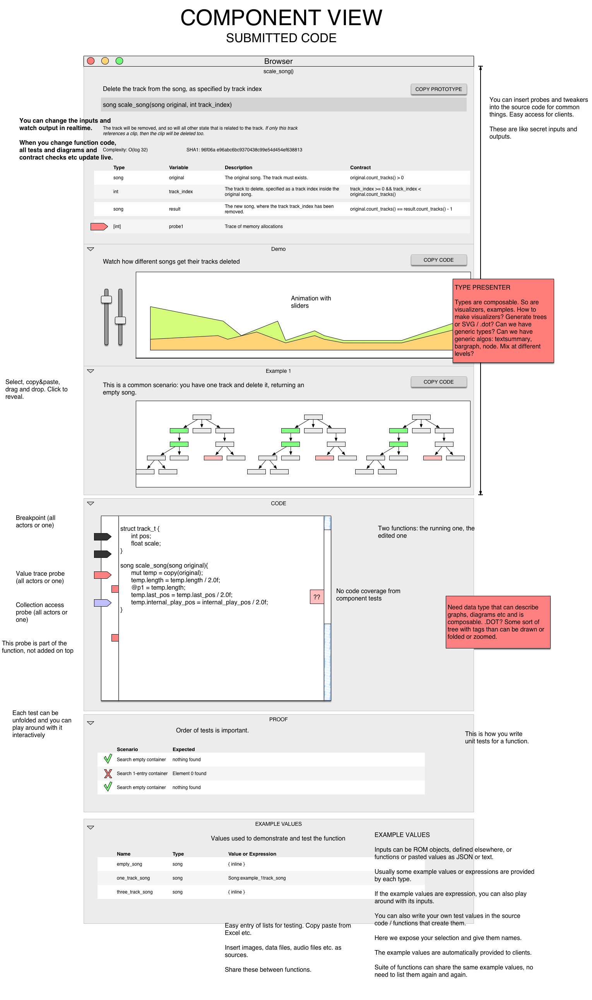

# FLOYD STUDIO

TODO: This is a rough mockup of the interactive tool.

This document describes the visual and interactive development environment for Floyd.

You need to learn about Floyd Speak and Floyd Systems in their respective manuals. This document is only about the development editor itself.

The Floyd Studio is browser based and runs inside a web browser, like Google Chrome.

# SCENARIOS
You can run all the development tools locally or using a cloud service.

# MAIN VIEWS

- Function playground
- Container designer
- Systems profiler & debugger
- Software System Navigator

# COMPONENT PLAYGROUND

Here you work on or several Floyd Speak functions. You edit the code, add some documentation. You add your tests and make some examples. You can step through the code, show values as visual graphs and so on.

# CONTAINER DESIGNER

Here you drag impure components, make your own processes and wire them together into a concurrent system.

You can edit it while it is running, interactively. You can add probes to trace stats and diagrams.

You can add tweakers to optimize performance.

# ANALYZER

Profile, debug, add tweaks, explore.

# SOFTWARE SYSTEM NAVIGATOR
Explore the system from top to bottom, in a meaningful way.

