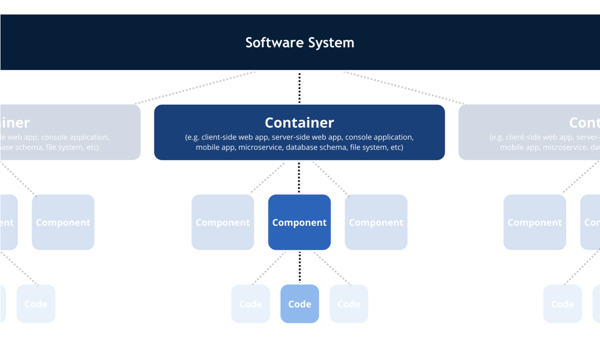
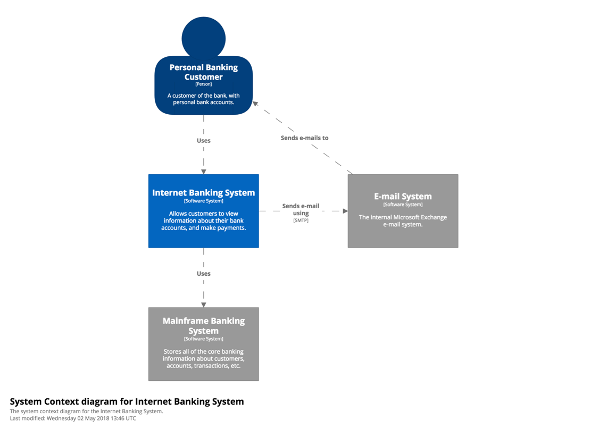
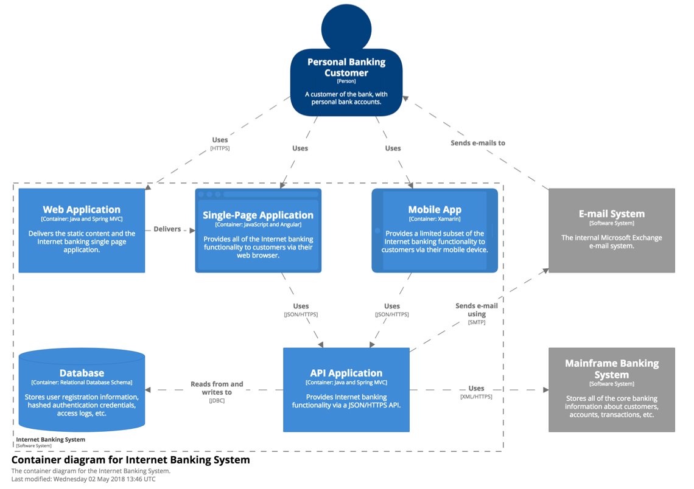
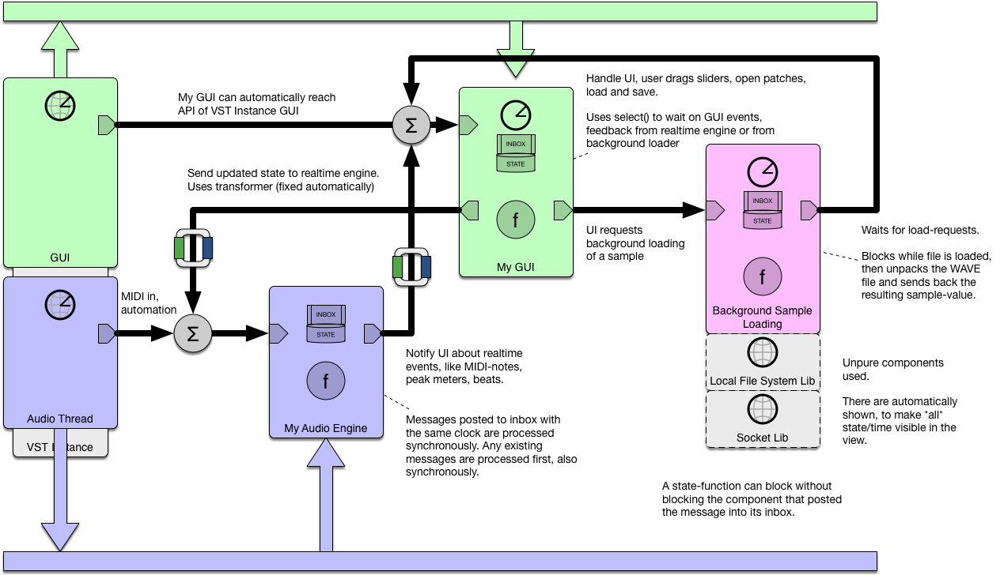

# FLOYD SYSTEMS MANUAL

Floyd Speak: this is the basic way to create logic. The code is isolated from the noise and troubles of the real world: everything is immutable and pure. Time does not advance. There is no concurrency or communication with other systems, no runtime errors.

Floyd Systems: this is how you make software that lives in the real world, where all those things happens all the time. Floyd allows you create huge, robust software systems that you can reason about, spanning computers and processes, handling communication and time advancing and faults. Floyd Systems are built on top of Floyd Speak logic.

Floyd uses the C4 model to organize all of this. Read more here: https://c4model.com/


GOALS

1. Allow you design reliable systems and reason about them. Systems with many computers, processes and threads -- concepts beyond functions, classes and modules. It represent those concepts through out: at the source code level, in debugger, in profiler and so on.
2. Provide simple and robust methods for doing concurrency, communication, parallelization, errors handling, etc.
3. Allow extreme performance and profiling capabilities.
4. Support next-gen visual programming and interactions.


# ABOUT PERFORMANCE

Floyd is designed to make it simple and practical to make big systems with performance better than what you get with average optimized C code.

It does this by splitting the design into two different concepts:

1. Encourage your logic and processing code to be simple and correct and to declare where there is opportunity to execute code independently of each other. This type of code is ideal to run in parallel or cache etc, like a shader in a graphics API.

2. At the top level, profile execution and make high-level improvements that dramatically alter how the code is *generated* and executed to run on the available hardware. Caching, collection type selection, batching, parallelization, ordering work for different localities, memory layouts and access patterns.

It is also simple to introduce more concurrency to create more opportunities to run computations in parallel.


# ABOUT C4 CONCEPTS

A complete system is organized into parts like this:





### PERSON

Represents various human users of your software system. Uses some sort of user interface to the Software System. For example a UI on an iPhone.


### SOFTWARE SYSTEM

Highest level of abstraction and describes something that delivers value to its users, whether they are human or not, can be composed of many computers working together.


### CONTAINER

A container represents something that hosts code or data. A container is something that needs to be running in order for the overall software system to work. A mobile app, a server-side web application, a client-side web application, a micro service: all examples of containers.

This is usually a single OS-process, with internal mutation, time, several threads. It looks for resources and knows how to string things together inside the container. The basic building blocks are components, built in ones and ones you program yourself.


### COMPONENT

Grouping of related functionality encapsulated behind a well-defined interface. Like a software integrated circuit or a code library. Does not span processes. JPEG library, JSON lib. Custom component for syncing with your server. Amazon S3 library, socket library.

A component can be fully pure. Pure components have no side effects, have no internal state and are passive, like a ZIP library or a matrix-math library.

Or they can be impure. Impure components may be active (detecting mouse clicks and calling your code) and may affect the world around you or give different results for each call and keeps their own internal state. get_time() and get_mouse_pos(), on_mouse_click(). read_directory_elements().

Pure components are preferable when possible.


### CODE

Classes. Instance diagram. Examples. Passive. Pure.


# ABOUT C4 DIAGRAMS

There is a set of standard diagram views for explaining and reasoning about your software. These lets you have a complete overview over your entire system and how users interact with it, then drill down to individual containers and further down to components and the code itself.




**Above, level 1: System Context diagram**




Above, level 2: Container diagram


Above, level 3: Component diagram


Above, level 4: Code


Notice: a component used in several containers or a piece of code that appears in several components will *appear in each*, appearing like they are duplicates. The perspective of the diagrams is **logic dependencies**. These diagrams don't show the physical dependencies -- which source files or libraries that depends on each other.


# MORE ABOUT CONTAINERS

Containers are where you spend most of your time along with writing the Floyd Speak code.

A mobile app is a container, so is the Django server on Heroku. A container is typically run as its own OS process.

The container *completely* defines *all* its: concurrency, state, communication with outside world and runtime errors of the container. This includes sockets, file systems, messages, screens, UI.

There are often sibling containers in your system, like a server for your mobile game or data on Amazon S3. Containers may be implemented some other way or maybe canned solutions like Amazon S3, but should still be represented in Floyd Systems.

Containers are data files: they list the needed containers and wires them together and adds a few other types of parts, like clocks and processes.

**Wires**: carry messages encoded as a Floyd value, typically a Floyd enum. Notice that the message can carry *any* of Floyd's types -- even huge multi-gigabyte nested structs or collections. Since they are immutable they can be passed around efficiently (internally this is done using their ID or hardware address).


**Processs** and **Clocks**: builtin mechanisms to define time and state.
**Probes** and **Tweakers**: these are added on top of a design. They allow you to augment a design with logging, profiling, breakpoints and do advanced performance optimizations.

Example of components you drop into your container:

- A component written in C
- Built in local file system component: Read and write files, rename directory, swap temp files (impure)
- SVG Lib component (pure)
- ImageLib component (pure)
- Built in S3 component (impure)
- Built in socket component (impure)
- Built in UI-component (impure)
- Built in command line component: Interfaces with command line arguments / returns (impure)
- Audio component that uses Direct X (impure)

Notice: these components are all non-singletons - you can make many instances in one container

The container's design is usually a one-off and cannot be composed into other containers. Almost always has side effects.


# MORE ABOUT CONCURRENCY AND TIME - INTRODUCING FLOYD PROCESSES

This is how you express time / mutation / concurrency in Floyd. These concepts are related and they are all setup at the top level of a container. In fact, this is the main **purpose** of a container.

A Floyd process is not the same thing as an OS process. A Floyd process is extremely light weight. It is sandboxed like an OS process since it cannot access data in other Floyd processes.

The goal with Floyd's concurrency model is:

1. Simple and robust pre-made mechanisms for real-world concurrency need. Avoid general-purpose primitives, have a ready made solution that works.
2. Composable.
3. Allow you to make a *static design* of your container and its concurrency and state.
4. Separate out parallelism into a separate mechanism.
5. Avoid problematic constructs like threads, locks, callback hell, nested futures and await/async -- dead ends of concurrency.
6. Let you control/tune how many threads and cores to use for what parts of the system, independently of the actual code.

Inspirations for Floyd's concurrency model are CSP, Erlang, Go routines and channels and Clojure Core.Async.


##### PROCESSES: INBOX, STATE, PROCESSING FUNCTION

For each independent mutable state and/or "thread" you want in your container, you need to insert a process. Processes are statically instantiated in a container -- you cannot allocate them at runtime.

The process represents a little standalone program with its own call stack that listens to messages from other processes. When a process receives a message in its inbox, its function is called (now or some time later) with the message and the process's previous state. The process does some work - something simple or a maybe call a big call tree or do blocking calls to the file system, and then it ends by returning its new state, which completes the message handling.

**The process feature is the only way to keep state in Floyd.**

Use a process if:

1. You want to be able to run work concurrently, like loading data in the background
2. You want a mutable state / memory
3. You want to model a system where things happens concurrently, like audio streaming vs main thread


The inbox is thread safe and it's THE way to communicate across processes. The inbox has these purposes:
	
1. Allow process to *wait* for external messages using the select() call
2. Transform messages between different clock-bases -- the inbox is thread safe
3. Allow buffering of messages, that is moving them in time

You need to implement your process's processing function and define its mutable state. The processing function is impure. It can call OS-functions, block on writes to disk, use sockets etc. Each API you want to use needs to be passed as an argument into the processing function, it cannot go find them - or anything else.

Processes cannot change any other state than its own, they run in their own virtual address space.

When you send messages to other process you can block until you get a reply, get replies via your inbox or just don't use replies.

The process function CAN chose to have several select()-statements which makes it work as a small state machine.

Processes are very inexpensive.


**Synchronization points between systems (state or concurrent) always breaks all attempts to composition. That's why Floyd has moved these to top level of container.**


The runtime can chose to execute processes on different cores or servers. You have control over this via tweakers. Tweakers also controls the priority of processes vs hardware.


Floyd process limitations:

- Cannot find assets / ports / resources — those are handed to it via the container's wiring
- Cannot be created or deleted at runtime
- Cannot access any global state or other processes


##### SYNCHRONOUS PROCESES

If the processes are running on the same clock, the sequence of:

- process A posts message to process B
- process B receives the message
- process B processes the message
- process B completes and updates its state
- process A continues

...is done synchronously without any schedueling or OS-level context switching - just like a function call from A to B.

You synchronise processes when it's important that the receiving process handles the messages *right away*. 

Synced processes still have their own state and can be used as controllers / mediators.


### GAIN PERFORMANCE VIA CONCURRENCY

Sometimes we introduce concurrency to make more parallelism possible: multithreading a game engine is taking a non-concurrent design and making it concurrent to be able to improve throughput by running many tasks in parallel. This is different to using concurrency to model real-world concurrency like UI vs background cloud com vs realtime audio processing.


### CONCURRENCY SCENARIOS

|#	|Need		|Traditional	|Floyd
|---	|---			|---			|---
|1	| Make a REST request	| Block entire thread / nested callbacks / futures / async-await | Just block. Make call from process to keep caller running
|2	| Make a sequence of back and forth communication with a REST server | Make separate thread and block on each step then notify main thread on completion / nested futures or callbacks / await-async | Make an process that makes blocking calls
|3	| Perform non-blocking impure background calculation (auto save doc) | Copy document, create worker thread | Use process, use data directly
|4	| Run process concurrently, like analyze game world to prefetch assets | Manually synchronize all shared data, use separate thread | Use process -- data is immutable
|5	| Handle requests from OS quickly, like call to audio buffer switch process() | Use callback function | Use process and set its clock to sync to clock of buffer switch
|6	| Improve performance using concurrency + parallelism / fan-in-fan-out / processing pipeline | Split work into small tasks that are independent, queue them to a thread team, resolve dependencies somehow, use end-fence with completetion notification | call map() or supermap() from a process.
|7	| Spread heavy work across time (do some processing each game frame) | Use coroutine or thread that sleeps after doing some work. Wake it next frame. | Process does work. It calls select() inside a loop to wait on next trigger to continue work.
|8	| Do work regularly, independent of other threads (like a timer interrupt) | Call timer with callback / make thread that sleeps on event | Use process that calls post_at_time(now() + 100) to itself
|9	| Small server | Write loop that listens to socket | Use process that waits for messages


# SIMULATION - ABOUT FLOYD'S LAYERS OF REALITY

### 1 - REALITY / WORLD

This is where your cat lives. Were it hurts to step on LEGO.

More things that lives here: networks, Internet, files, gravity, RAM memory, CPUs and graphics cards.
Also someone unconnecting a cable, a backup services temporarily locking some files, time-outs.

Your program needs to live in this mess.


### 2 - INSIDE FLOYD RUNTIME

The workings of the Floyd system. It runs in the real world and upholds the Floyd simulation, like the MATRIX.


### 3 - INSIDE FLOYD PROCESSES

Here your code runs like small independent programs. They still need to deal with the mess in the real world, but the Floyd runtime has hidden lots of complexity of the hardware your code runs on. There is no multi-threading or aliasing. You don't do logic here, focus is wiring things together into on-going processes and coordinating the reality vs your logic code.

A process uses a bunch of components (aka libraries aka, aka packages). Your own components or other people's. Only the top level of a Floyd process can instantiate components.


### 4 - INSIDE THE SIMULATION / THE MATRIX

This is where your logic lives. This should be the bulk of the code you write.

This is a fantastic place to write code.

- CPUs are infinitely fast.
- You work on a snapshot of reality that can't change - the worlds stands still while your function executes.
- You don't need to think about caching and memory access patterns or decide on which type of dictionary implementation to use.
- You have unlimited memory.
- There are no unexpected side effects or ripple effects. No callbacks or event pumps.


# FLOYD'S EFFECT LEVELS

- Level 0: Pure function -- referential transparent inside the simulation. In reality calling pure functions has some side effects: function execution uses real-world time, it heats up your CPU and spins the CPU fan, drains your battery, disturbes execution of other programs, allocates stack memory and heap memory etc. These happens *outside* the simulation and cannot be observed by the functions running inside.

- Level 1: External output-only effects. These effects cannot be observed by pure functions in the simulation. Example: tracing to the log file.

- Level 2: No external effects but internal state: keep a mutable variable in your process. In Floyd you can only do this inside processes and inside impure functions in components.

- Level 3: Externa input & output = impure: reading from file, writing to file. These things have state, state can be observed and mutated by other programs. If a resource is written to by more than one program we can get data races. These things can fail.


# ABOUT PARALLELISM

In Floyd you accelerate the performance of your code by making it expose where there are dependencies between computations and where there are not. Then you can orchestrate how to best execute your container from the top level -- using tweak probes and profiling probes, affecting how the hardware is mapped to your logic.

Easy ways to expose parallelism is by writing pure functions (their results can be cached or precomputed) and by using functions like map(), fold(), filter() and supermap(). These function work on individual elements of a collection and each computation is independent of the others. This lets the runtime process the different elements on parallel hardware.

[//]: # (??? make pipeline part. https://blog.golang.org/pipelines)

The functions map() and supermap() replaces FAN-IN-FAN-OUT-mechanisms.

You can inspect in code and visually how the elements are distributed as tasks.

supermap() works like map(), but each element also has dependencies to other elements in the collection.

Accelerating computations (parallelism) is done using tweaks — a separate mechanism. It supports moving computations in time (lazy, eager, caching) and running work in parallel.


Often processes and concurrency is introduced into a system to *expose opportunity* for parallelism.

The optimizations using tweaks in no way affect the logic of your program, only the timing and order where those don't matter.

To make something like a software graphics shaders, you would do

let image2 = map(image1, my_pixel_shader) and the pixels can be processed in parallel.


**Task** - this is a work item that takes usually approximately 0.5 - 10 ms to execute and has an end. The runtime generates these when it wants to run map() elements in parallel. All tasks in the entire container are scheduled together.

Notice: map() and supermap() shares threads with other mechanisms in the Floyd runtime. This mean that even if your tasks cannot be distributed to all execution units, other things going on can fill those execution gaps with other work.


# EXAMPLE SETUPS

### SIMPLE CONSOLE PROGRAM

[//]: # (???)

This is a basic command line app, have only one clock that gathers ONE input value from the command line arguments, calls some pure Floyd Speak functions on the arguments, reads and writes to the world, then finally return an integer result. A server app may have a lot more concurrency.
main() one clock only.


### EXAMPLE: VST-plugin

[//]: # (???)

TBD: make example of *all* the diagrams, including Software System diagram.




### FIRST PERSON SHOOTER GAME

[//]: # (???)

TBD: make example of *all* the diagrams, including Software System diagram.


https://www.youtube.com/watch?v=v2Q_zHG3vqg

A video game may have several clocks:

- UI event loop clock
- Prefetch assets clock
- World-simulation / physics clock
- Rendering pass 1 clock
- Commit to OpenGL clock
- Audio streaming clock

This game does audio and Open GL graphics. It runs many different clocks. It uses supermap() to render Open GL commands in parallel.


# REFERENCE

Here are all the details you need to use Floyd Systems. Every single feature. Floyd Speak is the building block for the logic used by the Floyd System.

Highest level of abstraction and describes something that delivers value to its users, whether they are human or not, can be composed of many computers working together.

There is no support for package management built into Floyd 1.0.

Floyd System defines what people use the system, which servers and programs and applications that are involved, how each program does its internal processing, which components its uses and so on. It's a lot. But the bulk of code is not included here - the program logic. The program logic is written in Floyd Speak and stored inside one or many components.


## SOFTWARE-SYSTEM

This is a dedicated keyword for defining software systems: **software-system**. It's contents is encoded as a JSON object and designed to be either hand-coded or processed by tools. You only have one of these in a software system.

|Key		| Meaning
|:---	|:---	
|**name**		| name of your software system. Something short. JSON String.
|**desc**		| longer description of your software system. JSON String.
|**people**	| personas involved in using or maintaining your system. Don't go crazy. JSON object.
|**connections**	| the most important relationships between people and the containers. Be specific "user sends email using gmail" or "user plays game on device" or "mobile app pulls user account from server based on login". JSON array.
|**containers**	| Your iOS app, your server, the email system. Notice that you map gmail-server as a container, even though it's a gigantic software system by itself. JSON array with container names as strings. These strings are used as keys to identify containers.


##### PEOPLE

This is an object where each key is the name of a persona and a short description of that persona.

```
"people": {
	"Gamer": "Plays the game on one of the mobile apps",
	"Curator": "Updates achievements, competitions, make custom on-off maps",
	"Admin": "Keeps the system running"
}
```


##### CONNECTIONS

```
"connections": [
	{
		"source": "Game",
		"dest": "iphone app",
		"interaction": "plays",
		"tech": ""
	}
]
```


|Key		| Meaning
|:---	|:---	
|**source**		| the name of the container or user, as listed in the software-system
|**dest**		| the name of the container or user, as listed in the software-system
|**interaction**		| "user plays game on device" or "server sends order notification"
|**tech**		| "webhook", "REST command"


## CONTAINER-DEF
This is a dedicated keyword. It defines *one* container, it's name, its internal processes and how they interact.

|Key		| Meaning
|:---	|:---	
|**name**		| Needs to match the name listed in software-systems, containers.
|**tech**		| short string that lists the most important technologies, languages, toolkits.
|**desc**		| short string that tells what this component is and does.
|**clocks**		| defines every clock (concurrent process) in this container and lists which processes that are synced to each of these clocks
|**connections**		| connects the processes together using virtual wires. Source-process-name, dest-process-name, interaction-description.
|**probes\_and\_tweakers**		| lists all probes and tweakers used in this container. Notice that the same function or component can have a different set of probes and tweakers per container or share them.
|**components**		| lists all imported components needed for this container


You should keep this statement close to process-code that makes up the container. That handles messages, stores their mutable state, does all communication with the real world. Keep the logic code out of here as much as possible, the Floyd processes are about communication and state and time only.


Example container:

```
container-def {
	"name": "iphone app",
	"tech": "Swift, iOS, Xcode, Open GL",
	"desc": "Mobile shooter game for iOS.",

	"clocks": {
		"main": {
			"a": "my_gui_main",
			"b": "iphone-ux"
		},

		"com-clock": {
			"c": "server_com"
		},
		"opengl_feeder": {
			"d": "renderer"
		}
	},
	"connections": [
		{ "source": "b", "dest": "a", "interaction": "b sends messages to a", "tech": "OS call" },
		{ "source": "b", "dest": "c", "interaction": "b also sends messages to c, which is another clock", "tech": "OS call" }
	],
	"components": [
		"My Arcade Game-iphone-app",
		"My Arcade Game-logic",
		"My Arcade Game-servercom",
		"OpenGL-component",
		"Free Game Engine-component",
		"iphone-ux-component"
	]
}
```


##### PROXY CONTAINER

If you use an external component or software system, like for example gmail, you list it here so we can represent it, as a proxy.

```
container-def {
	"name": "gmail mail server"
}
```

or 

```
container-def {
	"name": "gmail mail server"
	"tech": "Google tech",
	"desc": "Use gmail to store all gamer notifications."
}
```


## PROCESSES

Floyd processes are not the same as OS-processes. Floyd processes lives inside a Floyd container and are very light weight.

A process is defined by:

1. a struct for its memory / state

2. an initialisation function that instantiates needed components and returns the intial state

3. a process function that repeatedly handles messages. It can make impure calls, send messages to other processes and block for a long time. The process function ends each call by returning an updated version of its state - this is the only mutable memory in Floyd.

Usually process functions are one-offs and not reusable, they are the glue that binds your program together.

Avoid having logic inside the process functions - move that logic to separate, pure functions.


Example process code:

```
struct my_gui_state_t {
	int _count
}

func my_gui_state_t my_gui__init(){
	send("a", "dec")

	return my_gui_state_t(0	);
}

func my_gui_state_t my_gui(my_gui_state_t state, json_value message){
	if(message == "inc"){
		return update(state, "_count", state._count + 1)
	}
	else if(message == "dec"){
		return update(state, "_count", state._count - 1)
	}
	else{
		assert(false)
	}
}
```

|Part		| Details
|:---	|:---	
|**my\_gui\_state_t**		| this is a struct that holds the mutable memory of this process and any component instances needed by the container.
|**my\_gui()**				| this function is specified in the software-system/"containers"/"my_iphone_app"/"clocks". The message is always a json_value. You can decide how encode the message into that.
|**my\_gui__init()**		| this is the init function -- it has the same name with "__init" at the end. It has no arguments and returns the initial state of the process.


## FLOYD COMPONENTS

TBD: COMING SOON

There is a keyword for defining components, called "component-api". It specify the exported features of this component.

Floyd wants to make it explicit what is the API of a component. Functions, structs, version, tests, docs. Every library needs this to export API.

It's also important to make the component-API syntax compact - no need to duplicate or reformat like headers in C++. No implementation possible in "header".

API: defines one version of a component's exported interface. Functions, protocols, structs, tests and docs. Similar to a C++ namespace.


## BUILT-IN COMPONENTS

TBD: COMING SOON
A bunch of standard components come with Floyd.


## PROBES

TBD: COMING SOON


You add probes to wires, processes and individual functions and expressions. They gather intel on how your program runs on the hardware, let's you explore your running code and profile its hardware use.


## TWEAKERS

TBD: COMING SOON

Tweakers are inserted onto the wires and clocks and functions and expressions of the code and affect how the runtime and language executes that code, without changing its logic. Caching, batching, pre-calculation, parallelization, hardware allocation, collection-type selection are examples of what's possible.


## SYNTAX

```
STATEMENT "software-system" JSON_BODY
STATEMENT "component-def" JSON_BODY
```


## EXAMPLE SOFTWARE SYSTEM FILE


```
software-system {
	"name": "My Arcade Game",
	"desc": "Space shooter for mobile devices, with connection to a server.",

	"people": {
		"Gamer": "Plays the game on one of the mobile apps",
		"Curator": "Updates achievements, competitions, make custom on-off maps",
		"Admin": "Keeps the system running"
	},
	"connections": [
		{ "source": "Game", "dest": "iphone app", "interaction": "plays", "tech": "" }
	],
	"containers": [
		"gmail mail server",
		"iphone app",
		"Android app"
	]
}
result = 123

container-def {
	"name": "iphone app",
	"tech": "Swift, iOS, Xcode, Open GL",
	"desc": "Mobile shooter game for iOS.",

	"clocks": {
		"main": {
			"a": "my_gui_main",
			"b": "iphone-ux"
		},

		"com-clock": {
			"c": "server_com"
		},
		"opengl_feeder": {
			"d": "renderer"
		}
	},
	"connections": [
		{ "source": "b", "dest": "a", "interaction": "b sends messages to a", "tech": "OS call" },
		{ "source": "b", "dest": "c", "interaction": "b also sends messages to c, which is another clock", "tech": "OS call" }
	],
	"components": [
		"My Arcade Game-iphone-app",
		"My Arcade Game-logic",
		"My Arcade Game-servercom",
		"OpenGL-component",
		"Free Game Engine-component",
		"iphone-ux-component"
	]
}

func string my_gui_main__init() impure {
	print("HELLO")
	send("a", "stop")
	send("b", "stop")
	send("c", "stop")
	send("d", "stop")
	return "a is done"
}

```
