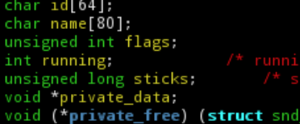

# WHAT IS THE PROBLEM?

Most software sucks. Both to use and to improve. There is already a lot of dogma and conservatism that holds programming back.

While hardware designers have grown from thousands of transistors to billions over the last 40 years, programmers are still programming exactly the same way: typing individual if-statements and for-loops in emacs into 7 bit ASCII files. Exactly like our parents and grandparents did in the 60ies and 70ies.

Programming at this levels is the software equivalent of building the next-gen NVIDIA graphics card by placing NAND-gates onto the silicon, one by one.

From their end, hardware designers have spent decades and enormous amount of on-chip transistors to try to work around the software industry's lack of progress. The hardware today tries to figure out the intent and structure of your code *from the machine code while executing it* to boost performance. This is information the software already has!

Floyd wants to improve the world and make it simpler to make big programs and make them efficient. This requires some changed habits.

# WHAT FLOYD WANTS TO DO

Floyd is intolerant of programming religion and conservatism, tired of all distractions with shiny new language syntax.

Floyd knows programming is about engineering and making insightful compromises about how your *system* works and performs. About exploring your system from different angles and try improvements and learn what works.

- You have limited brainpower, limited time, limited hardware -- great design is about figuring out how to spend these where it has maximum impact for the *product*.

Also at all cost avoid getting "design lumps" into your system that constantly limits how you can improve the software. "It can't be changed". A single well-placed mutex will break the composability of the entire system: google "win16 mutex". Your code needs to be reshaped during its lifetime and Floyd makes sure this is smooth.

- If you can't on request draw a clear overview picture how your system is structured -- then you can't possibly make system-wide decisions like which functions to optimize, what to cache and how to do *anything* with concurrency.

Floyd solves much of this by setting a simple but clear structure for how big systems (and small) needs to be organized and *enforces* this structure in the language from top to bottom to make us concentrate on the real engineering problems that needs to be solved. All while trying not to scare conservative programmers with too big changes to their source code typing.

Just like structured programming replaced goto hell with more specific but limited if-else and while loops, Floyd tries to name and impose another structure on systems and how they interact and are composed.

# SOLUTION PART 1/3 - FLOYD SPEAK

Floyd Speak is a fast and modern C-like program language that makes writing correct programs simpler and faster than any other programming language.

It's focus is composability (avoid lumps in your system), simplicity and robust programming techniques.

##### FEATURES

1. All critical building blocks are in the language itself: strings, collections and JSON literals and serialization. Avoid DYI primitives!
2. Statically typed with type inference.
3. Higher level (slightly) than C or Javascript. No pointers
4. Byte code interpreter. Future: compiled to native using LLVM
5. Designed for simple parsing and tool creation
6. Values, persistent data structures
7. Automatic behaviors: comparable, copyable, roundtrip values -- no need for boilerplate code
8. Pure functions, imperative. Encapsulation and protocols but not OOP
9. Visual playground
10. Familiar look and feel for most programmers to reduce friction

##### COMPOSABILITY
Normally, Floyd Speak functions don't have side effects or write to files etc -- they are only doing logic (aka Pure functions). This makes them composable!

But when a function needs to call the OS or have other types of side effects they are called "impure" functions. An impure function can't just decide to access the OS - it needs to have one or several Toolboxes provided as argument(s) so it can get to those features. This makes those side effects explicit and part of the static signature of the function. You can't accidentally call an impure function because you won't have the correct toolbox.

Floyd is not a functional language. You write statements, change local variables and so on. But those changes cannot escape the function -- the are hidden inside the function. All to make the functions composable.

#### NON-GOALS

- Have neat syntactical features that do not improve final product.
- Be multi-paradigm
- Be a real functional language
- Be a real object oriented
- Provide choice and expressing yourself
- Let programmer be 100% in control of the hardware
- Be an interesting intellectual challenge to master language

## CHEAT SHEET

## EXAMPLE CODE

	//  Make simple, ready-for use struct.
	struct photo {
		int width
		int height
		[float] pixels
	}

	//  Try the new struct.
	let a = photo(1, 3, [ 0.0, 1.0, 2.0 ])
	assert(a.width == 1)
	assert(a.height == 3)
	assert(a.pixels[2] == 2.0)

	let b = photo(0, 3, [])
	let c = photo(1, 3, [ 0.0, 1.0, 2.0 ])

	//	Try automatic features for equality
	assert(a == a)
	assert(a != b)
	assert(a == c)
	assert(c > b)

## DETAILS

**Floyd Speak Manual:** [Floyd Speak Manual](floyd_speak.md).

## BAD IDEAS

These feature have been excluded from Floyd on purpose, because they are too complicated and or breaks composability. Some of these are programming constructs, some are attitudes:

1. Aliasing
2. Pointers & references
3. Null and null-exceptions
4. Tracing garbage collection
5. Threads, locks, atomics, await, async, nested callback hell
6. OOP
7. Memory management
8. Mutable state
9. Callbacks, observers or broadcasting
10. Singletons and globals
11. Side effects
12. Find your resources
13. Header files
14. Error codes
15. Local optimization, caching 
16. Local threading decisions and assumptions
17. “Express your self in code”
18. Make your own linked list

# SOLUTION PART 2/3 - FLOYD SYSTEMS

This is a language that defines your complete software system and its internal interactions: components, concurrency, parallelism, communication, errors, time and mutation. The goals are these:

1. You can reason about it, present to no-developers and use to navigate visually

2. Clean concepts of robustness, concurrency, parallelism, communication, errors, time and mutation

3. Composable components

4. Simple to create tools

5. Visual profiling and editing

The second important feature of Floyd Systems is to configure how the system maps to the available hardware -- things like cores and threads, caches and RAM.

## SYSTEM STRUCTURE

Your **software system** is composed of **containers** (apps, servers and other programs), **components** (libraries) **and** code.

## EXAMPLE CONTAINER

This is a container with a bunch of actors wired together:

Concurrency is done at the top level of a container by wiring up actors -- small processes. This is inspired by Erlang processes. The actors are the blue, green and red boxes in the picture above.

There are no threads, locks, atomics, await-async, nested callback hell etc.

Read more here: **Floyd Systems Manual**: [Floyd Systems Manual](floyd_systems.md), **Floyd Systems Reference**: [Floyd Systems Reference](floyd_systems_ref.md).

# SOLUTION PART 3/3 - FLOYD STUDIO

TODO 1.0
This is a web-based interactive tool for making, exploring and tuning complete software systems.

**Floyd Studio Manual**: [Floyd Studio Manual](floyd_studio.md).
